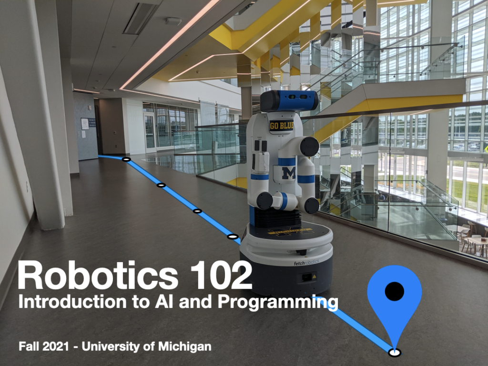

## Fall 2021

The objective of Robotics 102 is to introduce students in Engineering to the algorithmic method that drives robotics and artificial intelligence. Algorithms are an organized means to construct the solution of a problem, structured as a well-defined set of steps that can be carried out by a mechanism such as a computer.

Robotics 102 focuses on the development of algorithms to solve problems of relevance in robotics and artificial intelligence and implementation of these algorithms using high-level computer languages. It is centered on autonomous search and regression problems that are suited to computational solutions. These aspects of AI often arise as part of larger, more complex problems in engineering practice.

Robotics 102 also ties itself to the Robotics Pathways threaded curricular model.  Robotics Pathways that gives students early exposure to Robotics and AI as a foundation for a general engineering education as well as preparation for deeper study in Robotics and AI.  
<TwoColumn>

**Credits**  
4 credits / counts as ENGR 101

**Schedule**  
Lecture: Monday/Wednesday 10:00-11:30am in 107 GFL  
Lab: Friday 12-2pm or 2pm-4pm in 1060 FMCRB

https://www.youtube.com/watch?v=jZ0U339ewKo

**Teaching**  
Professor Chad Jenkins  
Jana Pavlasek

**Instructional Assistants**  
Broderick Riopelle  
Maxwell Topping  
Tom Gao  
Tommy Cohn

**Development**  
Madhav Achar  
Liz Olson

**Register**  
[Wolverine Access](https://wolverineaccess.umich.edu)

[Course site](https://robotics102.github.io)

**All lectures and lab sessions are recorded in support of a flipped classroom model.  Some of these recordings will be posted online within the bounds of proper compliance.**

</TwoColumn>

The objective for Robotics 102 is the implementation and understanding of autonomous navigation algorithms for mobile robots.  Students will gain exposure to modeling AI problems as graphs and performing inference though graph algorithms.  In the context of autonomous navigation, Robotics 102 will provide concrete examples of robotics and artificial intelligence that provide exposure to foundational concepts in autonomous decision making, including:

- Sense-Plan-Act paradigm

- Finite state machines

- Reactive automata and Subsumption architectures

- Feedback control

- Minimization and optimization (potential fields)

- A-Star search

- Artificial neural networks

## Frequently Asked Questions

**Does ROB 102 count as credit for ENGIN 101?**

Yes, for Robotics, CS, Aerospace, and other applicable majors! To ensure ROB 102 can be used as a substitute for your major, please check in with your academic advisor.

**I see there are advisory pre-reqs for ROB101 and ROB103 -- should I complete those classes first?** 

No - Fall 2021 is the pilot for ROB102, and we don't expect most students to have completed either of those classes.
