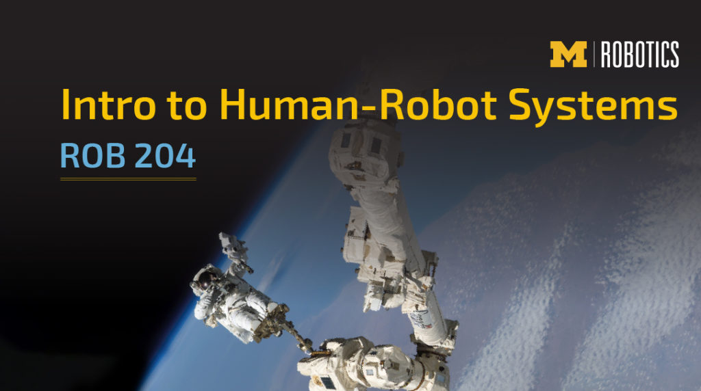

The objective of ROB 204 is to introduce students in Engineering to factors that influence the design of robotic systems from the perspective of the human user. Robots are designed to achieve many different tasks across many different discipline areas. Understanding the ways in which a person can interact with a robotic system can create a more usable and useful robot. Considering the potential users and evaluating different interaction modalities is part of the socially-engaged design process and can lead to the development of human-centered design requirements. 

This foundation in human-robot systems covers identifying and describing how human capabilities and behaviors inform robotic design. We survey theories, methods, and findings from relevant domains (e.g., cognitive/physical ergonomics, psychology, human-centered design), with attention to how these concepts influence robotic systems and design within development teams

ROB 204 also ties itself to the Robotics Pathways threaded curricular model and is a pre-requisite for the ROB 300 level courses. ROB 204 also consists of Technical Communications credit and will continue to work on the development of written and oral communication skills.
<TwoColumn>

**Credits**  
4 credits

**Schedule**  
Lecture: MW 12pm to 1:30pm  
Lab/Discussion: Thursdays

**Teaching**  
Professor Leia Stirling  
Professor Lionel Robert  
Joe Montgomery, Technical Communications Instructor

**Prerequisites**  
ROB 101, MATH 214, MATH 217, MATH 417, or MATH 419 (co-requisite); ROB 102, ENGR 101, EECS 183, or ENGR 151; ROB 103 or ENGR 100. 

**Register**  
[Atlas Course Site](https://wolverineaccess.umich.edu)

</TwoColumn>

## What are the topics covered in this course?

- Human Perception and Cognition
- Emotion and Motivation
- Socially Engaged Design
- Project Management and Team Interactions
- Designing for Human Fit, Sizing, and Strength
- Human – Robot Communication Modalities
- The impact of Situation Awareness and Trust on Automation Design
- User Interface Design for Robotic Systems
- Assessing Usefulness and Usability of a Robotic System
- Developing Human-Centered Design Requirements

## Why should I take ROB 204?

If you are interested in a career in Robotics, it is important to understand how human characteristics can influence the usability and usefulness of the systems you want to design, build, and implement. This course provides an introduction into the technical challenges of designing robots to aid people and provides hands-on labs to support these concepts. 

## Frequently Asked Questions

**I see there is a pre-requisite for ROB 103 or ENGR 100. Should I complete this class first?**

Yes, ROB 204 includes Technical Communications coursework that builds off of the materials that align in this pre-requisite list.
