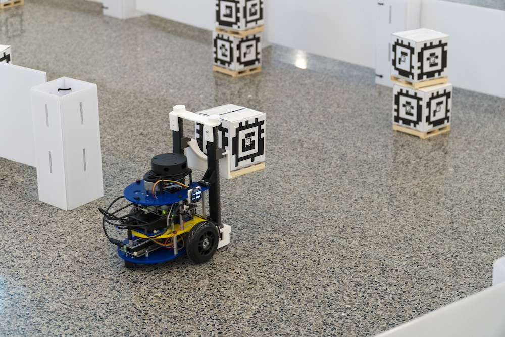

Robotics offers undergraduate and graduate level courses. The courses listed below make up a core part of the Robotics program, but as part of the College of Engineering and University of Michigan, there are also many cross-listed courses and electives from other programs that are available.

<TwoColumn leftWidth="60%" rightWidth="40%">
  

    Use the resources below to explore different Robotics courses used in our program and how they can be used towards degree requirements.

    ### Current Term Courses
    <MaizeButton href="https://docs.google.com/spreadsheets/d/1Ny6iqCIFH1gma03bm70DPT8qXLjYA4GLt1-K-PIZSy8/edit?usp=sharing" text="View Fall 2025 Course Guide" external="true" umlogin="true" />

    <Button href="https://robotics.umich.edu/academics/courses/course-offerings/" text="See more information on current term courses" />

    ### Complete Course Listing
    <Button href="https://robotics.umich.edu/academics/courses/complete-course-list/" text="Browse all robotics courses" />
  

  

    
  

</TwoColumn>

<TwoColumn>
  

    ## Free Online Courses
    Michigan Robotics also publishes many courses online, which can be freely accessed through sites like GitHub and YouTube. These courses typically include all lecture videos, notes, textbooks, homework, projects, and exams.

    <Button href="https://robotics.umich.edu/academics/courses/online-courses/" text="Explore free online courses" />
  

  

    ## Course Override Requests
    ### Undergraduate course override
    Undergraduate students looking to enroll in robotics courses who do not meet the enforced prerequisites can [submit a request to enroll](https://deptapps.engin.umich.edu/robovr/home?dept=210308).

    **Note:** Overrides for undergraduate core ROB courses (ROB 204; ROB 310; ROB 311; ROB 320; ROB 330; ROB 340) will not be issued to non-robotics majors until December 9th once everyone has had a chance to register.

    ### Graduate course approval
        400-level courses listed as electives in the Complete Course Listing, or any 500-level or higher courses within the College of Engineering, can be considered an elective.

    To request approval for courses not in these groups, [submit a course approval request](https://docs.google.com/forms/d/e/1FAIpQLSc5cGWCja2Y4OMsPL_SVYXeh1EJKfAGS422duZ5S4cN_xT-Pg/viewform). Please allow at least 2 weeks for a response.

    Questions? Email [robotics-sso@umich.edu](mailto:robotics-sso@umich.edu).
  

</TwoColumn>

## Past Course Offerings
Browse through our previous term course listings:

<ColumnList columns={3}>
- [Fall 2017](/course-offerings/Fall-2017-Course-List.pdf)
- [Winter 2018](/course-offerings/Winter-2018-robotics-courses.pdf)
- [Fall 2018](/course-offerings/Fall-2018-Course-List.pdf)
- [Winter 2019](/course-offerings/Winter-2019-course-list-1-16.pdf)
- [Fall 2019](/course-offerings/Fall-2019-Course-List-9-13-19.pdf)
- [Winter 2020](/course-offerings/Winter-2020-Course-List.pdf)
- [Fall 2020](/course-offerings/Fall-2020-Course-List.pdf)
- [Winter 2021](/course-offerings/Winter-2021-Course-List.pdf)
- [Fall 2021](/course-offerings/Fall-2021-Course-List.pdf)
- [Winter 2022](/course-offerings/Winter-2022-Course-List.pdf)
- [Fall 2022](/course-offerings/Fall-2022-Course-List.pdf)
- [Winter 2023](/course-offerings/Winter-2023-Course-List.pdf)
- [Fall 2023](/course-offerings/Fall-2023-Course-List.pdf)
- [Winter 2024](/course-offerings/Winter-2024-Course-List.pdf)
- [Fall 2024](/course-offerings/Fall-2024-Course-List.pdf)
- [Winter 2025](/course-offerings/Winter-2025-Course-List.pdf)
</ColumnList>
