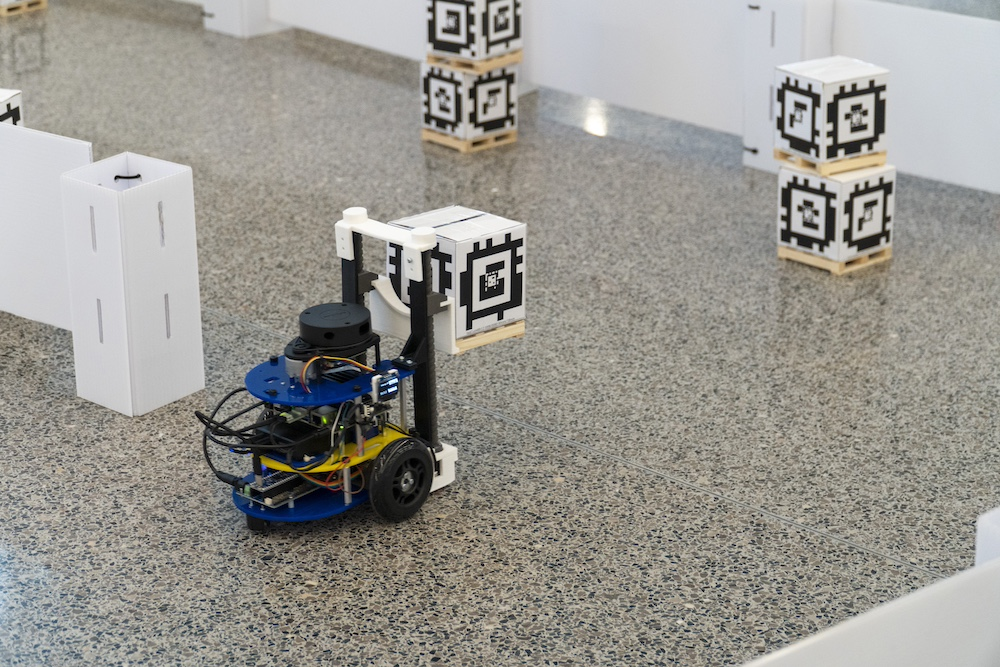

The Robotics curriculum spans sensing, reasoning, and acting, alongside human-robot interaction. We offer undergraduate and graduate-level courses, as well as cross-listed and elective courses across the College of Engineering and the University of Michigan.

<TwoColumn leftWidth="60%" rightWidth="40%">
  

    Use the resources below to explore Robotics courses and how they count towards degree requirements.

    <MaizeButton href="https://docs.google.com/spreadsheets/d/1GwfBNfBa28wxqjQE7HkXQ0Sh97neOfsCeM4tb82VkVM/edit?usp=sharing" text="View Fall 2026 Course Guide" external="true" umlogin="true" />

    This document is viewable by the University of Michigan community. Non-U-M members can view public course listings via the Complete Course List below or in the [College of Engineering Bulletin](https://bulletin.engin.umich.edu/courses/robotics-courses/).

    <Button href="/academics/courses/complete-course-list/" text="Complete Course List" />
    Browse all undergraduate and graduate robotics courses.

    <Button href="/academics/courses/online-courses/" text="Free Online Courses" />
    Access open-source lecture videos, textbooks, and course materials on GitHub and YouTube.
  

  

    
  

</TwoColumn>

## Course Overrides and Approvals

<TwoColumn>
  

    

      <h3 class="mt-0">Undergraduate Course Overrides</h3>

      If you are an undergraduate student interested in enrolling in a Robotics course but are unable to register in Wolverine Access due to missing enforced prerequisites, transfer or AP credit, major registration locks, or other special permission requirements, you must submit a course override request.

      

        <Button href="https://deptapps.engin.umich.edu/robovr/enrlreq/new?dept=210308&cid=1" text="Submit Course Override Request" />
      

    

  

  

    

      <h3 class="mt-0">Graduate Elective Approval</h3>

      400-level courses listed as electives in our [Complete Course List](/academics/courses/complete-course-list/), or any 500-level or higher course in the College of Engineering, automatically count as electives. For courses outside these groups, submit an approval request. Please allow at least 2 weeks for processing.

      

        <Button href="https://docs.google.com/forms/d/e/1FAIpQLSc5cGWCja2Y4OMsPL_SVYXeh1EJKfAGS422duZ5S4cN_xT-Pg/viewform" text="Submit Course Approval Request" />
      

    

  

</TwoColumn>

<Callout type="maize">
**Important (undergraduates):** Overrides for core undergraduate ROB courses (ROB 204, ROB 310, ROB 311, ROB 314, ROB 320, ROB 330, ROB 340) will not be issued to non-robotics majors until all students have had the opportunity to register.
</Callout>

### Non-Robotics Owned Courses (Cross-Listed ROB Courses)

The following ROB courses are administered and owned by partner departments. **Michigan Robotics does not manage enrollment, issue electronic overrides, or hold waitlists for these courses.** If you need permission or an override, follow the home department's registration and override process.

| Course Number & Title | Cross-Listed As | Home Department |
| --- | --- | --- |
| **ROB 422:** Intro to Algorithmic Robotics | EECS 465 | [Computer Science and Engineering](https://cse.engin.umich.edu/academics/undergraduate/undergraduate-advising/enrollment/) |
| **ROB 435:** Quantifying Human Motion Through Wearable Sensors | IOE 435 | Industrial and Operations Engineering |
| **ROB 464:** Hands-on Robotics | EECS 464 | [Electrical and Computer Engineering](https://ece.engin.umich.edu/academics/undergraduate/advising/registration-enrollment/) |
| **ROB 510:** Robotic Kinematics and Dynamics | EECS 567 / MFG 567 / MECHENG 567 | Mechanical Engineering; [me-aso@umich.edu](mailto:me-aso@umich.edu) |
| **ROB 517:** Sensing & Machine Learning for Neural Interfaces | BIOMEDE 517 | Biomedical Engineering |
| **ROB 530:** Mobile Robotics: Methods and Algorithms | EECS 568 / NAVARCH 568 | Naval Architecture and Marine Engineering |
| **ROB 535:** Self Driving Cars: Perception and Control | NAVARCH 565 | Naval Architecture and Marine Engineering |
| **ROB 543:** Ethics for AI and Robotics | CSE 543 | [Computer Science and Engineering](https://cse.engin.umich.edu/academics/undergraduate/undergraduate-advising/enrollment/) |
| **ROB 646:** Locomotion Mechanics and Design/Control of Wearable Robotic Systems | BIOMEDE 646 / MECHENG 646 | Mechanical Engineering; [me-aso@umich.edu](mailto:me-aso@umich.edu) |

### Registering for Non-ROB Courses

Each department within the College of Engineering manages its own class permissions, prerequisites, waitlists, and electronic override procedures. Robotics cannot grant overrides or issue permissions for courses offered outside the Robotics Department. If you need an override or permission to enroll in a non-ROB course, please consult the respective department's registration policy page.

## Registration and Class Procedures

For detailed step-by-step instructions on registering for, adding, or dropping classes in Wolverine Access, see the [Wolverine Access Student Business Guide](https://csprod.dsc.umich.edu/htmldoc/eng/dftie/lsaa/htm/sa_studentbusinessmenu.html).

### Registration Overview

- **Adding/Dropping Classes:** Changes made after the drop/add deadline (three weeks into each term) require instructor and program coordinator approval via Wolverine Access. Drops after the deadline result in a "W" transcript notation. International students dropping below full-time status must request a [reduced course load](/academics/student-services/reduced-course-load/).
- **Waitlists and Permissions:** Waitlists remain active in Wolverine Access through the drop/add deadline. Student Services works with instructors to issue permissions as seats become available. Please be mindful of the permission expiration date and register for the course prior to the deadline listed in the automated email. Failure to do so will result in being dropped from the waitlist.

**Advice on large waitlists:** You may need to join a waitlist for courses you plan to take in a given term. Seeing long waitlists can feel nerve-wracking, but it is a normal part of the process. Early in registration, many students add extra courses to their schedules while deciding which ones to keep. As the term approaches and students drop those extra courses, seats steadily open up.

## Undergraduate Independent Study

### ROB 490 - Directed Study

1. Identify a project and secure an agreement with a faculty sponsor. Once project details are finalized, fill out and submit the [ROB 490 Proposal Form](https://forms.gle/uzRU9PtzdfvRhJqCA).
2. Send the completed proposal responses to the faculty member via email, ensuring [robotics-sso@umich.edu](mailto:robotics-sso@umich.edu) is copied (CC'd) on the message.
3. Ensure the faculty sponsor replies to the email thread with their official approval or any requested updates.
4. Await class permission from the Student Services Office for the instructor's specific ROB 490 section, then complete enrollment in Wolverine Access.

### Credit Policy and Degree Audits

- **Credit Limit:** Students may enroll for a **maximum of 6 credits total** of ROB 490.
- **ROB Majors:** Please indicate in the form if you would like these credits to count towards the Flexible Technical Requirements. If eligible, Student Services will route these credits in the student's degree audit. No extra action is required from the student.

### Undergraduate Multidisciplinary Design Program (MDP)

Every year the Robotics Department reviews all MDP projects thought to have a Robotics affiliation and approves some of the projects to count towards the Robotics BSE Flexible Technical Elective requirement. This list will appear on the [MDP website](https://mdp.engin.umich.edu/).

In order for robotics majors to use MDP credits towards the Flexible Technical Electives requirement, students must first enroll in 4 credits of ENGR 455 during the second semester of the project and then [submit a petition](https://deptapps.engin.umich.edu/petition/student/form?dept=210308) to make the request.

## Graduate Independent Study

### ROB 590 & 690 - Directed Study

1. Identify a project and receive verbal or written approval from a Robotics faculty member (core or affiliate) to serve as your research advisor. Do not register before receiving this approval.
2. Submit the [ROB 590/690 Proposal Form](https://docs.google.com/forms/d/e/1FAIpQLSea5YctmfxwoRBWPfQxC6n1Pw8-SU2IHf8MXTZQ09rNmhu_CA/viewform) by the drop/add deadline of the term you will be registered. The form is sent to your advisor and the Graduate Chair, and your advisor will reply by email to approve or request revisions.
3. Register for your advisor's section in Wolverine Access. (Be sure to check "Include Independent Study Classes".) ROB 690 requires SSO permission to enroll: your advisor should email [robotics-sso@umich.edu](mailto:robotics-sso@umich.edu) with their approval, and the SSO will then email you permission.

For full details, see [ROB 590 and ROB 690](/academics/graduate/degree-requirements/rob-590-and-rob-690/).

### ROB 590 & 690 Credit Policy

- **ROB 590:** A minimum of 3 and a maximum of 6 credits count toward the Robotics MS. ROB 590 is graded S/U.
- **ROB 690:** 3 credits, letter graded. Take ROB 690 in the same term as your final 3 credits of ROB 590 or in a later term.
- **MDP:** All 4 MDP credits (including the 1 credit of ENGR 599) count toward the 6-credit ROB 590 maximum.

### Graduate Multidisciplinary Design Program (MDP)

Every year the Robotics Graduate Committee reviews all MDP projects and approves some of the projects to count toward ROB 590 credit. This list will appear on the [MDP website](https://mdp.engin.umich.edu/rob-590/).

Robotics graduate students in MDP register for 1 credit of ENGR 555 in the Winter semester and 3 credits of ROB 590 in the following Fall semester. If your MDP faculty mentor is not a Robotics faculty member, register for ROB 590 in the Robotics Graduate Chair's section. Students must still submit the [ROB 590/690 Proposal Form](https://docs.google.com/forms/d/e/1FAIpQLSea5YctmfxwoRBWPfQxC6n1Pw8-SU2IHf8MXTZQ09rNmhu_CA/viewform) by the Fall drop/add deadline.

## Visiting or Auditing Courses

Before requesting an audit, review Section 3.2 of Rackham's Academic Policies. Audited courses do not count toward degree requirements or full-time enrollment.

Once registered, email the instructor asking for approval to visit/audit (cc [robotics-sso@umich.edu](mailto:robotics-sso@umich.edu) and include your UMID). Upon approval, the Student Services Office will request that the Registrar's Office update your grading basis.

**Questions?** Contact the Student Services Office at [robotics-sso@umich.edu](mailto:robotics-sso@umich.edu).

## Past Course Offerings
Browse through our previous term course listings:

<ColumnList columns={3}>
- [Fall 2017](/course-offerings/Fall-2017-Course-List.pdf)
- [Winter 2018](/course-offerings/Winter-2018-Course-List.pdf)
- [Fall 2018](/course-offerings/Fall-2018-Course-List.pdf)
- [Winter 2019](/course-offerings/Winter-2019-Course-List.pdf)
- [Fall 2019](/course-offerings/Fall-2019-Course-List.pdf)
- [Winter 2020](/course-offerings/Winter-2020-Course-List.pdf)
- [Fall 2020](/course-offerings/Fall-2020-Course-List.pdf)
- [Winter 2021](/course-offerings/Winter-2021-Course-List.pdf)
- [Fall 2021](/course-offerings/Fall-2021-Course-List.pdf)
- [Winter 2022](/course-offerings/Winter-2022-Course-List.pdf)
- [Fall 2022](/course-offerings/Fall-2022-Course-List.pdf)
- [Winter 2023](/course-offerings/Winter-2023-Course-List.pdf)
- [Fall 2023](/course-offerings/Fall-2023-Course-List.pdf)
- [Winter 2024](/course-offerings/Winter-2024-Course-List.pdf)
- [Fall 2024](/course-offerings/Fall-2024-Course-List.pdf)
- [Winter 2025](/course-offerings/Winter-2025-Course-List.pdf)
- [Fall 2025](/course-offerings/Fall-2025-Course-List.pdf)
- [Winter 2026](/course-offerings/Winter-2026-Course-List.pdf)
</ColumnList>
