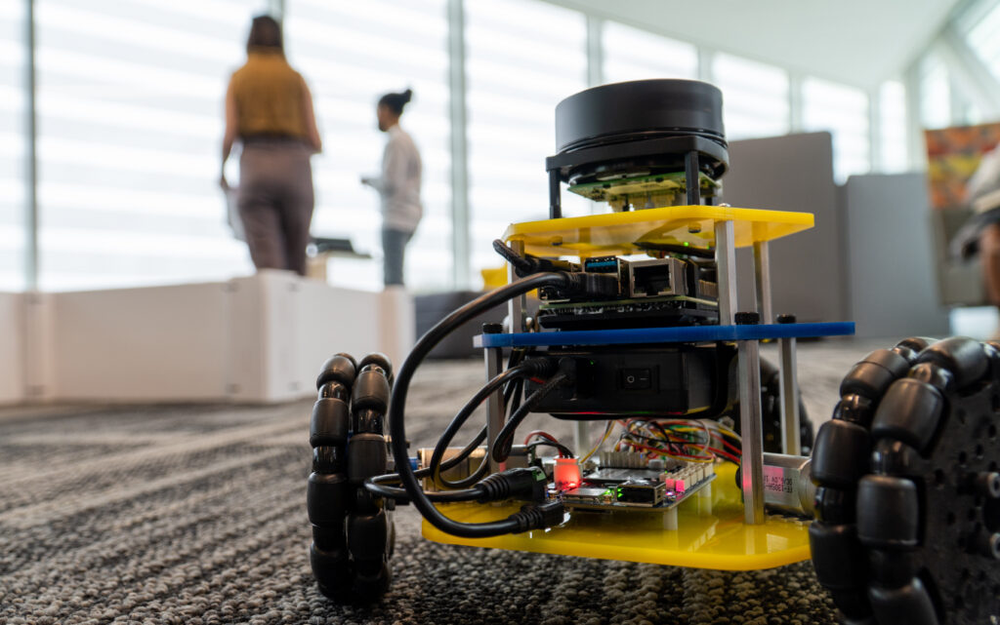

<TextWithImage imageSlot="right">
  

    
    Michigan Robotics launched its undergraduate program Fall of 2022, making it one of the first undergraduate robotics programs in the country and the first among top-ten engineering schools.

    Because robotics is so interdisciplinary, most engineering disciplines offer routes into robotics. Many students in our graduate program come from mechanical, electrical, or computer engineering backgrounds, but also from aerospace engineering, naval engineering, information science, kinesiology, biomedicine, or other fields. There are also several [undergraduate project teams](/people/student-teams/) where students can learn and apply skills while competing in international competitions.
  

  <figure slot="image">
    
    <figcaption>An MBot-Omni waits for instructions in ROB 102.</figcaption>
  </figure>
</TextWithImage>

## Program overview

<TwoColumn>
  

    

      <h3 class="text-xl text-white font-bold mb-2">Program Guide</h3>
      
Get complete details about courses, requirements, and program structure.

      <MaizeButton href="http://robotics.umich.edu/undergrad-guide" text="View Program Guide" />
    

  

  

    

      <h3 class="text-xl font-bold mb-2 text-white">Curriculum Whitepaper</h3>
      
Read about our approach to developing the undergraduate robotics curriculum on arXiv.

      <MaizeButton href="https://arxiv.org/abs/2308.06905v1" text="Read Whitepaper" external="true" />
    

  

</TwoColumn>

  <h3 class="text-xl font-bold mb-2">SUGS Program</h3>
  
The Sequential Undergraduate/Graduate Studies (SUGS) program allows qualified undergraduate students to pursue an accelerated master's degree.

  <MaizeButton href="https://robotics.umich.edu/academics/undergraduate/sugs/" text="Learn about SUGS" />
  
Note: We do not currently offer a minor in robotics, but we are working to establish one in the future.

## Current undergraduates: keep up-to-date with Robotics

<TwoColumn>
  

    

      <h3 class="text-xl font-bold mb-2">Undergrad Q&A Forum on Piazza</h3>
      
Post any Robotics-related questions as well as contribute to the discussion threads.

      
U-M email required.

      <MaizeButton href="http://piazza.com/umich/winter2022/roboticsugqa" text="Join the Piazza" external="true" />
    

  

  

    

      <h3 class="text-xl font-bold mb-2">Robotics Events</h3>
      
See what's happening in Robotics, especially the [next Robotics Pathways and Careers Speaker Series](https://robotics.umich.edu/academics/undergraduate/robotics-pathways-speaker-series/ "Undergraduate Robotics Pathways and Careers Speaker Series").

      <MaizeButton href="https://events.umich.edu/group/3998" text="View events" external="true" />
    

  

</TwoColumn>

## Frequently asked questions

  <Accordion title="Can I get a minor in robotics?">
    Currently, we do not offer a Robotics minor and do not yet have a timeline for when the minor may be available.
  </Accordion>

  <Accordion title="What are introductory Robotics classes like?">
    

      <figure>
        <YouTube id="95xv9ae5rcE" />
        <figcaption class="text-center mt-2">A look into ROB 103: Robotic Mechanisms.</figcaption>
      </figure>
    

    
100-level Robotics classes cover topics such as computational linear algebra, robotic mechanisms, and introduction to programming and artificial intelligence.

    
This brings the typical upper-level topics to first-year undergraduates, allowing you to cover engineering fundamentals of math and science through robotics projects, an approach we call "coding is believing."

    <h4 class="font-bold mb-2">Get a greater sense of each course below:</h4>
    <ul class="list-disc pl-6 space-y-2">
      <li><a href="/academics/courses/course-offerings/rob-101-fall-2020/" class="hover:underline">ROB 101: Computational Linear Algebra</a></li>
      <li><a href="/academics/courses/course-offerings/rob-102-intro-to-ai-programming/" class="hover:underline">ROB 102: Introduction to AI and Programming</a></li>
      <li><a href="/news/2021/building-the-basics-in-rob-103-robotic-systems/" class="hover:underline">ROB 103: Robotic Mechanisms</a></li>
      <li><a href="/academics/courses/course-offerings/rob-204-winter-2022/" class="hover:underline">ROB 204: Introduction to Human-Robot Systems</a></li>
    </ul>
  </Accordion>

  <Accordion title="How can I get a tour of the new building?">
    There is a [self-guided audio tour](https://audio.robotics.umich.edu) of the building for anyone to take at their own pace as they explore the building. Just bring your own mobile device capable of web browsing and your headphones whenever the building is open from Monday to Friday, 7am to 7pm. The audio tour should take roughly 30 minutes.

    We recommend that interested prospective undergraduates [sign up for a tour with the College of Engineering Undergraduate Admissions](https://www.engin.umich.edu/admissions-aid/visit/).
  </Accordion>

  <Accordion title="How can I use Robotics' facilities and resources like M-Air or the Makerspace?">
    M-Air can be used by research groups, student teams, or courses. More information on M-Air and how to reserve it can be found on [the M-Air site](/about/facilities/m-air/).

    The Makerspace is designed for use by [student teams](https://teamprojects.engin.umich.edu/) and [MDP](https://mdp.engin.umich.edu) projects.
  </Accordion>

  <Accordion title="How do I apply as an undergraduate?">
    Current U-M students can get in touch with our [advising](https://robotics.umich.edu/academics/undergraduate/scheduling/ "Undergraduate Advising & Scheduling") team to declare Robotics as their undergraduate major.

    Interested prospective undergraduates can [find out more about applying to the College of Engineering](https://www.engin.umich.edu/admissions-aid/undergraduate/apply/). Please note that students coming to U-M will be admitted to the College of Engineering (not a specific department) and will declare their major afterwards. Please see the [College of Engineering Bulletin](https://bulletin.engin.umich.edu/ug-ed/degrees/) for more information on declaring a major.
  </Accordion>

  <Accordion title="How do I find out about or apply for financial aid?">
    More information on financial aid for undergraduates can be found at the [College of Engineering's scholarship and funding site](https://www.engin.umich.edu/admissions-aid/scholarships-funding/).
  </Accordion>

  <h3 class="text-xl font-bold mb-4">More questions?</h3>
  
If you are not a U-M student, please contact <a href="https://www.engin.umich.edu/admissions-aid/undergraduate/">Engineering Recruitment and Admissions</a>.

  
For current students, questions about the Robotics Undergraduate Program can be sent to <a href="mailto:robotics-sso@umich.edu">robotics-sso@umich.edu</a>.

<figure class="w-full mx-auto md:w-1/2">
  <VideoCenter url="https://www.youtube.com/watch?v=kt-iXDHgMyw" caption="This Robotics Undergraduate Advising Super Session, which took place on November 11, 2024, covers information on the undergraduate program and several courses currently offered." />
</figure>
<figure class="w-full mx-auto md:w-1/2">
<NewsCard 
  href="/news/2022/new-u-m-undergraduate-robotics-program" 
  title="New U-M Undergraduate Robotics Program" 
  date="2022-09-01" 
  slug="new-u-m-undergraduate-robotics-program"
  excerpt="The new undergraduate program in robotics at Michigan Engineering will empower students to practice the full spectrum of robotics—including underwater, wheeled, legged, flying and medical robots—at U-M's 134,000-square-foot Ford Motor Company Robotics Building."
  image={{
    src: import('/src/content/news/2022/images/DSC02584-scaled.jpg'),  // Update this path to match your actual image
    alt: "The Michigan Robotics building"
  }}
  isLarge={true}
/>
</figure>