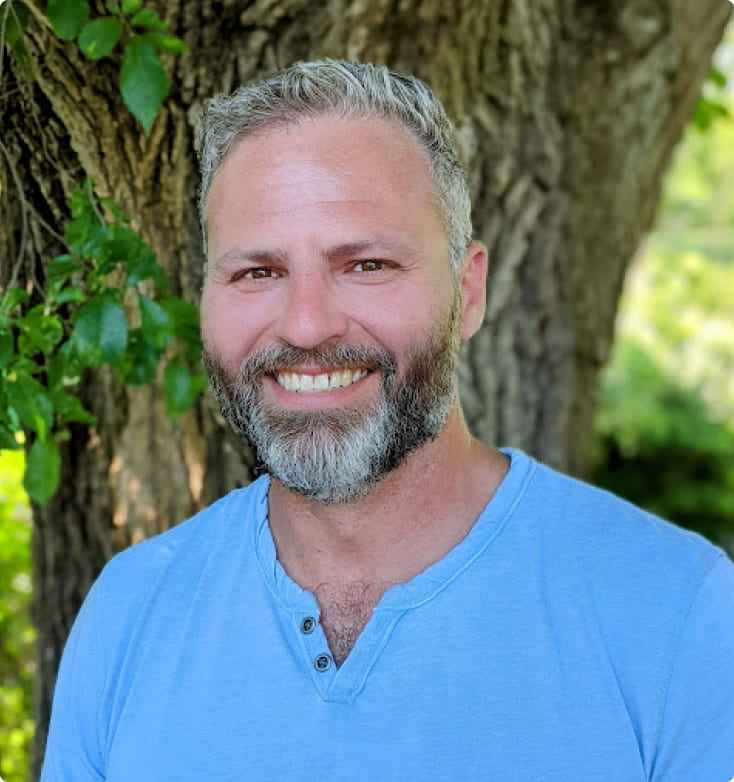
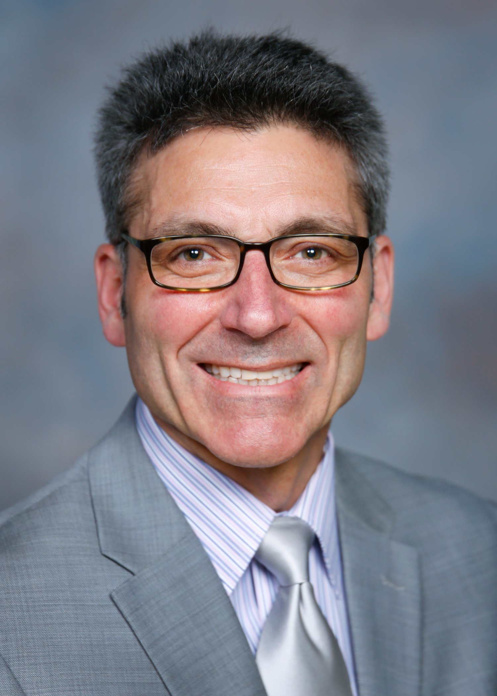
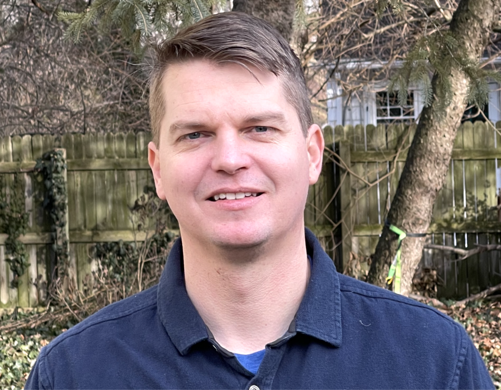
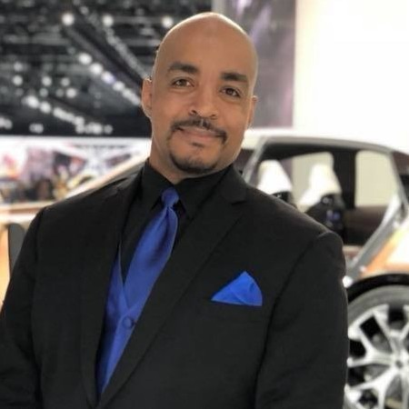
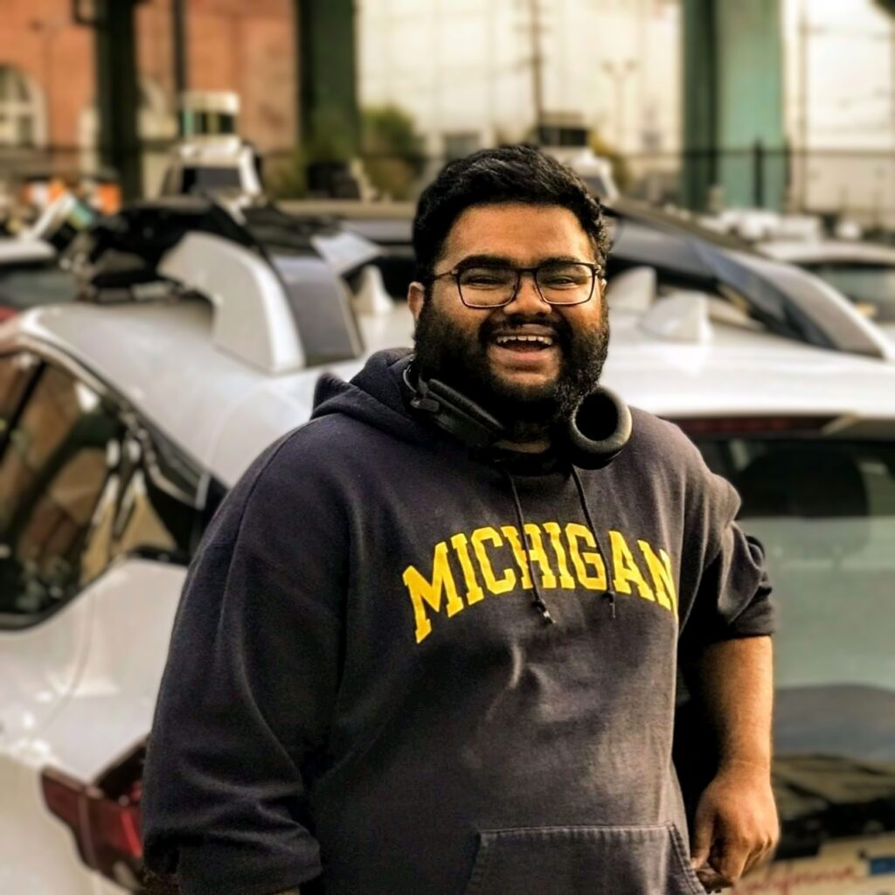
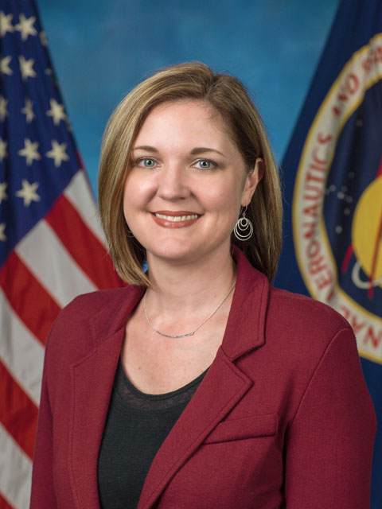
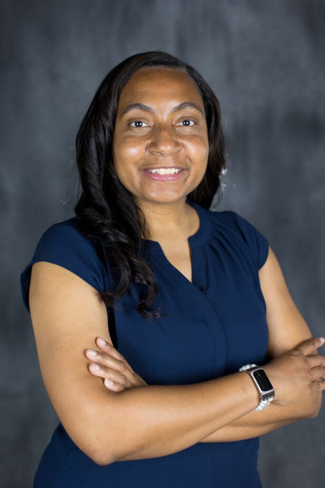

_Answering the question of “What can I do with a robotics degree?”_ 

The Robotics Pathways and Careers Speaker Series (RPCSS) invites professionals working in robotics to come talk with current undergraduates about their career path, how a background in robotics has impacted their professional growth, and what they hope to see in students looking to enter the profession.

The RPCSS is held every other Tuesday evening from 4:30-6:00pm on the campus of the University of Michigan in 2300 FMCRB.

The 90-minute format of the event will consist of a 30-minute presentation from the invited speaker and up to 40 minutes of moderated Q&A and discussion. Students will be able to participate in person or remotely. Each seminar will be available [via Zoom](https://umich.zoom.us/j/92286702864).

## Upcoming speakers

January 14, 2025

AI-Driven Manufacturing: The Future of Robotic Automation and Industry 4.0

Vic Pellicano

_Founder & CEO, Seraf_

**Abstract**

This talk explores the holistic integration of AI and robotics in modern manufacturing, examining how these technologies complement and enhance each other to create more intelligent and efficient industrial systems. We'll delve into the dual role of AI - both as the brain-driving robotic systems and as the intelligence layer optimizing broader manufacturing processes. Drawing from real-world implementations, we'll explore how AI enhances robotic capabilities through improved perception, decision-making, and adaptability while simultaneously orchestrating business systems to streamline operations. The presentation will showcase practical applications ranging from AI-powered quality control and predictive maintenance to advanced human-robot collaboration, demonstrating how this technological convergence is reshaping the future of manufacturing.

**Website Link:** [https://serafai.com/](https://serafai.com/)

**Bio**

Victorio Pellicano's journey from a blue-collar background to becoming a pioneering force in AI and manufacturing technology embodies the transformative power of resilience and innovation. Teaching himself to code at age 13, he pursued degrees in Computer Science and Mathematics while working full-time, becoming the first in his family to attend college. After founding Verenia, a manufacturing software company that grew through a "people-first" approach, he led it to a successful acquisition by Oracle in 2022.

His current venture, Seraf, is revolutionizing manufacturing operations through advanced AI systems, building upon his experience with Avianna, where he integrated AI into robotics. His unique perspective combines deep technical expertise with practical manufacturing experience, making him particularly attuned to the challenges and opportunities in industrial automation and robotics.

Victorio's approach to technology development is shaped by his background in manufacturing sales and hands-on experience in factory environments. He brings a unique perspective on how AI and robotics can transform manufacturing while empowering workers and improving operational efficiency. His work focuses on creating practical, implementable solutions that bridge the gap between cutting-edge technology and real-world manufacturing challenges.

**Recording**

January 28, 2025

Turning a Senior Design into an Industry-Leading Startup

Danny Ellis

_CEO, SkySpecs_

**Abstract**

Danny started building drones in 2009 as part of his senior design in Aerospace Engineering at Michigan. While pursuing his Masters degree, Danny and his team joined the Center for Entrepreneurship to try to turn their project idea into a business. Danny will tell the story about how he began as an engineering student working on robots and built SkySpecs into a global leader in wind turbine asset management. 

**Website Link:** [https://skyspecs.com/](https://skyspecs.com/)

**Bio**

Danny is a two-time graduate of the University of Michigan with his BSE and MSE in Aerospace Engineering. He cofounded SkySpecs in 2012 and has grown the team to over 250 people worldwide. Danny is a Techstars alum, Forbes' "30 under 30" award winner, Endeavor Entrepreneur, Detroit Crain's "40 under 40" winner, 2023 EY Entrepreneur of the Year Regional winner, and 2023 Michigan Entrepreneur of the Year. Danny lives in Ann Arbor with his wife, three daughters, and two dogs. 

**Recording**

## Past speakers

February 20, 2024

Robotics in Today’s Automotive Engineering

Andrew Farah

_Executive Director, Advanced Driver Assistance Systems_

**Abstract**

The early 1980’s, when I was a student at the University of Michigan, was the time that industrial robots for material handling, assembly, and inspection were becoming well established in product manufacturing environments. Robotic capabilities have continued to develop and expand into the products themselves, made possible as the enabling technologies have become “retail market mature” in their performance, cost-effectiveness, and reliability. Consumer products apply these technologies to enhance their customer-facing capabilities using robotics technology… and transportation products are  
no exception.

Automobiles have become more technologically advanced and feature-laden, particularly in the areas of active safety systems and varying levels of autonomous operation. In each case the vehicle itself takes over or augments safety-critical tasks that the driver was fully responsible for previously. This has pulled robotics engineering to intersect with the world of automotive product engineering. Both are highly interdisciplinary and require broad thinking to pull it all together as a retail consumer product. Deep technical specialization is also required in critical areas along the engineering supply chain.

In this talk I will share my education and career path in the automotive industry, similarities between automotive and robotics engineering, and how today’s robotics engineering education can apply to this industry. I will also discuss some of the skills and behaviors that employers are looking for that we are not directly taught in school. We will also have time for Q&A at the end.

**Bio**

Andrew J. Farah, most recently the Executive Director of Advanced Driver Assistance Systems (ADAS) at General Motors, has stepped back from his 36-year career with the automaker in September 2023. He has held various leadership positions in Engineering, Planning, and Aftersales. He plans to continue in the industry to advise leaders and businesses, while also focusing on developing the engineering talent that the industry needs today and tomorrow.

With over 40 years of total automotive technical and business experience, Mr. Farah has had the opportunity to work on and lead many groundbreaking vehicle programs. He made major contributions to the EV1 electric vehicle as Engineering Manager for Propulsion Software & Controls, the Chevrolet Volt extended-range electric vehicle as Vehicle Chief Engineer, and the Cruise AV and Cruise Origin as vehicle Chief Technical Architect and program Executive Director. He has also been involved in the automotive launch of several electrical/electronic technologies that are now considered commonplace in the industry. In his most recent ADAS role he was responsible for the development and execution of active safety features, Super Cruise, and Ultra Cruise for GM's retail and fleet portfolio.

Mr. Farah holds a bachelor’s degree in Computer Engineering (BSE CE ’82) and a master’s degree in Electrical Science (MSE ’84), both from the University of Michigan in Ann Arbor. He is also a member of the Society of Automotive Engineers (SAE).

**Recording**

https://youtu.be/fV6oSQoxu2g

December 6, 2023

Grokking Non-Academic Problems: Unleashing Creative Solutions for Real-World Challenges

Demarcus Edwards

_Applied ML Research_

**Abstract**

In this university talk, we will explore the intersection of generative artificial intelligence (AI) and robotics, and how this combination can fuel career growth. Fostering a passion for innovation is crucial in creating impactful projects. We will delve into the importance of seeking out interesting and challenging projects that push the boundaries of what is possible. By actively engaging in hands-on work and building "cool toys," individuals can showcase their skills and demonstrate their ability to translate ideas into practical applications.

**Website Link:** [https://www.darelabs.xyz](https://www.darelabs.xyz/)

**Bio**

Demarcus Edwards is a driven and hands-on tinkerer in the field of machine learning (ML) with a strong focus on generative AI. As a Ph.D. candidate, he is on the verge of defending his thesis within the next two weeks.

In the private sector, DeMarcus has worked with notable companies such as Google X, Facebook, Netflix, and Apple, where he has worked on a broad range of Applications of AI from Recommendation to Language and Video Generation. His experience includes leading the development of the currently used Graph entity resolution at Netflix, Text to Kinematics sequence modeling systems at Google X, implementing novel attention-based ranking models at Instagram Reels, and designing a 3D perception-based kinematic modeling system for action recognition at Apple. His passion for generative AI has been a driving force in his research and career journey, as he explores the creative potential of AI systems to generate novel and realistic outputs.

In the public sector, DeMarcus has contributed his expertise to organizations such as NightVision Research Labs and the DOD Center of AI/ML Excellence. His research in adversarial machine learning, GAN algorithms for infrared imagery, and spectral image recognition has advanced the field and demonstrated his commitment to making a positive impact beyond the industry.

**Recording**

https://www.youtube.com/watch?v=RAq4tBBXxO8

November 29, 2023

Flying high at Skydio: how U of M helped launched me into a successful career - twice 

Karl Rosaen

_Software Engineer at Skydio_

**Abstract**

Come learn about Spatial AI at Skydio, including 3D Scan, Skydio's Visual Positioning System and Onboard 3d modeling, and learn about Karl's path to working at Skydio, including how working in a lab at UM Robotics played a pivotal role in Karl's shift from full stack cloud and mobile software engineering to robotics. Karl will detail the latest technology at Skydio, including a live telop demo planning an autonomous mission from over 2000 miles away. Karl will also discuss his career since graduating from U of M Engineering, and give tips for continuing to learn and stay on the cutting edge throughout one's career.

**Website Link:** [https://www.linkedin.com/in/karlrosaen](https://www.linkedin.com/in/karlrosaen)

**Bio**

Karl is a Software Engineer on the autonomy team at Skydio, where he helps develop Skydio's Visual Positioning System. Karl graduated from UM with a BSE and MSE in Computer Engineering and started his career at Google working on Adwords and Android before leaving to start his own company in the food / tech space. After continuing to work in that space for a bit, Karl decided to shift gears and get into robotics. This is where U of M came back into the picture, as Karl worked in the UM Ford Center for Autonomous Vehicles as a research engineer, which launched him solidly into the robotics field, first at Toyota Research Engineer (TRI) working on autonomous vehicles, and now Skydio.

**Recording**

https://www.youtube.com/watch?v=fC4cma\_2\_x8

November 15, 2023

A Random Walk Through Biorobotics

Laksh Kumar Punith

_Research Investigator in UM Neurobionics Lab_

**Abstract**

How does someone who wanted to be an environmentalist as a high schooler end up dissecting frogs for a PhD in Robotics and then get a type of job he didn’t even know existed? In exploring this story, we will unpack (a) how a chance encounter got me into biorobotics, (b) how thinking of robotics as a human endeavor as opposed to a base of knowledge helped me land a PhD position and make award-nominated contributions to biology, and lastly (c) how a combination of soul searching and connecting with people helped me get unstuck after my PhD and land a job I didn’t even know existed. Ultimately, I hope learning of my journey gives you encouragement to follow your curiosity, hope that things will turn out okay, and some practical tools to soul search if you’re stuck in that process.

**Website Link:** [https://www.linkedin.com/in/lakshkumarp/](https://www.linkedin.com/in/lakshkumarp/)

**Bio**

Dr. Laksh Kumar Punith is a Research Investigator in the Neurobionics Lab at the University of Michigan’s Robotics Department. He holds a B.Tech in Mechanical Engineering from the National Institute of Technology Karnataka (‘15), and a Ph.D. in Robotics from Georgia Institute of Technology (‘22). As a roboticist, Dr. Punith has been fascinated by how animals move so much better than any robots we’ve ever built - all while having hardware that should make their job much harder - namely, slower communication (i.e. neurons), state-dependent actuators (i.e. muscles) and squishy transmission (i.e. tendons). To solve this conundrum, he (1) develops hypotheses of how animals move from comparative biomechanics literature and experiments in the lab and (2) directly tests them by attempting to generate movement in mathematical models and organic robots. He hopes this approach will not only shed light on the basic science of animal locomotion, but also serve as an accelerant to build better organic and inorganic robots.

**Recording**

https://www.youtube.com/watch?v=tWWMMjZtCH8

November 1, 2023

Making Undergrad Count for a Career in Robotics

Matthew Dreisbach

_Software Engineer at Woven by Toyota_

**Abstract**

In his talk, Matthew Dreisbach focuses specifically on his time as an undergrad, sharing the decisions made outside-the-classroom that helped him build a career in robotics. From networking to job hunting Matthew shares personal examples of what worked and what failed. Following his journey from undergrad-interested-in-robotics to software-engineer Matthew shares skills and tips to build a career in the growing, fun and impactful field of robotics.

**Website Link**: [https://www.linkedin.com/in/matthew-dreisbach/](https://www.linkedin.com/in/matthew-dreisbach/) 

**Bio**

Matthew is a Software Engineer at Woven By Toyota (Formerly: Toyota Research Institute), where he develops large-scale SLAM algorithms with a superb team. As a UM alumnus, BSE in Computer Science (2018) and Masters in Electrical and Computer Engineering wth a focus on Robotics (2020), he was among the first employees at Mcity, an autonomous vehicle test track.

**Recording**

https://www.youtube.com/watch?v=BC0zMITN8M0

October 18, 2023

What it Takes to Get Samples from Mars (A Lot of Robots and a Lot of People)

Karthik Urs

_Mechatronics Engineer, NASA Jet Propulsion Lab_

**Abstract**

Robots are the key to exploring our Solar System and beyond. For decades, we've sent robotic spacecraft to our planetary neighbors and other bodies to understand essential scientific questions: How did the planets come to be? Is there or has there been life elsewhere? What else is out there? In this talk, I will speak about the next step in understanding one of our nearest neighbors, Mars, through a multi-spacecraft, multi-robot mission to return martian samples back to Earth for the first time ever. I will be discussing how we go about tackling such a massive engineering challenge, how I learned the skills to do so at Michigan, and how you can too.

**Website Link:** [karthikurs.com](http://karthikurs.com/)

**Bio**

Karthik is currently a Mechatronics Engineer at NASA Jet Propulsion Lab (JPL) building actuators for Mars robots. Before JPL, he earned a MS in Robotics (2021), BSE in Computer Engineering (2020), and BSE in Mechanical Engineering (2020) at University of Michigan. At the University, Karthik also spent two years as a Research Assistant in EMBiR Lab under Prof. Talia Moore building legged robots and actuators; instructed ME350 as a GSI and IA for seven semesters; and worked on the MRover project team in various capacities for four years. His interests lie in robotic mechanism design, actuation, system identification, and control.

**Recording**

https://www.youtube.com/watch?v=mz15D2R3UcI

September 27, 2023

Mechanizing Detroit

Leon Pryor

_Senior Video Game Producer, META_

**Abstract**

Michigan Grad and Video Game producer Leon Pryor has combined a lifelong interest in robotics with a desire to promote better outcomes in Detroit. Learn how he’s working to change the culture of STEM in Detroit through competitive _FIRST_ robotics.

**Website Link:** [https://motorcityalliance.org/](https://motorcityalliance.org/)

**Bio**

Leon Pryor received his B.S. degree in Electrical Engineering from the University of Michigan-Ann Arbor in 1997. After graduating from Michigan, Leon joined Microsoft, where he helped launch the Xbox and Xbox 360 game consoles and dozens of games from Electronic Arts, Microsoft Game Studios, Disney, and Lucasarts. Leon is currently a Senior Video Game Producer for META’s(Facebook) reality lab group, building games for Augmented and Virtual Reality headsets. Outside work, Leon is a passionate advocate for STEM enrichment in Detroit, Michigan, where he co-founded the Motor City Alliance: A non-profit organization that supports over 100 robotics teams in Detroit in after-school programs, summer camps, and FIRST Robotics competitions. Leon is also the coach of two _FIRST_ Robotics teams: FIRST Robotics Challenge team 8280 K9.0 Robotics from the School at Marygrove and FIRST Tech Challenge team 14010 TechnoPhoenix from the Foreign Language Immersion and Cultural Studies school. Team TechnoPhoenix recently made history as the first Detroit Public school to qualify for the World Championships. Additionally, Leon was recognized as the Michigan State  _FIRST_ Robotics Coach of the Year and was runner-up for the award at the World Championships in Houston, TX.

**Recording**

https://youtu.be/GVIQvSd-bQ0

December 1, 2022

**From Robotics to Finance: A Fun Journey**

Zhen Zeng

_Research Scientist, JP Morgan AI Research_

**Abstract**

I will share my career journey in robotics, and how I become a research scientist at J.P. Morgan, while continuing to contribute to robotics. I started off in computer vision during undergrad. Soon I came to realize robotics is my true passion where perception and action come together to close the loop. I focused on perception for manipulation and active vision for object retrieval during my Ph.D., and have been continuing my robotics research through collaborations with Prof. Chad Jenkins. At J.P. Morgan AI Research, I have been finding more connections between Robotics and Finance and promoting the presence of women in AI. I will share insights that helped me through my journey. And I would like to quote Dr. Fauci, “expect the unexpected and stay heads up for an unanticipated opportunity should it present itself.”

**Bio**

Dr. Zhen Zeng is currently an AI Research Scientist on the AI Research team at J.P. Morgan. Her research interests are semantic robot programming, perception for mobile manipulation, and novel representations of financial data. She received her Ph.D. in Electrical and Computer Engineering at the University of Michigan, Ann Arbor in 2020. She worked in the [Laboratory for Progress](https://progress.eecs.umich.edu/index.html#) with her advisor Prof. [Chad Jenkins](https://web.eecs.umich.edu/~ocj/). Her research focused on enabling users to program the world through a mobile agent through robot programming by demonstration, semantic mapping, and active vision. Her research motivation is rooted in assisting people with impaired physical mobility to live independent lives with dignity. At J.P. Morgan AI Research, she works on unique ways of visually interpreting financial data and activities, and is active in promoting the presence of women in the field of AI.

**Recording**

https://youtu.be/en6lzwzZ1oA

November 17, 2022

**Move Fast and Brake For Things**

Shiva Ghose

_Tech Lead L3 Autonomy,  
NVIDIA_

**Abstract**

A quick overview of my career in robotics ranging from unicorn start ups to big companies featuring lessons learned the easy and hard way.

**Bio**

I got my Master's from the UofM in Robotics and Autonomous Vehicles back in 2012 and after that I started my PhD soon after started collaborating with Cruise Automation in 2015. I was with Cruise working on the planning stack as it grew from 15-20 people all the way up through the acquisition into the 2000-ish people company in 2020. After that, I had a small stint at Robust AI working on collaborative robotics. Nowadays I'm at Nvidia - back in the AV world! - where I lead the Low Speed Maneuvers Group that deals with driving around in unstructured environments close to people and objects!

November 3, 2022

**From TW to US and EE to Robotics**

Bruce Huang

_Software Engineer, Google_

**Abstract**

Do you want to know how a foreigner comes to the US to study Robotics, cracks all the FAANG interviews, and then becomes a roboticist working at Google? Are you also wondering how an interview process looks like and how to prepare for the interview? Come check it out and we will show you how!

**Bio**

Bruce earned his Ph.D. in Robotics at the University of Michigan (UofM), Ann Arbor. He received a bachelor's degree in Electrical Engineering at National Taiwan University and an MS degree in Robotics at U-M in 2018. He worked in the [Biped Robotics Lab](https://www.biped.solutions/) under the supervision of Professor [Jessy W. Grizzle](https://ece.umich.edu/faculty/grizzle/). His research focused on autonomy of bipedal robots, encompassing sensor fusion, pose estimation, and motion planning. He was in charge of building a full stack of autonomy pipeline for the system integration of Cassie Blue, a bipedal robot with 20 degrees of freedom.

**Recording**

https://www.youtube.com/watch?v=dTbV0TwMAfo

October 20, 2022

**Robotics for NASA Exploration Missions**

Kimberly Hambuchen

_Acting Deputy, ISS Systems Engineering & Integration Office_

**Abstract**

Dr. Hambuchen will discuss needs for robotics in future NASA missions, including the upcoming Artemis missions; current and previous technology development to meet these needs; and how academic and commercial space technology development is closing NASA robotics exploration gaps. Dr. Hambuchen will highlight robotics for NASA’s human exploration objectives, with a focus on the operation environments that are unique to NASA.

**Bio**

Dr. Kimberly Hambuchen currently serves as the acting Deputy Manager for the Systems Engineering and Integration Office of the International Space Station Program. As SE&I deputy manager, she oversees the performance of the ISS including robotics, modeling, safety, and mission success. Previously, she served as the chief of the Robotic Systems Technology Branch at NASA’s Johnson Space Center, where she directed the development of advanced robotic technologies for space exploration missions. Prior to this, she was the Principal Technologist for Robotics in NASA’s Space Technology Mission Directorate’s (STMD) serving as the STMD technical expert and advocate for robotics across all NASA centers for STMD programs. During her 20-year career as a robotics engineer at Johnson Space Center, Dr. Hambuchen developed human-robot interaction techniques and tools for the Robonaut and Centaur robots, the Space Exploration Vehicle (SEV), and bipedal humanoid, Valkyrie (R5), among many others. Dr. Hambuchen was a member of the International Space Exploration Coordination Group’s (ISECG) Telerobotics Gap Assessment team, providing gap analysis in the field of operating space robots for the international space community, and in 2016 was named “One of the 25 Women in Robotics to Know” by RoboHub.

**Recording**

https://youtu.be/6mYRJf2Wbcs

October 6, 2022

Nia Jetter

_Amazon Robotics AI senior principal technologist_

**Abstract**

Fault detection, Isolation and Response (FDIR) as well as Safety for critical autonomous systems is highly ambiguous given that standards are being written as we are developing products and the process to certify them.  Defining the FDIR and safety systems for these products becomes even more complex when they are operating in an unstructured environment able to move freely amongst and/or provide critical services for people.  In this talk Nia Jetter will discuss her journey through 20 years as an Aerospace Engineer specializing in Autonomy and AI and her current career in Robotics at Amazon.  She will also present a framework for architecting autonomy for critical systems independent of product and focused on how the user interacts with the product.

**Bio**

Nia Jetter is passionate about changing the world through innovation, technology planning, teaching, mentoring and solving tough problems in Autonomy and AI that can be applied across different platforms.  She has a dedicated focus on helping people who may not have easy access to educational materials to understand topics like artificial intelligence.  Nia is enthusiastic about working the human-AI interface as artificial intelligence is further integrated into our society. 

Nia is an Aerospace Engineer who has 20 years of experience in the Aerospace Industry and has supported a variety of programs across the product-lifecycle from design and development to mission and anomaly resolution and through customer delivery and support.  In January 2021, Nia left the Aerospace Industry as a Technical Fellow to join Amazon as a Senior Principal Technologist for Robotics AI. In this role she is a leader in technical development for autonomy as well as strategic planning for robotics and other autonomous applications.

Nia has a bachelor’s degree in Math with Computer Science and a minor in Earth Atmospheric and Planetary Sciences from MIT as well as a Master’s Degree in Aeronautical and Astronautical Engineering from Stanford.  Nia enjoys reading (especially science fiction), astronomy, baking, travelling, dancing and creating short videos that break down complex topics like AI and explains them simply for her YouTube channel ([Thinque Bytes](https://www.youtube.com/channel/UCQ7UULqNWmNsTJgZg705T2A)).  For more information, please see her website: [www.niajetter.com](http://www.niajetter.com/).

September 22, 2022

**Mobile Robotics in the Wild: From Marine Robotics to Automated Driving**

Ryan Eustice

_SVP, Human-Centered AI, Human Interactive Driving, and Tech Adoption_

**Abstract**

I will cover my career journey in the field of mobile robotics. I started off in the area of simultaneous localization and planning (SLAM) for my PhD work as applied in the area of marine robotics. This then grew into working with Autonomous Underwater Vehicles for automated ship hull inspection as well as marine science. I then moved into perception, planning, and prediction for automated driving and have spent over 15 years working in the area.  

Along my journey, my personal philosophy toward my career has been: First – Follow serendipity, Second – Luck favors the prepared, and Finally – Be comfortable with being uncomfortable. This talk will cover my career journey and insights into how that philosophy has led me through it.

**Bio**

Dr. Ryan Eustice is a Professor at the University of Michigan (UM) and the Senior Vice President of Human-Centered AI, Human Interactive Driving, and Tech Adoption at the Toyota Research Institute (TRI). Dr. Eustice received a Ph.D. from the Massachusetts Institute of Technology / Woods Hole Oceanographic Institution Joint Program in Ocean Engineering in 2005 and was a Postdoctoral Research Scholar at Johns Hopkins University. He joined the faculty at the University of Michigan in 2006 in the Department of Naval Architecture & Marine Engineering. He also holds an appointment as a core Robotics faculty member in the newly formed Robotics Department and remains the Director of the Perceptual Robotics Laboratory (PeRL) at UM. Dr. Eustice is perhaps best known for his work in advancing large-scale simultaneous localization and mapping, including visual mapping of the RMS Titanic. He has published over 160 technical papers, is the recipient of an NSF CAREER award and ONR Young Investigator Award, has been an Associate Editor for IEEE Transactions on Robotics, IEEE Robotics and Automation Letters, and IEEE Journal of Oceanic Engineering, and is widely cited in the mobile robotics literature. He was a core member of Team IVS in the 2007 DARPA Urban Challenge (one of 11 finalist teams). He worked collaboratively with Ford Motor Company for over a decade in self-driving vehicle research as a PI at the University of Michigan before going on leave in 2016 to launch TRI and lead the Automated Driving Division prior to taking on his current role at TRI since May 2022.

**Recording**

https://www.youtube.com/watch?v=F-5PmFVrXmk

September 8, 2022

**Manufacturing Automation – A Look towards the Future**

Mario Santillo

_Robotics Research Supervisor, Ford Motor Company_

**Abstract**

The next generation of manufacturing will be driven by advances in process automation for all areas of manufacturing – material delivery, inventory management, assembly, cleaning, inspection, fleet management, smart infrastructure, and facility mapping. Areas such as material handling are growing extremely fast outside of automotive, largely driven by warehouse and delivery management from online ordering businesses, enabled by advances in key robotics technologies such as Artificial Intelligence, batteries, wireless communication, sensors, perception and control algorithms, and open-source software frameworks. This talk will elaborate on the current and future states of advanced manufacturing within the automotive industry and my journey to get there.

**Bio**

Mario Santillo received the B.S. degree in Aeronautical and Mechanical Engineering from Rensselaer Polytechnic Institute in 2003, and M.S. and Ph.D. degrees in Aerospace Engineering from the University of Michigan in 2005 and 2009, respectively. Mario currently leads the robotics research efforts within Ford Motor Company’s Research & Advanced Engineering Organization, where he focuses on the development and application of advanced control methods and artificial intelligence algorithms to next-generation robotic technologies in manufacturing and package-delivery automation.

**Recording**

https://www.youtube.com/watch?v=6udKYi-sX5Q
