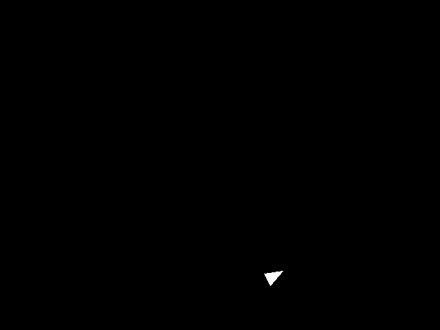
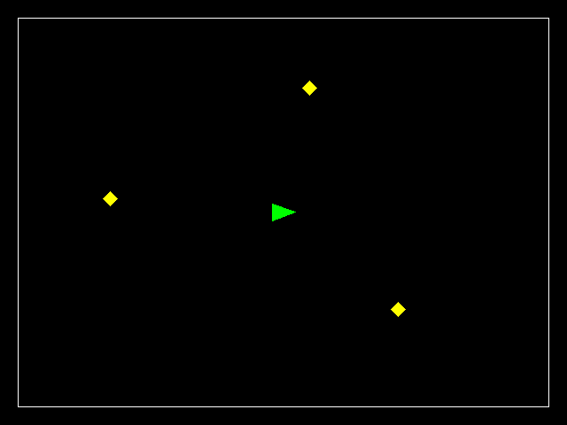

## When the style checker gives you an error proof with lots of "notes"

In some cases, you might get an error from the style checker that contains a proof of how your program might run so as to make that error happen. These messages can be long and confusing, so I want to give you some hints about how to understand them! Below is an example of a message similar to what someone got for `linked.c`.

Some general advice:

1. Look for the overall structure of things that happen in the proof. In the section I have posted here, you can see `Calling 'list_push_start'` and then also `Returning from 'list_push_start'`. The full proof of this error actually had four different function calls. This series of function calls would give you a test case file for `link_steps.csv` you could actually run!
    
2. The prover makes some assumptions. Sometimes these are obviously reasonable. For example, it assumes `argc` is 2, because otherwise your program will just quit right away and nothing interesting will happen!
    
3. The assumptions that are made are based on _your_ code. Why did it assume `argc` of 2? Well because we check `argc != 2`
    
4. If your code can in fact run the test case just fine, maybe the prover is making an **incorrect assumption that you appear to be suggesting might happen**. For example, if you have a condition `if (list->start && list->end)` meaning if the start pointer is non-null and the end pointer is also non-null, this _suggests_ that there may be a case where **one** of them is null and the other is non-null, otherwise there is no need to check both! If the prover then assumes that case might happen, it will try to make sure your code is still valid in that scenario, _even if that scenario can never happen_! A proper linked list **will never have a start of null and an non-null end, or vice versa**.
    

Here is the kind of scenario we are talking about that with a proper list, will never happen, but that the style checker will yell at you about:

```
void do_something(list_t *t) {
    if (t->start && t->end) {
        printf("We have a proper list\n");
    } else if (t->start) {
        printf("This scenario CANNOT happen with a proper list but it will crash if it does happen!");
        ((list_t*)(NULL))->val = 10;
    } else {
        printf("We have a proper empty list\n");
    }
}
```

```
/workspace/class6/linked.c:##:##: error: Access to field 'prev' results in a dereference of a null pointer (loaded from field 'start') [clang-analyzer-core.NullDereference,-warnings-as-errors]
        free(list->start->prev);
             ^
/workspace/class6/linked.c:##:##: note: Assuming 'argc' is equal to 2
    if (argc != 2) {
        ^
/workspace/class6/linked.c:##:##: note: Taking false branch
    if (argc != 2) {
    ^
/workspace/class6/linked.c:##:##: note: Assuming 'f' is non-null
    if (!f) {
        ^
/workspace/class6/linked.c:##:##: note: Taking false branch
    if (!f) {
    ^
/workspace/class6/linked.c:##:##: note: Assuming the condition is true
    while (!feof(f)) {
           ^
/workspace/class6/linked.c:##:##: note: Loop condition is true.  Entering loop body
    while (!feof(f)) {
    ^
/workspace/class6/linked.c:##:##: note: Assuming 'res' is equal to 1
        if (res != 1) {
            ^
/workspace/class6/linked.c:##:##: note: Taking false branch
        if (res != 1) {
        ^
/workspace/class6/linked.c:##:##: note: Assuming the condition is true
        if (strcmp("push_start", command) == 0) {
            ^
/workspace/class6/linked.c:##:##: note: Taking true branch
        if (strcmp("push_start", command) == 0) {
        ^
/workspace/class6/linked.c:##:##: note: Assuming 'res' is equal to 1
            if (res != 1) {
                ^
/workspace/class6/linked.c:##:##: note: Taking false branch
            if (res != 1) {
            ^
/workspace/class6/linked.c:##:##: note: Calling 'list_push_start'
            list_push_start(list, value);
            ^
/workspace/class6/linked.c:##:##: note: Field 'start' is null
    if (list->start) {
        ^
/workspace/class6/linked.c:##:##: note: Taking false branch
    if (list->start) {
    ^
/workspace/class6/linked.c:##:##: note: Returning from 'list_push_start'
            list_push_start(list, value);
            ^
/workspace/class6/linked.c:##:##: note: Assuming the condition is true
    while (!feof(f)) {
           ^
/workspace/class6/linked.c:##:##: note: Loop condition is true.  Entering loop body
    while (!feof(f)) {
    ^
/workspace/class6/linked.c:##:##: note: Assuming 'res' is equal to 1
        if (res != 1) {
            ^
/workspace/class6/linked.c:##:##: note: Taking false branch
        if (res != 1) {
        ^
/workspace/class6/linked.c:##:##: note: Assuming the condition is true
        if (strcmp("push_start", command) == 0) {
            ^
/workspace/class6/linked.c:##:##: note: Taking true branch
        if (strcmp("push_start", command) == 0) {
        ^
/workspace/class6/linked.c:##:##: note: Assuming 'res' is equal to 1
            if (res != 1) {

```

## Have a group discussion of this scenario!

After talking about the scenario, please also talk about the question: "How might your future career be different if you are a super-star programmer vs. just an okay programmer (meaning you hadn't taken 502)?"

## git pull upstream master

I have made several changes to the default files for this assignment folder, so please run:

```
git pull upstream master
```

#### A note on program organization

This homework is considerably more complex than the last one. I suggest that you organize your code into different files so that your code is easy to reuse between problems 1 and 2, and so that it is easy for you to keep related code together.

I have the following files for rasterize:

```
// don't modify these!
image_server.c
image_server.h
// Only has bmp_serialize and bmp_calculate_size
bmp.c
bmp.h
// only has _create, _append, and _destroy functions
vector_xy_t.c
vector_xy_t.h
vector_xy_i32_t.c
vector_xy_i32_t.h
// contains ALL of the gx_ functions
graphics.c
graphics.h
// contains a minimal amount of code, just enough to call the right functions from graphics.h, bmp.h, and image_server.h for the specific test cases we have
rasterize.c
```

For braitenberg, I reuse all the files from above except for `rasterize.c` and I also have these files:

```
// slightly modified from homework 1, they provide a single function
// bool check_collides(vector_xy_t *pg1, vector_xy_t *pg2);
collision.c
collision.h

// contains just the code specific to braitenberg
braitenberg.c
```

All of your relevant `.c` files will be needed on your makefile target line (the line with the name of your program and then a colon followed by code files). Your makefile may also need to have `-lpthread` at the end of the `gcc` compilation line. This is because image\_server.c makes a new thread to run the server in the background, and the threading library also needs to be linked in, just like the math library can be linked in with `-lm`.

Accordingly, my makefile has the following section for rasterize:

```
rasterize: rasterize.c vector_xy_t.c vector_xy_i32_t.c image_server.c bmp.c graphics.c
	gcc -o $@ $^ $(CFLAGS) -lm -lpthread
```

## Problem 1: rasterize

In this problem we will build a graphics subsystem for our robotics simulation. We will start by constructing a 64 by 48 black image, encoding this as a bitmap (".bmp") image file, and then using the provided image server to show the image in your browser. This problem and homework are very involved so please start early and ask for as much help as necessary. We will likely spend a class period for introducing each part of this homework to give the support and time needed for it.

### Test case 0: A black 64 by 48 bitmap image

In this first task, and the first test case for this problem, we need to construct a valid Microsoft bitmap image. This image format is simple because it supports completely uncompressed images, meaning images that directly contain the RGB (red, green, and blue) values for every pixel. For a black image, we specify 0 for the RGB values for every pixel. For a 64 by 48 image, that would end up being 64 \* 48 \* 3 = 9216 bytes of zero values!

The pixels are organized in rows, so the first pixel of the first row, at index 0, is in the top-left corner of the image. The whole first row contains the pixels from indices 0 through 63. After the first row is full, we have the first pixel of the second row at index 64. The third row starts at index 128 (width \* 2), and so forth.

For a 4 by 4 image, that indices of pixels would map to pixels like so:

```
0   1   2   3
4   5   6   7
8   9   10  11
12  13  14  15
```

#### Making the black image

We have provided a C header file `bmp.h` with various definitions to make this problem easier. We can construct a `bitmap_t` to represent our black image like this:

```
#include "bmp.h"

int main(void) {
    bitmap_t bmp = { 0 }; // initialize to zeros
    bmp.width = 64;
    bmp.height = 48;
    // color_bgr_t represents the color for each pixel
    // calloc gives enough space for width*height of these pixels
    // and calloc also sets the initial values of all of these to zero (black)
    // NOTE that the end of one row is directly followed by the beginning
    // of the next row in the data array!
    bmp.data = calloc(width * height, sizeof(color_bgr_t));

    // if we wanted to make the first pixel white
    // bmp.data[0].r = 255;
    // bmp.data[0].g = 255;
    // bmp.data[0].b = 255;
    // if we wanted to set pixel [10, 10] white
    // bmp.data[bmp.width * 10 + 10].r = 255;
    // bmp.data[bmp.width * 10 + 10].g = 255;
    // bmp.data[bmp.width * 10 + 10].b = 255;

    // remember to later free the bmp.data when we are done using it
    free(bmp.data);

    return 0;
}
```

#### Creating the bitmap format headers

Unfortunately, we also have to provide some extra information about the image so that the computer knows how to interpret it. For an uncompressed image, the bitmap format will contain two headers of information about the image followed by the RGB pixel data.

The `bmp.h` header file also contains the formal definitions of these necessary headers, as provided by Microsoft. These two headers come at the very beginning of the bitmap in order:

- First we have the [`BITMAPFILEHEADER`](https://docs.microsoft.com/en-us/windows/win32/api/wingdi/ns-wingdi-bitmapfileheader). This header marks the file as a bitmap image and includes the size in bytes of the image and the offset of the actual pixel data from the start of the file. This means we could skip ahead to the pixel data directly if we like, without looking at the next section.
- Following this is the [`BITMAPINFOHEADER`](https://docs.microsoft.com/en-us/windows/win32/api/wingdi/ns-wingdi-bitmapinfoheader), which specifies the width and height of the image, the number of bits per pixel (we use 24 for RGB color, 1 byte for each of red, green, and blue), whether it is compressed, and the resolution in pixels per meter.

Use the linked descriptions above and the information below to carefully fill out these structures for our simple image, given the `bitmap_t` from above which has the width and height values.

```
BITMAPFILEHEADER file_header = { 0 }; // start out as all zero values
file_header.bfType = ...;
file_header.bfSize = ...;
file_header.bfOffBits = ...;

BITMAPINFOHEADER info_header = { 0 };
info_header.biSize = ...;
info_header.biWidth = ...;
info_header.biHeight = ...;
...
```

- When the `BITMAPFILEHEADER` says that the `bfType` needs to be `BM` it means the first byte of the file is the character `'B'` (`0x42`) and the second is `'M'` (`0x4d`). It can be tricky to get the order of these right when they are packed into a 16-bit number. Perhaps try both 0x424d and 0x4d42, or even change the structure to split `bfType` into two single bytes you assign separately.
- Specify `2835` as the number of pixels per meter for `biXPelsPerMeter` and `biYPelsPerMeter`. This is about equal to 72 dpi and apparently people use this as a reasonable default.
- `biCompression` of 0 means uncompressed. (`BI_RGB` in the specification has a value of 0.)
- `biSizeImage` can be 0 for uncompressed images, so go ahead and use zero!
- All the fields you don't use can be set to/left at 0. For example, `biClrUsed`.
- You may have noticed the odd `__attribute__((__packed__))` in the declaration of the structures in the file, and this line instructs the compiler to not add any extra padding bytes to those structures. This is important if we want to directly use the structures with memcpy as parts of the file which needs to have the exact right order and size of bytes.

#### Serializing the whole bitmap image

The next step is figuring out how to put all these sections, including the two headers and the pixel data, together into one continuous stream of bytes.

In `bmp.h` we have written a couple of _function prototypes_, which give the names and types of functions, but don't give their code. When you want to use these functions from another file, you include the header file. In `bmp.c` the same functions appear again and this is where you write your code for them. You don't `#include` the `.c` file. Instead you give all the `.c` source files to the compiler in your makefile.

The two functions are `bmp_calculate_size` and `bmp_serialize`. The idea is that first you calculate the number of bytes that your bmp will need, then you can `malloc` that amount of space, and finally you _serialize_ the image by writing it out byte by byte onto the buffer you just allocated.

```
#include "bmp.h"

int main(void) {
    bitmap_t bmp = { 0 };
    // set bmp width and height
    // allocate bytes for bmp.data
    // set pixels in bmp.data, for example:
    bmp.data[0].r = 255;

    size_t bmp_size = bmp_calculate_size(&bmp);
    uint8_t *serialized_bmp = malloc(bmp_size);
    bmp_serialize(&bmp, serialized_bmp);
    // serialized_bmp now has the full bmp formatted image

    // write to a file so we can check if it is a valid image
    // note we ONLY do this for debugging this test case 0
    // do not keep this for code you submit
    FILE *f = fopen("my_image.bmp", "wb");
    fwrite(serialized_bmp, bmp_size, 1, f);
    fclose(f);

    // free stuff we malloced

    return 0;
}
```

Now let's write the code for them in `bmp.c`:

For the total size in `bmp_calculate_size` you will want to use the `sizeof` operator in C to get the sizes of the required headers: e.g. `sizeof(BITMAPFILEHEADER)`. Compute the total size in bytes of the two headers and all the BGR pixel data.

For the actual serialization of the image, first set the fields of the header structures based on the documentation linked above and the hints below. Once you have constructed the fields, it is actually fairly easy to copy them to a memory buffer. Here we use `memcpy` to copy the entire structures over.

Next is the pixel data itself. There are some quirks to this:

1. Each pixel is given in BGR order, not the standard RGB.
2. The rows are inverted with the bottom row first and the top row last.
3. If the number of bytes in a row are not an even multiple of 4-bytes, extra 0 valued bytes are padded on the end of the row. As long as the image width is a multiple of 4 (which it is), we don’t have to worry about this.

Quirk 1 is handled by using the `color_bgr_t` type to store the image data in `bitmap_t`. This structure correctly orders the data with blue first and red last. Quirk 3 is also not a problem because we will always use the same image dimensions. So we only have to specially deal with quirk 2 by flipping the order of the rows in the serialized output.

Generally, using `memcpy` will be much faster for copying large amounts of data at a time. You will probably also want to use it for copying over each row of pixels:

```
void bmp_serialize(bitmap_t *bmp, uint8_t *data) {
    BITMAPFILEHEADER file_header = { 0 }; // start out as all zero values
    BITMAPINFOHEADER info_header = { 0 };

    // set all the interesting fields in file_header and info_header

    // keep track of the next place we should write in the data buffer
    uint8_t *data_out = data;

    memcpy(data_out, &file_header, sizeof(file_header)); // write X number of bytes
    data_out += sizeof(file_header); // and then move data_out forward X bytes

    memcpy(data_out, &info_header, sizeof(info_header));
    data_out += sizeof(info_header);

    for each row of pixel data, going from the bottom to the top {
        memcpy(data_out, &bmp.data[beginning of row], size of row of pixels in bytes));
        data_out += size of row of pixels in bytes;
    }
}
```

I recommend trying to duplicate the provided sample `all_black_img.bmp` with the below debugging suggestions before completely finishing this task.

#### Debugging suggestions:

For debugging purposes, you might find it useful use `printf` to display your serialized data as hexadecimal. For example:

```
bmp_serialize(&bmp, serialized_bmp);
for (int i = 0; i < 16; i++) {
    // %x is for hexadecimal
    // 02 tells it to print the leading zeros (0) of each byte (2 characters)
    // so "0e" instead of just "e"
    printf("%02x ", serialized_bmp[i]);
}
printf("\n");
```

You can then compare this to the sample file `all_black_img.bmp` that we have provided. You can use the `xxd` command to print out a section of that file as hexadecimal, for example the same first 16 bytes:

```
xxd -l 16 all_black_img.bmp
```

It should should you three sections: the offset, or distance into the file, in hexadecimal on the left; the data in hexadecimal in the middle; and the data in ASCII text on the right, with some substitutions for characters that don't print nicely.

You can confirm that a bitmap file `my_image.bmp` is identical to `all_black_img.bmp` by using the `diff` command:

```
diff my_image.bmp all_black_img.bmp
```

If the files are different it will print out a message saying so.

Once you have an all-black image, try making an image all of some other color. This makes for a good test of the logic in your bmp\_serialize, since if you miscopy any part of the image, that part you miss will still be black.

#### Using the image server to display your image

Once you think the bmp image is being constructed correctly, you can give it to the provided image server to show in your browser.

The code in `image_server.c` will take a bitmap image file you have constructed and will serve it at `http://localhost:8000/image.bmp` so that you can see the image in your browser. For your convenience, open the provided `animation.html` file. This page will automatically refresh the image for you, so if it open and visible when you run your program, the image should show up.

Use the image server like this:

```
#include <unistd.h>
#include "image_server.h"

int main(void) {
    ...
    size_t image_size = // calculate the size of the image
    uint8_t *image_data = malloc(image_size);
    // make image_data a valid bmp image file (the whole file!)

    image_server_set_data(image_size, image_data);

    // the auto-grader will give you a port to use
    // but set this to 8000 for your own testing
    image_server_start("8000");
    sleep(1);
    ...
    return 0;
}
```

We use the `sleep` (from `unistd.h`) function because the image server is started in "the background" and if your main program quits, so will the image server. This way, the main program runs for 1 second before it quits.

### Test case 1: Clearing the image to a color

Write a function to set the entire image to a single color:

```
void gx_clear(bitmap_t *bmp, color_bgr_t color);
```

Use this function to make a red **320 by 240 image**. If you have trouble getting all the pixels to show red, this may indicate some problem with how you are copying the rows of pixels in `bmp_serialize`.

Later on you may use this function to clear the whole image back to black.

### Test case 2: Rasterizing a line with Bresenham's line-drawing algorithm

Now that we can make a valid image file, we get to start drawing on it. The primitive we will be using for this is line drawing, which we will be able to expand to arbitrary shapes.

We will implement [Bresenham's line algorithm](https://en.wikipedia.org/wiki/Bresenham%27s_line_algorithm). The algorithm is based around the idea of accumulating the pixelation error between the ideal line and the last drawn pixel. You should implement the final version of the algorithm on the linked Wikipedia page because it is the most succinct, handling all four quadrants of line orientations at the same time. I have copied it here verbatim in case the Wikipedia page changes:

```
plotLine(int x0, int y0, int x1, int y1)
   dx = abs(x1-x0);
   sx = x0<x1 ? 1 : -1;
   dy = -abs(y1-y0);
   sy = y0<y1 ? 1 : -1;
   err = dx+dy;  /* error value e_xy */
   while (true)   /* loop */
       plot(x0, y0); // instead of plotting, save the pixel location (x0, y0)
       if (x0==x1 && y0==y1) break;
       e2 = 2*err;
       if (e2 >= dy)
           err += dy; /* e_xy+e_x > 0 */
           x0 += sx;
       end if
       if (e2 <= dx) /* e_xy+e_y < 0 */
           err += dx;
           y0 += sy;
       end if
   end while
```

If you are not familiar with the notation like `sx = x0<x1 ? 1 : -1;`, this is called the ternary operator, and it exists in C and several other languages. It is a short kind of if-else statement, in the form of (condition) ? if-true-value : else-value. Here it is short for:

```
if x0 < x1
    sx = 1
else
    sx = -1
endif
```

Line rasterization will be used in several different ways in this problem, so we want to make it useful generally. Implement it to have the following function signature, or something very similar. The important thing is that it mallocs and returns a vector of points, and each point has an `int32_t` for both x and y.

```
vector_xy_i32_t *gx_rasterize_line(int x0, int y0, int x1, int y1);
```

Choose the right location in the `while` loop to append the current (x0, y0) point to the vector, and use vector functions to perform the vector operations:

```
// In vector_xy_i32_t.h

typedef struct vector_xy_i32 {
    ... // use the same fields as we did in golomb.c
} vector_xy_i32_t;

vector_xy_i32_t *vector_xy_i32_create(void);
void vector_xy_i32_append(vector_xy_i32_t *vec, int32_t x, int32_t y);
void vector_xy_i32_destroy(vector_xy_i32_t *vec);

// Then give the implementations in vector_xy_i32_t.c, including this example
vector_xy_i32_t *vector_xy_i32_create(void) {
    // We malloc the space for a vec so we can return a pointer to it
    vector_xy_i32_t *vec = malloc(sizeof(vector_xy_i32_t));
    ...

    return vec;
}
```

Then also implement a function to color in the line, simply iterating through the points and coloring the pixels.

```
void gx_draw_line(bitmap_t *bmp, vector_xy_i32_t *points, color_bgr_t color);
```

Having this color as a function argument makes it very easy to set the pixels, something like this:

```
bmp->data[y * bmp->width + x] = color;
```

This test case is to draw a white line from (10, 10) to (200, 200) on a black background of size 640 by 480.

### Test case 3: Drawing a polygon

Now that we can draw lines, we should move up a level of abstraction. A polygon is just a series of points with the last one connecting back to the first, so if we use a vector of points we will be able to handle polygons in general. Now while it is tempting to use the same vector of integer points that we made in the last section, we should actually make a new type that holds a vector of floating point (e.g. double) points. This will help us to correctly handle collisions and rounding.

The winding order of points in polygons will affect how the Bresenham's algorithm rasterizes them, so you must use a clockwise winding order. Carefully make sure this order is maintained in all of your polygons, knowing that the origin of the image is (0, 0) in the top left corner and that x increases rightward and y increases downward.

Write a function to construct a rectangle with a given width and height, centered at (0, 0). This function should return a vector of vertex points. We make it always centered at (0, 0) because this makes it easier to rotate the shape later.

You can make a very similar vector for vertices, the only difference from `vector_xy_i32_t` is that it uses `double` for x and y instead of `int32_t`.

```
// In vector_xy_t.h

typedef struct vector_xy {
    ... // use the same fields as we did in golomb.c
} vector_xy_t;

vector_xy_t *vector_xy_create(void);
void vector_xy_append(vector_xy_t *vec, double x, double y);
void vector_xy_destroy(vector_xy_t *vec);

// Then give the implementations in vector_xy_t.c, including this example
vector_xy_t *vector_xy_create(void) {
    // We malloc the space for a vec so we can return a pointer to it
    vector_xy_t *vec = malloc(sizeof(vector_xy_t));
    ...

    return vec;
}
```

#### Point "rounding"

Before we draw them we have to handle "rounding". The goal of this rounding is to preserve the size of polygons and to not draw overlapping polygons that do not overlap mathematically. Our simple method for this is:

```
if point.x is the minimum x in the polygon {
    output.x = ceiling(point.x)
} else {
    output.x = floor(point.x - epsilon)
}
```

The y-values are also handled in the same way. Epsilon can be any small value, for example `1e-6`.

> This pseudocode works by rounding polygon points inward, and using epsilon so that integer polygon intervals are closed on the low side and open on the right side. If we wanted to draw a box of width 4, from 1 to 5, this would fill in pixels 1, 2, 3, 4, for a total width of 4. If the box were from 1.1 to 5.1, it would fill in pixels 2, 3, 4, 5. Unfortunately, there are some corner cases with slanted lines where it is still possible for polygons to be drawn slightly overlapping that do not actually touch.

Then also write a polygon drawing function that takes a vector of points, performs the above rounding, and draws the lines to connect them.

The test case for this problem is to draw a 4 by 4 pixel white square centered at (0, 0). This square would naturally extend from -2 to 2, would round to -2 to 1, and then the negative coordinate pixels should not be drawn. You should get the lower-right 2 by 2 pixel section of the total square. Note that this square is not filled in yet! And this is still on a black background of size 640 by 480.

For all rasterize test cases (all of them from here onward) that perform this rounding, print out the values both before and after the rounding with "%.5f" (order of the points/lines does not matter):

```
./rasterize 3
Before rounding: -2.00000 -2.00000
Before rounding: 2.00000 -2.00000
Before rounding: 2.00000 2.00000
Before rounding: -2.00000 2.00000
After rounding: -2.00000 -2.00000
After rounding: 1.00000 -2.00000
After rounding: 1.00000 1.00000
After rounding: -2.00000 1.00000
```

### Test cases 4, 5, 6: Translation

Implement a function to translate a vector of polygon vertex points by a constant x and y.

Test case 4 is to draw a 4 by 4 pixel white square centered at (2, 2). Now the whole square should be visible.

Test case 5 is to draw a 5 by 5 pixel white square centered at (2, 2). The whole square should also be visible. If you have trouble with this test, look back at how to do the polygon rounding again.

Test case 6 is to draw a 600 (width - 40) by 440 (height - 40) white border centered at the center of the image (640 / 2, 480 / 2). The border's top left pixel will be at (20, 20) and the bottom right corner at (619, 459).

### Test case 7: Filling a convex polygon

Now let us figure out how to fill in polygons instead of just drawing their outlines.

The basic algorithm we will use is described on this [StackOverflow post](https://stackoverflow.com/a/19078088/726723). We are going to use a slightly simplified version:

- Construct two buffers to mark the starting and ending x-value for each horizontal fill line, and initially fill them with -1 values. Make the buffers the same size as the image's height. We can call them `x0[]` and `x1[]`.
- Iterate through each point (x, y) of each rasterized line, finding the minimum and maximum values of x for each value of y.
    - If `x0[y] == -1` then set both `x0[y] = x` and `x1[y] = x`
    - Otherwise, set `x0[y] = min(x0[y], x)` and `x1[y] = max(x1[y], x)`.
- Finally, iterate through the buffers, starting at the minimum y value we encountered and ending at the maximum y value we encountered. Fill in all the pixels between (x0\[y\], y) and (x1\[y\], y).

This test case is to fill in the rectangle in test case 6. Filled in pixels should still reach exactly from (20, 20) to (619, 459).

### Test case 8: A "robot" triangle

A triangle poses a very nice shape to represent a robot because it is geometrically simple and has a clear forward orientation.

Write a function to construct a path (vector of points) of an isosceles triangle that is 20 "wide" in y, and 20.0 \* 4 / 3 = 26.66... long in x (use the full precision of the fraction), and that points in the positive x-direction. It should be centered at (0, 0). Make sure the points are in clockwise order, as described above.

This test case is to fill in this robot shape, translated to/centered at (400, 400). It will not appear completely symmetrical.

### Test case 9: Rotation

Now implement a function that takes a path (vector of points) and rotates them by some angle in radians. Please please always use radians or you will likely get rounding errors at some point later in this assignment.

This test case is the same test case 8, but with the robot rotated pi/6 radians (30 degrees) counterclockwise. **Note that because we have y-down, this will need to be a negative rotation!** Note it should still be centered at (400, 400).

This test case should look like so: 

### Evaluation

Your program should take the number of a test case and serve that image using the image server on the given port number. Make the port number optional and default to 8000 if you leave it off. Your program should make a reasonable error if the test case given does not exist. Your program should sleep for one second before exiting.

```
./rasterize
usage: ./rasterize <test case> [<port number=8000>]
./rasterize -1
didn't recognize test case -1
./rasterize 0
./rasterize 1 8000
./rasterize 3
Before rounding: -2.00000 -2.00000
Before rounding: 2.00000 -2.00000
Before rounding: 2.00000 2.00000
Before rounding: -2.00000 2.00000
After rounding: -2.00000 -2.00000
After rounding: 1.00000 -2.00000
After rounding: 1.00000 1.00000
After rounding: -2.00000 1.00000
```

## Problem 2: braitenberg

In this problem we will implement and visualize a simple [Braitenberg vehicle](https://en.wikipedia.org/wiki/Braitenberg_vehicle). We will also incorporate the collision detection code that we wrote in the last homework.

The vehicle we will implement is the 2b type, which has two "light sensors". The more light received by the left light, the faster the right wheel turns. The more light received by the right light, the faster the left wheel turns. This will cause the vehicle to turn towards a light source, accelerating as it gets closer.

We will make our light sensors each point 60 degrees off from the robot's forwards direction. So the left sensor will be `theta - pi / 3` and the right sensor `theta + pi / 3`. Your code should only ever use radians and not degrees. We will assume that the amount of light received will be equal to the dot product of the light sensor's direction and the robot-to-lamp direction, multiplied by the light's intensity and divided by the squared distance. We will not worry terribly much about the units. The light intensity value we will use is 100000. Each wheel of the robot will max out at 12 pixels per time step, and the wheels will only be able to turn forwards. For calculating rotation with a differential drive model, we will use a wheel base value of 80 pixels. (Yes I know it doesn't make much sense, given the robot is only 20 pixels wide, but the values worked out well like this).

We will simulate three "lamps" with locations:

```
(124.1, 224.1)
(349.1, 99.1)
(449.1, 349.1)
```

The size of each lamp is a 12 by 12 square rotated by 45 degrees (pi / 4) like a diamond shape.

The robot will have an initial location at the center of the canvas, with theta of 0 (pointing to the right in the positive x direction).

We will use the same graphics primitives that we developed in the first problem.

At each time step we take the following steps:

- Update movement
- Check for and completely resolve collisions
- Update graphics
- Sleep for 40ms to make a 25fps animation.

### Updating movement

```
move_l = 0
move_r = 0
for each lamp l:
    dist_sq = squared distance from robot to lamp l
    dir = unit vector pointing from robot to lamp l
    eye_l = unit vector pointing at angle theta - 60 degrees
    eye_r = unit vector pointing at angle theta + 60 degrees
    move_l += max(0.0, dir . eye_r) * lamp_power / dist_sq
    move_r += max(0.0, dir . eye_l) * lamp_power / dist_sq

move_l = min(max_movement, move_l)
move_r = min(max_movement, move_r)

theta += (move_l - move_r) / wheel_base
forward_dist = (move_l + move_r) / 2
move robot forward_dist in the theta direction
```

Note that you need to be careful with your axis coordinates because on the screen, x is positive to the right, but y is negative going up. This makes the z-axis go down into the screen, so positive rotations are clockwise.

### Updating graphics

- Start with a black 640 by 480 canvas.
- Draw a white border as in the fifth test case above, with corners at (20, 20) and (619, 459).
- Draw each lamp as a yellow (255 in red and green, 0 in blue) diamond (45 degree rotated rectangle) centered on the lamp's location.
- Draw the robot as a green (255 in green, 0 in red and blue) robot triangle.

We have included a file `animation.html` which you can open in Firefox and will keep an up-to-date view (as long as the page isn't hidden) of whatever is being served on `http://localhost:8000/image.bmp`. This page doesn't currently refresh properly in Chrome.

The initial graphics at time 0 should look like so: 

### The 40ms sleep

Unfortunately, functions in C to sleep (that is, suspend the program's execution for a little while) are different depending on the operating system.

The best supported way to sleep on Linux is currently with `nanosleep`.

Because it is still not entirely standard, we have to use a preprocessor define to tell the compiler that we are okay with using special Linux functions. You can use it like this.

```
#define _GNU_SOURCE // this must come before ALL the #include's in order to work
#include <time.h>

...

int seconds = 0;
long nanoseconds = 40 * 1000 * 1000;
struct timespec interval = { seconds, nanoseconds };
nanosleep(&interval, NULL);
```

### Printing of robot shape points

At each timestep, you should print out the points of the robot's shape, both before and after rounding, much like we did in rasterize:

```
./braitenberg 1 1
0: Before rounding: 333.33333 240.00000
0: Before rounding: 306.66667 250.00000
0: Before rounding: 306.66667 230.00000
0: After rounding: 333.00000 239.00000
0: After rounding: 307.00000 249.00000
0: After rounding: 307.00000 230.00000
1: Before rounding: 337.27066 239.72093
1: Before rounding: 310.76904 250.15046
1: Before rounding: 310.44591 230.15307
1: After rounding: 337.00000 239.00000
1: After rounding: 310.00000 250.00000
1: After rounding: 311.00000 231.00000
```

### Collisions

You should adapt the collision detection code you wrote in the first homework to detect collisions between the robot and the lamps. In particular, your code should operate on the new dynamic arrays of points that we are now using.

We will not be particularly elegant in how we resolve collisions. If the robot is ever in collision with a lamp, then the robot should move a total of 0.5 pixel distance away from the obstacle along the vector between the robot and that obstacle's center. Then check if the collision is resolved, and if not, move the robot again, and repeat until the collision is gone. This all happens in the same time step that the collision originated in; we will not update graphics until all the collisions have been resolved.

The robot will never be in collision with the boundary walls, so we can neglect checking those for collisions.

Note that since we use increments of 0.5 pixels, we will likely move more than the minimum distance needed to resolve collisions and this is okay.

For any timestep that had at least one collision, report this occurrence a single time:

```
##: Lamp collision
```

### Evaluation

Your program should take the number of time steps to run for as well as a parameter to mark the "speed" of running the simulation. What we have described above is the "slow" version for watching the animation and debugging. As in rasterize, you will also need to accept an optional final argument of port number to run the image server on so that it can be something other than "8000".

When in "fast" mode:

- Don't include any of the 40ms sleeps between time steps
- Don't update graphics until all time steps have finished
- Do update graphics a single time at the very end
- Sleep for 1 second after updating the graphics

The following are the test cases we will use to check your code. Note that following all the instructions exactly is very important because we will be looking for every pixel to be correct! The tests will indicate which pixels are incorrect. The tests are set up to measure before and after various collisions.

```
./braitenberg
usage: %s <time steps> <fast=0|1> [<port number=8000>]
./braitenberg 0 1 8000
./braitenberg 1 1
./braitenberg 35 1
./braitenberg 36 1
./braitenberg 42 1
./braitenberg 250 1
```
