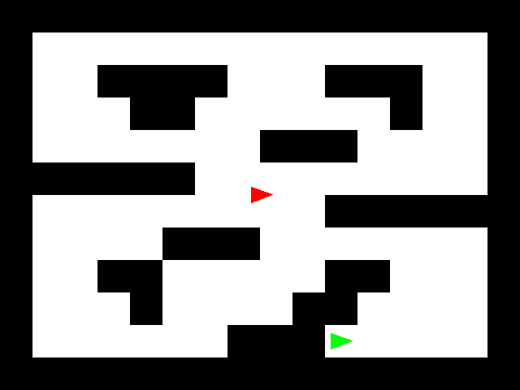

## Due Friday, November 06 06:00PM

### Header files and organization for homework2

`vector_xy_t.h`:

```
typedef struct xy {
    double x;
    double y;
} xy_t;

typedef struct vector_xy {
    uint32_t size;
    uint32_t capacity;
    xy_t *data;
} vector_xy_t;

vector_xy_t *vector_xy_create(void);

void vector_xy_destroy(vector_xy_t *vec);

void vector_xy_append(vector_xy_t *vec, xy_t value);
```

`vector_xy_i32_t.h`:

```
typedef struct xy_i32 {
    int32_t x;
    int32_t y;
} xy_i32_t;

typedef struct vector_xy_i32 {
    uint32_t size;
    uint32_t capacity;
    xy_i32_t *data;
} vector_xy_i32_t;

vector_xy_i32_t *vector_xy_i32_create(void);

void vector_xy_i32_destroy(vector_xy_i32_t *vec);

void vector_xy_i32_append(vector_xy_i32_t *vec, xy_i32_t value);
```

`graphics.h`:

```
vector_xy_i32_t *gx_rasterize_line(int x0, int y0, int x1, int y1);

void gx_draw_line(bitmap_t *bmp, color_bgr_t color, int x0, int y0, int x1, int y1);

vector_xy_t *gx_round_points(vector_xy_t *points);

void gx_draw(bitmap_t *bmp, color_bgr_t color, vector_xy_t *points);

void gx_fill(bitmap_t *bmp, color_bgr_t color, vector_xy_t *points);

void gx_clear(bitmap_t *bmp, color_bgr_t color);

vector_xy_t *gx_rect(double width, double height);

vector_xy_t *gx_robot(double dim);

vector_xy_t *gx_rot(double theta, vector_xy_t *points);

vector_xy_t *gx_trans(double x, double y, vector_xy_t *points);
```

`collision.h`:

```
bool check_collides(vector_xy_t *pg1, vector_xy_t *pg2);
```

`rasterize.c`:

```
void print_rounding_points(vector_xy_t *points);
void draw_case(bitmap_t *bmp, int test_case);
int main(int argc, char **argv);
```

`braitenberg.c`:

```
typedef struct state {
    int time_step;
    bitmap_t bmp;
    size_t image_size;
    uint8_t *image_data;

    double x;
    double y;
    double theta;
} state_t;

void print_rounding_for_robot(state_t *state);
void update_collisions(state_t *state);
void update_movement(state_t *state);
void update_graphics(state_t *state);
int main(int argc, char **argv);
```

### Clicker Questions

Use p4r-clicker to submit your answer

```
int val1 = 10;
int val2 = 20;
int *b = &val1;
int *c = b;
int **d = &b;

printf("%d\n", **d); // 1

*b = 1;
b = &val2;

printf("%d\n", *b); // 2
printf("%d\n", *c); // 3
printf("%d\n", **d); // 4

*d = &val1;

printf("%d\n", *b); // 5
printf("%d\n", *c); // 6
printf("%d\n", **d); // 7
```

## Problem 1: calc

In this problem we will be parsing mathematical expressions that include addition/subtraction, multiplication/division, and parenthesis.

We will use a technique called recursive-descent top-down parsing, where the program starts at a high-level abstraction and gradually reaches the most basic elements. We start with some kind of [formal grammar](http://matt.might.net/articles/grammars-bnf-ebnf/), which defines the syntax we are going to parse.

Please watch this video about how top-down parsing works: [https://www.youtube.com/watch?v=bxpc9Pp5pZM](https://www.youtube.com/watch?v=bxpc9Pp5pZM)

Here is another example video of writing a simpler calculator: [https://www.youtube.com/watch?v=N55XNj8KjC4](https://www.youtube.com/watch?v=N55XNj8KjC4)

We are using square brackets below to denote optional parts. In addition, white space (spaces, tabs, new line, or carriage return characters) in this grammar are not significant. In the expressions we parse here, white spaces are allowed anywhere _except for in number literals_.

```
additive-expression:
    multiplicative-expression
    additive-expression + multiplicative-expression
    additive-expression - multiplicative-expression
multiplicative-expression:
    parenthesis-expression
    multiplicative-expression * parenthesis-expression
    multiplicative-expression / parenthesis-expression
parenthesis-expression:
    number-literal
    ( additive-expression )
number-literal:
    [sign] [digits] . digits
    [sign] digits [.]
sign:
    +
    -
digits:
    digit [digits]
digit:
    a digit 0 to 9
```

The basic idea for parsing your input text is to start at the highest level, `additive-expression`, and define it in terms of the simpler segments.

For example, referring to some of the functions given below:

```
additive_expression(input_string) {
    value = multiplicative_expression

    // use the peak function to check the next character
    while the next character (skipping whitespace) is a '+' or '-' {
        // use the parse_token function to save that + or - so that we perform the correct operation
        add or subtract multiplicative_expression from existing value
    }
    return value
}
```

Parsing the floating point literals will be a little tricky, so make sure to follow the grammar carefully. You may use `sscanf` to do the actual number conversion, but you will still need to verify the format and correctly pass over the number literal.

Each expression level has to both return a value and also move the equation pointer along. The simplest way to do this is by passing a pointer to a pointer at each step. Here are some of the lowest level functions to use to help you out:

```
#include <ctype.h>

void skip_whitespace(char **str) {
    while (isspace(*str[0])) {
        (*str)++;
    }
}

// returns the next character, skipping whitespace
// without consuming that character
// calling this multiple times in a row returns the same character
char peak(char **str) {
    skip_whitespace(str);
    return *str[0];
}

// returns the next character, skipping whitespace
// and it _does_ consume that character
char parse_token(char **str) {
    skip_whitespace(str);
    char token = *str[0];
    if (!token) {
        fprintf(stderr, "parsing error. unexpected end of string\n");
        exit(1);
    }
    (*str)++;
    return token;
}
```

Your program's only output should be the result number printed with "%lf\\n", or an error message from a parsing error. Error messages should include what character was expected and what character the parser actually found. Those single characters should be in single quotes.

Here are some examples:

```
./calc
usage: ./calc <statement>
./calc 1
1.000000
./calc .5
0.500000
./calc +1.
1.000000
./calc +1.0e10
parsing error. unexpected junk at end. got 'e'
./calc 1+2
3.000000
./calc '2*10'
20.000000
./calc 10/a
parsing error. expected number (0-9,+,-,.) got 'a'
./calc '1 0'
parsing error. unexpected junk at end. got '0'
./calc '(1 0'
parsing error. expected ')' got '0'
```

The error message `unexpected junk at end.` means that we successfully call `additive_expression` on the whole string and we get a result, but the string pointer still does not point to the null character. This means that we could not parse the entire equation, and we consider this an error.

## Problem 2: chase

In this problem we will program one robot (the "chaser") to chase after another robot (the "runner").

You have already written the majority of the code needed for this problem, so you should start by copying over all the files you used for homework 2's braitenberg problem.



### Use a state structure

Improve your program data organization by using a state structure to hold important program variables. This makes it easy to pass all these values to relevant functions. This is the one I used for the _braitenberg_ problem:

```
typedef struct state {
    int time_step;
    bitmap_t bmp;
    size_t image_size;
    uint8_t *image_data;

    double x;
    double y;
    double theta;
} state_t;

void update_collisions(state_t *state);
void update_movement(state_t *state);
void update_graphics(state_t *state);
```

### Map setup

Include the following code to specify the map of the environment we are using:

```
#define WIDTH 640
#define HEIGHT 480

#define BLOCK_SIZE 40
#define MAP "XXXXXXXXXXXXXXXX" \
            "X              X" \
            "X  XXXX   XXX  X" \
            "X   XX      X  X" \
            "X       XXX    X" \
            "XXXXXX         X" \
            "X         XXXXXX" \
            "X    XXX       X" \
            "X  XX     XX   X" \
            "X   X    XX    X" \
            "X      XXX     X" \
            "XXXXXXXXXXXXXXXX"
#define MAP_W (WIDTH / BLOCK_SIZE)
#define MAP_H (HEIGHT / BLOCK_SIZE)
```

Wherever there is an `X` in the map, draw a `BLOCK_SIZE` by `BLOCK_SIZE` black square, leaving the remainder of the image white. Modify your previous rectangle function to _not_ center the rectangles. This will make it easier to fit them all on the image.

Draw the chaser robot red, and have it start at the center of the image, pointing to the right.

Add one more command-line argument to your program to accept the map index at which the runner robot should start:

```
./chase
usage: ./chase <time steps> <fast=0|1|2> <initial runner index>
```

Draw the runner robot green, and have it start at the center of that map location. You can do that like this:

```
int map_idx_x = initial_runner_idx % MAP_W;
int map_idx_y = initial_runner_idx / MAP_W;
state->runner.x = (map_idx_x + 0.5) * BLOCK_SIZE;
state->runner.y = (map_idx_y + 0.5) * BLOCK_SIZE;
```

### Action model for the robots

The state of each robot can be described by location (x and y), orientation, forward velocity, and angular velocity.

At each time step, the robots have several actions available to them:

- 0: Do nothing
- 1: Increase velocity by 2, capped to a max velocity of 12
- 2: Increase angular velocity by PI / 16 in the counterclockwise direction
- 3: And for the chaser only, increase angular velocity by PI / 16 in the clockwise direction

In addition, angular velocity decays by a factor of 0.8 on each step, and forward velocity is cut in four if the robot has a collision.

In total, movement proceeds like this, _first_ for the chaser and then for the runner:

```
apply action
theta += angular velocity
angular velocity *= 0.8
move robot by velocity in the theta direction
```

It is important that the chaser moves first, because its choice is dependent on the runner's position, and we can't have the chaser "seeing into the future" of how the runner will be moving on this time step.

After movement for _both_ the chaser and the runner, they resolve collisions, again with the chaser first and the runner second (just to have a defined order). For each robot:

```
resolve collisions
if robot had any collision with a wall {
    velocity *= 0.25 // this can only happen at most once per time step
}
```

### A random-walk for the runner

At every time step, the runner should randomly choose a number from 0 to 19, inclusive. If the number chosen is 1, the runner will take action 1. If it is 2, the runner takes action 2. If it is any other number, the runner takes action 0 (do nothing).

We designed these conditions so that the runner will gradually make interesting trajectories around the map.

## Order of collision resolution

In this problem, it is possible for a robot to be in collision with multiple wall blocks simultaneously. When this happens, the robot should only move away from one block by 0.5 pixels before moving away from another block. In addition, the blocks should be processed in order of index in the MAP.

For example, if the robot is in collision with the blocks at (5, 7) and (6, 7), we might get the following order of resolutions:

```
Moving away from block at (5, 7) // collision not fully resolved
Moving away from block at (6, 7) // collision fully resolved
Moving away from block at (5, 7)
Moving away from block at (5, 7) // all collisions fully resolved
```

The simplest way to deal with this is to effectively have a double-loop structure:

```
while first time through loop or we had any collisions in the last loop {
    for each block in order of low index to high index {
        if robot collides with that block {
            move 0.5 pixels away from that block
        }
    }
}
```

### Tree search for the chaser

We are going to program the chaser to "intelligently" select its action at each time step. It is going to do this by searching its actions over a horizon into the future. We will forward simulate the trajectory of the chaser for different possible actions it could take. Then at the end of the simulated trajectory we will compute a score to represent how good of a place we are in relative to the runner. Although we will be simulating multiple steps into the future, we will only ever choose the action that right now would lead to the best outcome. Each time step will perform a complete new search for the best action.

At each time step, the chaser has four possible actions. This means that the number of simulations required to explore all possible sets of actions `n` steps into the future is `n^4`. Unless we reduce this complexity in some way, the chaser will either be very shortsighted or very slow at coming to decisions.

Notice that our actions make changes in velocity. This means that the effects of an action will continue in later time steps even when we choose the "do nothing" action. We will take advantage of this in our forward simulations. After each deliberate action we will automatically perform 3 more "do nothing" actions.

We will use an `n` of 4, so that our tree search will include a total of 256 different simulations. After each real action choice we have 3 "do nothing" actions, so each simulation will actually be 16 time steps into the future.

We are not simulating the runner's movements and are assuming the runner stays stationary. This works fine because the runner's random walk is not trying to get away from the chaser.

Each level of the search will keep track of the following information:

- depth/level of the search
- runner state
- chaser state

### The objective function

In order for this search to be effective, we need to be able to evaluate and reward states of the chaser that will actually lead to capturing the runner. The first objective is to minimize the distance between the chaser and the runner. Unfortunately, by itself this objective is too greedy and sometimes the chaser will get stuck close on the other side of an obstacle from the runner. So for each level of the search we add another term to penalize moving slowly. As long as the chaser keeps on moving around it should eventually find a way to its target!

We want the robot to move at a pace of around 2 pixels per time step, but we don't want to reward it for going so fast it can't steer well. We add a term `300 / min(2, chaser velocity)` during each level of the search. The `300` is a weight on the term. `min(2, ...)` keeps the chaser from needing to go faster than 2 pixels per time step, and the division makes it so that the slower the chaser moves, the bigger the penalty (we are trying to minimize the total score). If the chaser velocity is 0, this penalty goes to infinity! Although dividing by zero is often an error, here we know that it will go to infinity, and that this simply means "really really bad," and won't cause any problems.

The code will look something like:

```
search_actions() {
    if chaser collides with runner {
        return a score of 0
    }
    if depth >= max depth {
        return a score of distance-between-chaser-and-runner
    }
    for each chaser action {
        make a new copy of the search state to modify
        simulate this action forward (movement and collisions)
        as long as the chaser and runner aren't colliding,
            simulate 3 more "do nothings" forward (movement and collisions)
        score = search_actions(new search state, with depth + 1)
        score += 300 / min(2, chaser velocity)
    }
    return the best/lowest score of any action, and which action that was
}
```

I actually use the following function signature:

```
double search_actions(search_node_t node, int *chosen_action);
```

Notice that I pass the `search_node_t` _by value_ so that each recursive call automatically gets its own copy to modify. Also notice that I use a pointer `int *chosen_action` to return the final chosen action:

```
*chosen_action = whatever my best action is;
```

The function itself returns the best score possible for any action deeper in the tree search.

### Example data structures

As an example, I used the following data structure organization:

```
typedef struct agent {
    bool is_runner;
    double x;
    double y;
    double theta;
    double vel;
    double ang_vel;
} agent_t;

typedef struct search_node {
    int depth;
    agent_t runner;
    agent_t chaser;
} search_node_t;

typedef struct state {
    int time_step;
    bitmap_t bmp;
    size_t image_size; // size of serialized image
    uint8_t *image_data; // data for serialized image

    bool runner_caught;

    agent_t runner;
    agent_t chaser;
} state_t;
```

Please think about _why_ I choose to organize the data like this before you copy it to use yourself.

### Optimization

So that your code runs fast enough for the auto-grader, you will want to submit your final code compiled with `-O3` optimization and with `-fsanitize=address` disabled/commented out.

You will also want to be intelligent about calculating collisions between the map and robots, because performing the full collision check between the robots and every single wall block will be inefficient.

The simplest way to do this will be to only consider the nine "tiles" around the robot's current position. My favorite way to do this is to first find which "block x" and "block y" the robot is at, and then to do a double loop around these. By block x/y, I mean the coordinates that can index `MAP` and that have a total `MAP_W` and `MAP_H`.

```
int robot_block_x = ...;
int robot_block_y = ...;
for (int dy = -1; dy <= 1; dy++) {
    for (int dx = -1; dx <= 1; dx++) {
        int block_x = robot_block_x + dx;
        int block_y = robot_block_y + dy;
        ...
    }
}
```

Another more general approach uses a quick approximation of the robots and wall rectangles as circles. Then, if these bounding circles do not intersect, you don't need to do any more expensive collision checking:

```
wall_r = diagonal distance across the wall square / 2
robot_r = max distance from rotational center of robot triangle
collision_dist_sq = (wall_r + robot_r)^2
dist_sq = square distance between centers of wall square and robot
if (dist_sq <= collision_dist_sq) {
    return full collision detection
}
return false (no collision)
```

Remember that this bounding circle approximation is essentially an upper-bound on the sizes of the shapes. So if you are unsure of the exact radius values to use, it is okay to use a value that is larger than necessary. You just need to make sure your radius values are never too small, or you might miss a collision! This trick of relaxing the upper bound is also a good way to check that your choice of nine surrounding tiles is sufficient/correct.

### Evaluation

At each time step, you should print out a line with the runner action first and then the chaser action. Your code will be run with a maximum of 400 time steps, but it should stop after the runner has been caught/collided with. Your code will pass each test as long as the sequence of actions you list ends with catching the runner, in 400 time steps or fewer. This means you are welcome to experiment with making changes to the method described above. On the other hand, the method described should work without changes.

Here are some interesting initial runner locations to try: 19, 170, 126

```
./chase
usage: ./chase <time steps> <fast=0|1|2> <initial runner index>
./chase 1000 2 19
0 1
0 2
0 2
0 2
0 1
0 1
0 1
0 0
0 0
1 1
```

In addition to the "fast mode 1" from last time, we also have introduced a new "fast mode 2". In fast mode 2, do not call `image_server_start` at all! Otherwise it is like fast mode 1. Your code will be evaluated in fast mode 2 and this will prevent `bind(): Address already in use` errors between multiple image servers being evaluated at the same time.

Note that because we are testing your action outputs here and not the visual output, in "fast" mode, your code does not need to have a 1 second delay at the end. You may either remove the delay entirely, or shorten the delay such that the animation viewer still works for you to see the final state.
