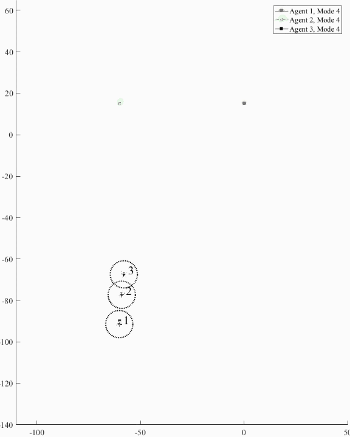

Anticipating skies crowded with crisscrossing autonomous vehicles, University of Michigan researchers have developed a future air traffic control system that allows any number of autonomous planes to safely route around each other to their final destinations.

Kunal Garg, a University of Michigan graduate student, designed the system to be utilized by autonomous fixed-wing aircraft, which require more time and space to turn than rotorcraft such as quadcopters. The work could be extended to autonomous vehicles, which follow similar turning dynamics.

<figure>

<figcaption>

In this simulation, autonomous fixed-wing aircraft change goal points and flight modes to avoid collisions based on control laws developed by Kunal Garg.

</figcaption>

</figure>

<!--more-->

“It doesn’t seem that complicated: given two points, design a safe trajectory,” Garg said. “But, adding the dynamics and constraints of fixed-wing aircraft, decentralizing the system to allow for unlimited scalability, and doing all this with a limited communication radius makes it complicated.”

In the paper, “[Hybrid Planning and Control for Multiple Fixed-Wing Aircraft under Input Constraints](http://www-personal.umich.edu/~dpanagou/assets/documents/KGarg_Scitech19.pdf),” Garg and his advisor Dimitra Panagou, Core Faculty in Robotics and Assistant Professor of Aerospace Engineering, show that for an arbitrarily large number of planes, the planes will always be able to resolve their conflicts, reach their goal location, and maintain safety.  The paper is a finalist in the 2019 [American Institute of Aeronautics and Astronautics](https://www.aiaa.org/)Scitech Conference Graduate Student Paper Competition.

In approaching the problem, Garg first simplified it with a realistic constraint. While planes can ascend or descend to avoid one another, there are likely to be altitude restrictions on autonomous aircraft, especially in urban areas. Given this, he removed altitude from the equation, and focused on creating safe flight paths in two dimensions.

With the simpler problem, Garg created the control laws.

“We wanted to exploit hybrid systems because designing a single controller for this complicated system would have been very difficult,” Garg said. “We divided the system into five modes and, depending on what the aircraft are doing, they will decide which mode to choose. Each mode which has its own controller that will make sure it is always safe.”

“If the aircraft is alone, the controller will take it to its goal location. If it has one aircraft coming head on, it will do a roundabout maneuver. If there are more than two aircraft, depending on their location, the algorithm will decide the safe mode for all of those aircraft.”

Allowing for safe paths in this system is also possible because aircraft can be assigned temporary goals in place of their final destination in order to avoid collisions. And, because the aircraft are not solving any optimization problems, the algorithms can be implemented on low-cost microcontroller boards that are often already onboard flying autonomous vehicles.

“Instead of trying to solve a complete problem in one go, hybrid system theory allows us to solve individual parts, where the analysis becomes simpler, and then we can stitch them together into a complete solution,” said Garg.

While the modes were hand-designed by the researchers, they hope in the future to automate the design of such a system, or as Garg said, “How can we design an algorithm that will find an algorithm for safe trajectories?”

In addition, the team is working on adding other types of aircraft, such as quadcopters, to their system. They are also testing cases where there might be disturbances, such as malfunctioning sensors or wind.

The research is supported by NASA Grant NNX16AH81A and the Air Force Office of Scientific Research award number FA9550-17-1-0284.
