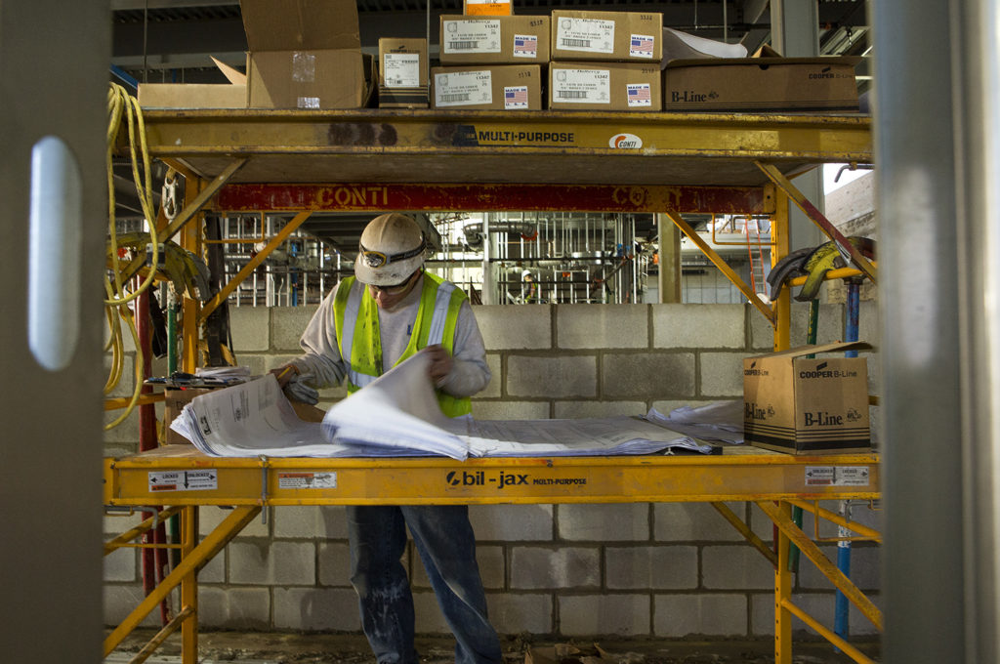

<figure>

<figcaption>A construction worker reads plans for the GG Brown Addition on North Campus. Photo: Joseph Xu, Michigan Engineering</figcaption>
</figure>

Robots seem a perfect match for many of the exacting, tedious, and repetitive jobs that occur on a construction site, and they can free up human workers to take on more complex tasks. However, introducing robots capable of nailing drywall or laying loads of brick can introduce unfamiliar dangers to a worksite already full of hazards from heavy machinery, power tools, and cranes dangling steel beams.

To ensure humans feel safe working with and around new robots, researchers at the University of Michigan developed and tested a social theory using a platform that is able to prototype robots in an immersive virtual reality.

Their work allows for quick and cheap testing of human-robot interactions and can help predict how humans will respond to future collaborative work with yet-to-be-made robots.

“There are two challenges to improve human-robot collaboration,” said [Lionel Robert](https://sites.google.com/a/umich.edu/lionelrobert/home), core faculty of the [Robotics Institute](https://robotics.umich.edu/) and associate professor in the School of Information. “One, it is expensive to prototype robots, and two, there is not a lot of social theory for human-robot interaction.”

Robert, working with Vineet Kamat and [SangHyun Lee](https://dpm.engin.umich.edu/professor/), professors of Civil and Environmental Engineering and affiliate faculty of Robotics, created a virtual reality environment with a common gaming engine and headset that allows designers to virtually create and test robots and their interactions with humans, ultimately reducing design time and cost.

Using the virtual reality environment, the team tested out a theory they call the “Robot Acceptance Safety Model,” which states that separating the work areas of the human and robot can increase a worker’s perceived safety through greater trust in the robot and a greater sense of working as a team.

“Robots should decrease stress and anxiety, but if you don’t feel safe working with robots, they can increase your stress and anxiety,” Robert said. “While manufacturing environments, such as automobile factories, are typically fixed and have built-in safety barriers around robots, construction sites are dynamic and require different solutions.”

In the virtual world, the team tested putting a stack of blocks to separate the work areas between a robot and human participant both tasked with laying bricks. The study found that the barrier increased the human’s perceived safety, and increased the willingness to work with the robot in the future.

“This opens the door for deeper research into collaborative robots, or cobots,” Robert said. “We can explore when and why people feel comfortable working with robots in all types of settings and tasks, and do it all virtually at a fraction of the time and cost it would take to build a real-world prototype.”

The paper outlining the work, “Enhancing perceived safety in human–robot collaborative construction using immersive virtual environments,” was [published](https://www.sciencedirect.com/science/article/pii/S0926580517302868?via%3Dihub) in _Automation in Construction_, and includes authors Jeong-Hwan Kim, a post-doctoral research fellow at U-M, and Sangseok You, a former PhD student advised by Robert and now a professor at HEC Paris.

The project was funded through MCubed, an experimental U-M funding program designed to spur innovative, cross-disciplinary research.
