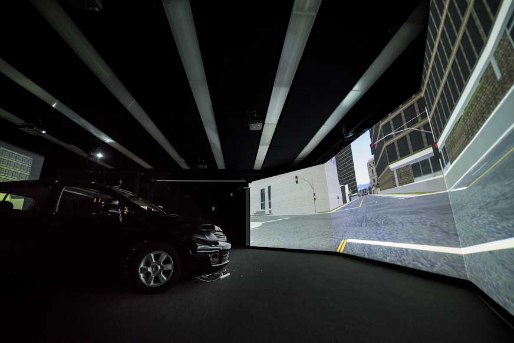

<figure>

<figcaption>Laboratory simulation of urban, highway and rural route driving at the U-M Transportation Research Institute. Image courtesy: UMTRI.</figcaption>
</figure>

When working with others, clearly communicating expectations, tasks, and progress can alleviate many issues common in teamwork. What if the teammate is not another human, however, but an autonomous system helping you drive? Do drivers still want to be kept in the loop of a car’s intentions and actions?  

To help answer this question, researchers at the University of Michigan led a study that put drivers in a simulation with a talking autonomous vehicle. The findings can help those who are designing autonomous vehicles to make sure drivers will adopt the autonomy and realize their safety benefits.  

“Humans build trust off of expectations,” said [Lionel Robert](https://robotics.umich.edu/people/faculty/lionel-robert/), core faculty in the University of Michigan Robotics Institute and lead author on the related paper. “So, if you say you are going to come today at 2 o’clock, I trust you to come at 2 o’clock. If you didn’t come at 2 o’clock I think, ‘Oh, I can’t trust this person.’  

“One way you may try to mitigate a loss of trust is to say, ‘I couldn’t come at 2 o’clock because of blah blah blah.’ Better still, is if you call me and say, ‘Something came up and I’m running late, but I am on my way.’ Not only is that a good strategy to minimize my loss of trust in you, it may increase my trust in you.  

“It’s the same thing with machines. We have an expectation of what they should do and when they don’t behave that way, we lose trust in them.”  

The paper, “[Look Who’s Talking Now: Implications of AV’s Explanations on Driver’s Trust, AV Preference, Anxiety and Mental Workload](https://www.sciencedirect.com/science/article/pii/S0968090X18313640),” is published in Transportation Part C: Emerging Technologies, July 2019. 

In the simulation, drivers sat in a fixed car outfitted for a lab environment between wide screens that created a virtual driving experience. The car operated with level four autonomy, meaning the car could complete a trip without any human input, except in select situations.   

While the participants drove, the autonomous system would encounter situations such as a police vehicle approaching, a vehicle stopped on the shoulder, or a swerving vehicle. Given a situation, the autonomous system would either explain its plan before reacting, after reacting, react with no explanation, or ask for permission to react. Drivers then were asked about how much they trusted the autonomous vehicle, their preference for each type of notification, and their levels of anxiety and mental workload.  

The researchers hypothesized that the more information the autonomous system conveyed, the more the driver would trust and prefer the system, and the less their anxiety and mental workload would be. This was not always the case.  

“What we found is that explanations promote trust with humans but only if they are given before the car takes actions,” Robert said. “Explanations in and of themselves aren’t necessarily good things and explanations after the fact don’t seem to do much.”  

The researchers did confirm that autonomous vehicles that provide an explanation before acting are preferred to those with no explanation, those that ask for permission to react, or those that explain their reaction after.  

When it came to anxiety and mental workload, however, explanations made no significant difference. The same levels of anxiety and mental workload were found among all autonomous vehicle settings, whether drivers were warned before or after an action, not at all, or asked to approve an action.  

The team also discovered that participants found that the autonomous system that asked for permission to be less intelligent versus the system that warned before acting on its own. The researchers think that drivers could have judged this system as less capable because it couldn’t determine what to do without human input.  

Future work will include adapting explanation timing and level of control to each driver’s personality, as well as extending the vehicle’s explanations beyond sound to sight or touch.  

Additional authors on the paper include [X. Jessie Yang](https://robotics.umich.edu/people/faculty/xi-jessie-yang/), assistant professor of industrial and operations engineering, Anuj Pradhan, assistant research scientist at U-M Transportation Research Institute, [Dawn Tilbury](https://robotics.umich.edu/people/faculty/dawn-tilbury/), professor of mechanical engineering, Qiaoning Zhang, PhD student at the School of Information, Jacob Haspiel, former master’s student at the School of Information, and Na Du, a PhD student in industrial and operations engineering.  

This research was supported by Mcity and the National Science Foundation.
