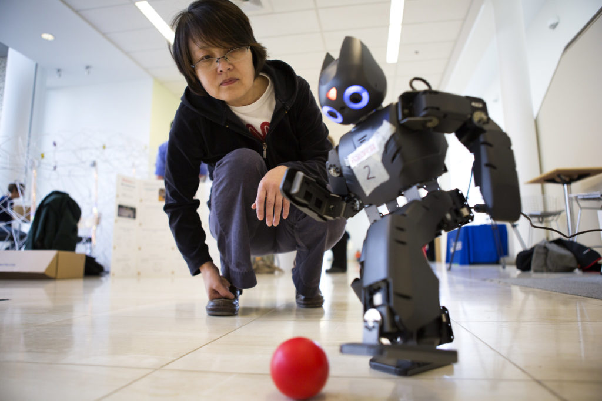

<figure>

<figcaption>

YiBin Jiang, Medical School Research Technician, plays soccer with a robot. Photo: Joseph Xu.

</figcaption>

</figure>

Soldiers develop attachments to the robots that help them diffuse bombs in the field. Despite numerous warnings about privacy, millions of us trust smart speakers like Alexa to listen into our daily lives. Some of us name our cars and even shed tears when we trade them in for shiny new vehicles.

Research has shown that individually we develop emotional, trusting relationships with robotic technology, but until now little has been known about whether groups that work with robots develop attachments, and if so, if such emotions affect team performance. 

The short answer, say University of Michigan researchers is, yes and yes!

Previous studies have focused on linking emotional attachment to robots with individual fun and enjoyment in more playful settings, said Sangseok You, who began what he and colleagues believe is the first study of its kind on attachment between groups and robots as a doctoral candidate at the U-M School of Information. 

“We found that humans perform better with robotic teammates when they have strong emotional attachment to them,” said You, now an assistant professor at HEC Paris. “This means that organizations like Amazon should invest in approaches that encourage their employees to have some level of emotional attachment with their robotic co-workers.”

For [their study](https://aisel.aisnet.org/jais/vol19/iss5/2/) reported in the Journal of the Association for Information Systems, the researchers recruited 114 human participants, assigned to 57 teams—two people, two robots per team. They were split into four groups—some teams were identified by robot, some by team, some by both robot and team, and some by neither. The task was to move five water bottles from one point to another.     

Those that were identified by robot and by team all developed emotional attachments to their robot teammates. With the emotional attachment came better performance and team viability. One group also was asked to come up with a team name and given jerseys for themselves and their robots to see if identification with a team enhanced attachment. It was only marginally significant.

Among many questions on a multipart survey that sought to gauge attitudes and understanding about robots as well as perceptions of the experiment were: “This robot is dear to me,” “I feel emotionally connected to this robot,” “This team including robots would perform well together in the future,” “If given a choice, I would prefer to continue working in this team, including robots.”

The researchers caution, however, that too much emotional attachment to robots or artificial humans can have drawbacks. 

“For example, robots are machines which record their interactions with others,” said senior author [Lionel Robert](https://2024.robotics.umich.edu/profile/lionel-robert/), an associate professor of information and a member of the Michigan Robotics Institute. “Humans that believe they can trust robots in the same way that trust their human co-workers might forget about the video cameras in robots and say or engage in behaviors that might be viewed as unacceptable by the company.

“These humans might trust that their robotic co-workers would not tell anyone while forgetting that everything they say or do around the robot is being recorded.” 

The researchers say that more research with other types of robots is needed as their study involved embodied physical action robots, or those that look human.

“The distinction between physical robots and virtual bots might be important,” Robert said. “On one hand, we acknowledge that embodied physical action robots are themselves unique, which might explain why emotional attachment led to better performance in ways similar to emotional attachment between human teammates. 

“On the other hand, the findings might be applied to other types of technology beyond EPA robots to chatbots or intelligent agents working with humans that do not have physical bodies.”

_[Original article on Michigan News.](https://news.umich.edu/humans-robot-teams-work-better-when-theres-an-emotional-connection/)_
