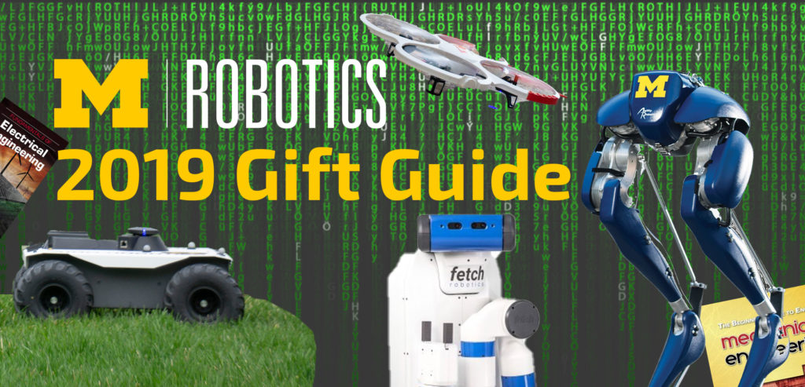

Need a gift for someone into robotics? Or at least to spark an interest in robotics? Maybe a robotics gift for yourself? We've rounded up some top gifts, and are looking for you to share yours.

<!--more-->

## The young reader

https://www.youtube.com/watch?v=obwJ7HBd\_XA

Professor [Robert Gregg](https://2024.robotics.umich.edu/profile/robert-gregg/) recommends _[Robots, Robots Everywhere](https://www.indiebound.org/book/9780449810798)_ ($5) written by Sue Fliess and illustrated by Bob Staake on the Little Golden Book imprint for the young child learning to read.

## The mechanically-inclined entomologist

https://www.youtube.com/watch?v=qFR9Wkyc0Nc&feature=emb\_title

Research Scientist [Talia Moore](https://2024.robotics.umich.edu/profile/talia-moore/) recommends [Kamigami Robots](https://kamigamirobots.com) (starting at $10), which were designed by graduate students who studied the movements of cockroaches.

## The second grade tinkerer

https://www.youtube.com/watch?v=Ed0woZJOBSc

Professor [Chad Jenkins](https://2024.robotics.umich.edu/profile/chad-jenkins/) recommends [Snap Circuits Jr.](https://shop.elenco.com/consumers/brands/snap-circuits.html) ($37). The kit includes 100 projects, and allows children to easily connect circuits that include sensors, fans, speakers, and more.

## The third grade (or above) tinkerer

https://www.youtube.com/watch?v=ZNcebanW\_pQ

Another from Professor Jenkins, this one built with an Arduino: the [mBot robot](https://store.arduino.cc/usa/mbot-v1-1-blue) ($95). Assembly is noted to take 10 minutes, and is coded with software based on Scratch 2.0, or for the more advanced, the Arduino IDE.

## The nostalgic engineer

https://www.youtube.com/watch?v=qX76DDLg9jU

Rounding out Professor Jenkins list is the [Armatron](https://en.wikipedia.org/wiki/Armatron) (around $40+). Only available [second-hand](https://www.ebay.com/b/Armatron/19198/bn_7023250053), this remote controlled robotic arm gives its user a quick education in [manipulation](https://2024.robotics.umich.edu/research/focus-areas/robot-perception-manipulation/) and [human-robot interaction](https://2024.robotics.umich.edu/research/focus-areas/human-robot-interaction/).

## The philanthropic-minded

https://www.youtube.com/watch?v=hT4H4F\_s-jA

From kindergarten to 12th grade, FIRST Robotics allows children to explore robotics early and often through its clubs and competitions. At the high school level, the World Championships are a [dizzying atmosphere](https://twitter.com/UMRobotics/status/1121485384704253952) of roboticists that are highly tuned to positively impact the future.

At the University of Michigan, we're lucky to have the [FIRST Alumni & Mentors Network at Michigan](https://famnm.club) (FAMNM), a group of former FIRST students who:

- organize events for local FIRST teams, including a competition kickoff attended by nearly 1,000 students

- create a community for 150 fellow UM students, including a recently created scholarship fund

- provide mentorship to about 20 local teams, from when they start building to the competition

- volunteer and practice outreach, at over 30 FIRST competitions around the state

If you know a roboticist who has everything, consider [giving to FAMNM](http://giving.umich.edu/give/934852) in their name. Supporting FAMNM is a unique and local way to support FIRST, and you'll likely get an amazing thank you note from the grateful members.

## Share your favorite robotics gifts

Have a favorite robotics gift? Share your suggestions either [on Twitter](https://twitter.com/UMRobotics/status/1202238879106879488) or in the comments!
