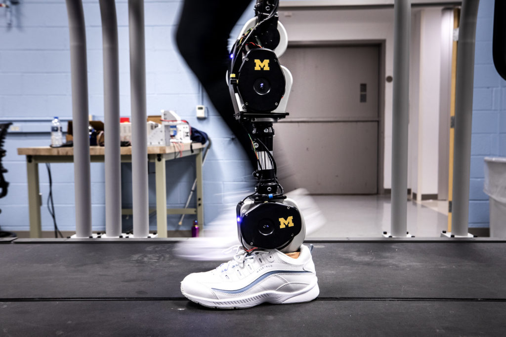
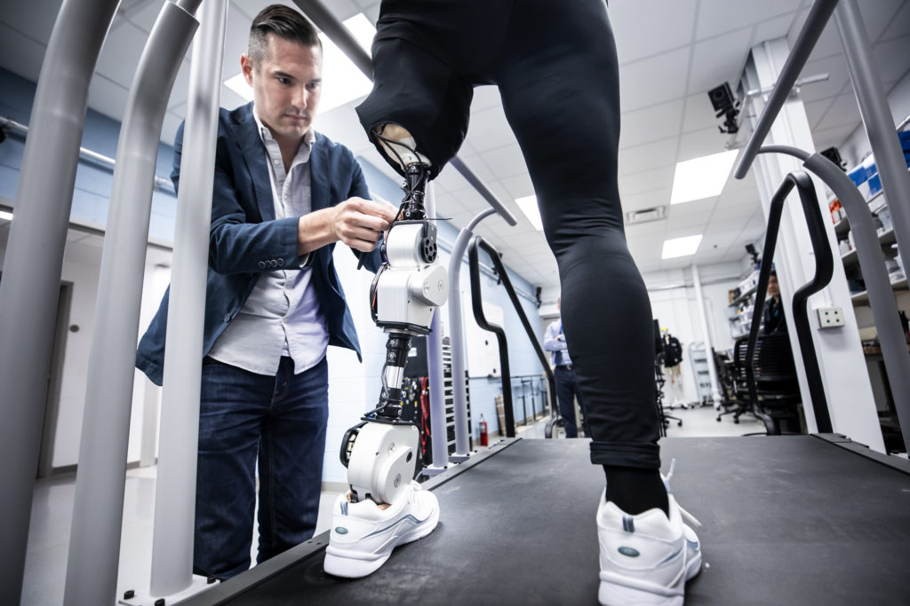

https://www.youtube.com/watch?v=Rqla0u813r8

A new open-source, artificially intelligent prosthetic leg designed by researchers at the University of Michigan and Shirley Ryan AbilityLab is now available to the scientific community.

The leg’s free-to-copy design and programming are intended to improve the quality of life of patients and accelerate scientific advances by offering a unified platform to fragmented research efforts across the field of bionics.

<!--more-->

“Our Open-Source Bionic Leg will enable investigators to efficiently solve challenges associated with controlling bionic legs across a range of activities in the lab and out in the community,” said lead designer Elliott Rouse, core faculty at U-M’s Robotics Institute and assistant professor of mechanical engineering. “In addition, we hope our bionic leg will unite researchers with a common hardware platform and enable new investigators from related fields to develop innovative control strategies.”

<figure>

<figcaption>

The open-source bionic leg being tested in the Neurobionics Lab at the University of Michigan. Photo: Joseph Xu/Michigan Engineering.

</figcaption>

</figure>

Rouse and collaborator Levi Hargrove, director of the Center for Bionic Medicine at the Shirley Ryan AbilityLab in Chicago, will unveil the leg and its online platform at the Amazon re:MARS conference in Las Vegas. Details on where to order the parts, how to put them together and how to program the leg are available at [opensourceleg.com](https://opensourceleg.com/).

Hargrove, who is also an associate professor of physical medicine and rehabilitation and biomedical engineering at Northwestern University, is already using the leg in clinical studies.

“While the designs and code are free, the leg is still a high-end, state-of-the-art machine,” Hargrove said. “It’s a unique plug-and-play system that allows scientists to avoid research and development costs in the millions of dollars and immediately begin testing on prosthetics for the knee and ankle. It effectively lowers the barriers to entry for researchers.”

### **Efficient, first-of-a-kind design**

While designing the leg, Rouse focused on keeping it simple, low cost and portable, yet high-performance. The result incorporates relatively inexpensive parts from just a few suppliers; a modular design that can act as a knee, ankle, or both; and an onboard power supply and control electronics that allow it to be tested anywhere.

In addition, the team adapted and incorporated new motor technology that has been developed for the drone industry. The flat pancake-style motors trade less speed for more torque. These lower-geared motors allow for more efficient, finer control and more human-like movements.

<figure>

<figcaption>

Kim Ingraham, ME PhD Student and member of the Neurobionics Lab, runs tests on an open-source robotic leg with Dawn Jordan Musil. Photo: Joseph Xu/Michigan Engineering

</figcaption>

</figure>

Researchers who work directly with people with disabilities often have to build their own robotic leg system, Rouse said. Instead of starting from scratch, researchers can take this common platform and, after some assembly, begin working on better solutions to help people with mobility impairments. The common platform also enables direct comparisons of new algorithms used to control the bionic leg, which researchers can then iterate and build upon.

While there are many open-source prosthetics for the upper body, such as hands, this is the first such platform for the lower extremities. Research in lower limb bionics has traditionally lagged that of the upper limb prosthetics, primarily due to the high risk to maintain balance and support a patient’s entire body.

The full bionic leg as specified costs $28,500, which includes parts machined by Star Rapid, actuators from Dephy Inc., and a Raspberry Pi mini-computer that powers the artificial intelligence.

The advanced AI-based control, led by Hargrove, can adapt the actions of the bionic leg to seamlessly switch activities, such as going from walking to going up stairs to down a ramp. To accomplish this, the team uses a combination of muscle contraction signals and sensor data from within the bionic leg to predict whatever behavior is required for the next step.

### Community-driven research and development

As an open-source project, anyone can contribute to improving the leg’s design and function. While the leg is meant as a research tool and not as a build-at-home solution, patients involved in the project can help focus and improve the design through their feedback in trials. Companies can prototype the leg with their own parts to enhance the design. And, researchers can utilize the project website to discuss modifications and suggestions in design and control.

“This represents the future of research—rapid prototyping of open-source robotic hardware and embedded systems with shared code,” Rouse said.

<figure>

<figcaption>

Elliott Rouse, Assistant Professor of Mechanical Engineering, runs tests on an open-source robotic leg with Dawn Jordan Musil. Photo: Joseph Xu/Michigan Engineering

</figcaption>

</figure>

The team previously [presented progress](https://ieeexplore.ieee.org/document/8488057) on the leg at the 2018 IEEE International Conference on Biomedical Robotics and Biomechatronics. This paper included first author [Alejandro Azocar](https://www.afazocar.com), a Ph.D. student in mechanical engineering at U-M, and Luke Mooney, co-founder of Dephy Inc.

They are now partnering with groups nationally and internationally to develop and test the leg, including Carnegie Mellon University, University of Texas at Dallas, Georgia Tech, VA Puget Sound and University of Washington, and University of Sydney. The project is supported by the National Science Foundation’s National Robotics Initiative and the MSL Renewed Hope Foundation.
