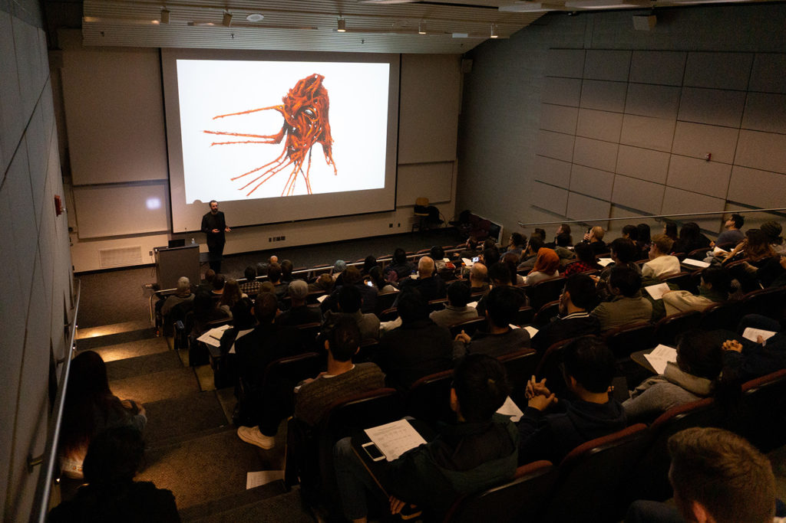
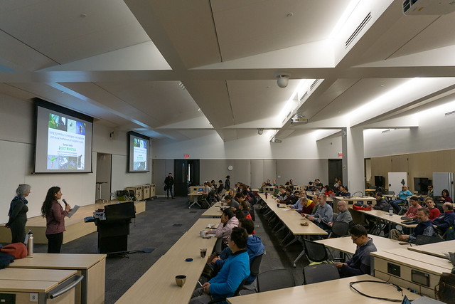
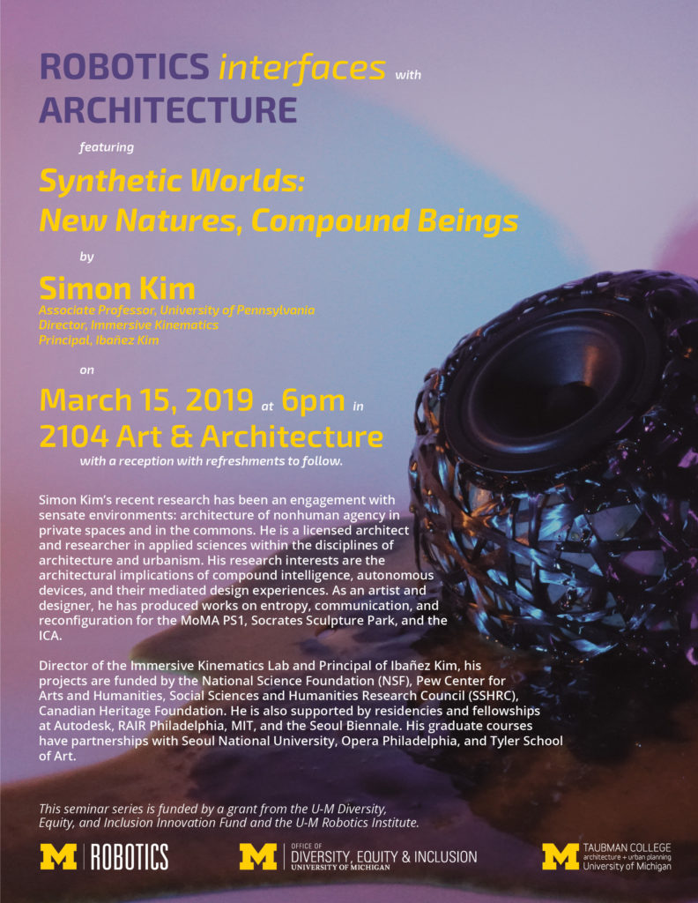
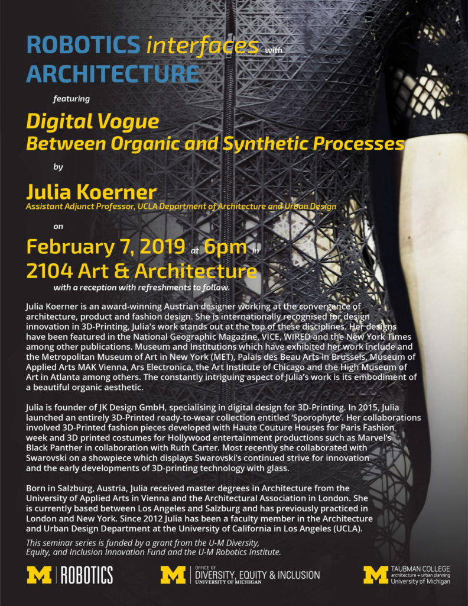
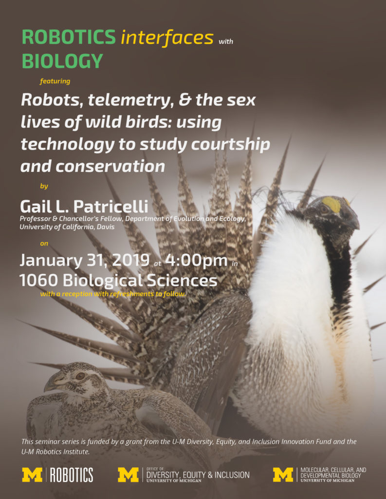
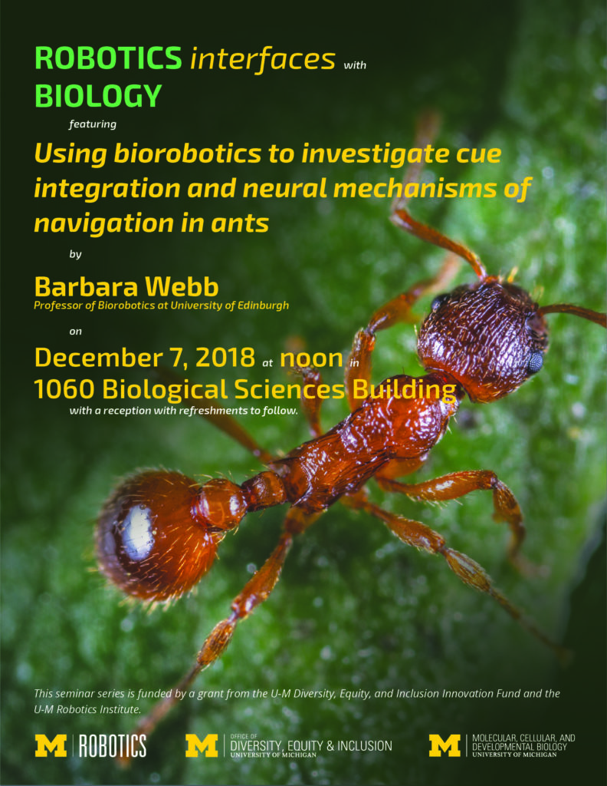
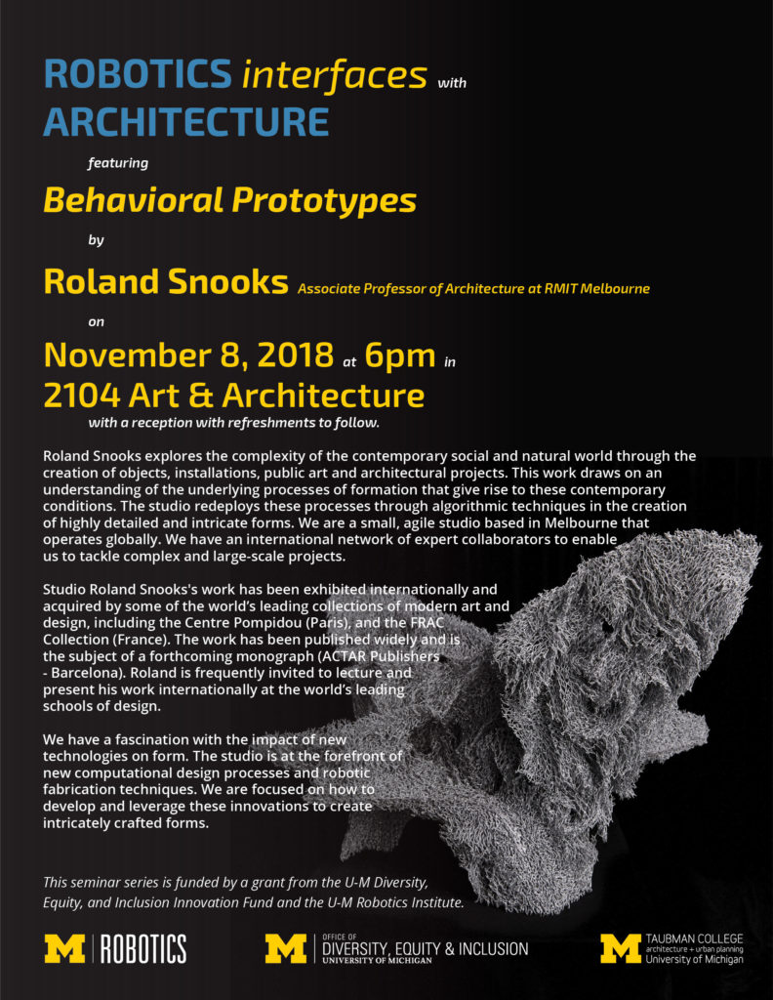

<figure>

<figcaption>

At the first Robotics Interfaces seminar, Roland Snooks, Associate Professor of RMIT Melbourne, presents "Behavioral Prototypes."

</figcaption>

</figure>

Beginning in 2018, [Talia Moore](https://2024.robotics.umich.edu/profile/talia-moore/ "Talia Moore"), a postdoctoral fellow in ecology and evolutionary biology, with the help of [Shai Revzen](https://2024.robotics.umich.edu/profile/shai-revzen/), Robotics core faculty, organized partnerships between Robotics and departments around the university to invite speakers whose research demonstrates the interdisciplinary nature of the field, creating the "Robotics Interfaces" seminar series.

Talks have spanned research on [how ants navigate](http://blog.inf.ed.ac.uk/insectrobotics/research/) to 3D printing in [architecture](http://www.rolandsnooks.com) and [fashion](https://www.juliakoerner.com). Despite the various origins of such research, such as biology, architecture, or design, all presented topics have implications for robotics. For example, Barbara Webb's research of navigation in ants includes building computational models of the ant's neural processing. She then uses these models to test and replicate the navigational behavior in small, ant-like robots.

<!--more-->

Through creating the seminar series, Moore hopes to highlight and inspire the diversity of thought and combination of fields that robotics will encompass in the future. Moore, herself, [studies biomechanics of animals](https://www.moorebiomechanics.com) to explain patterns in evolution. To test theories, Moore designs robots to mimic these animal movements, combining robotics and evolutionary biology.

 

<figure>

- <figure>
    
    
    
    <figcaption>
    
    Simon Kim
    
    </figcaption>
    
    </figure>
    
- <figure>
    
    
    
    <figcaption>
    
    Julia Koerner
    
    </figcaption>
    
    </figure>
    
- <figure>
    
    
    
    <figcaption>
    
    Gail Patricelli
    
    </figcaption>
    
    </figure>
    
- <figure>
    
    
    
    <figcaption>
    
    Barbara Webb
    
    </figcaption>
    
    </figure>
    
- <figure>
    
    
    
    <figcaption>
    
    Roland Snooks
    
    </figcaption>
    
    </figure>
    

</figure>

[Matais del Campo](https://2024.robotics.umich.edu/profile/matias-del-campo/), affiliate faculty in Robotics, helped coordinate seminars with the [Taubman College of Architecture and Urban Planning](https://taubmancollege.umich.edu). In one of the seminars that focused on architecture, Roland Snooks described how he uses robotic fabrication with composite materials and algorithmic design to create beautiful intricate structures that blend natural and digital design.

The talks are supported by a grant from the Office of Diversity, Equity, and Inclusion, as well as funding from the Robotics Institute and other collaborating units, including: [Ecology and Evolutionary Biology;](https://lsa.umich.edu/eeb) [Molecular, Cellular, and Developmental Biology](https://lsa.umich.edu/mcdb); and Taubman College.  

To be notified of future Robotics Interfaces seminars, and other Robotics events, please join the [robotics-announce mailing list](https://mcommunity.umich.edu/#group:robotics-announce) or look for future seminars and subscribe to calendar feeds at [events.umich.edu](https://events.umich.edu/list?filter=sponsors:3998,&range=2019-01-23).
