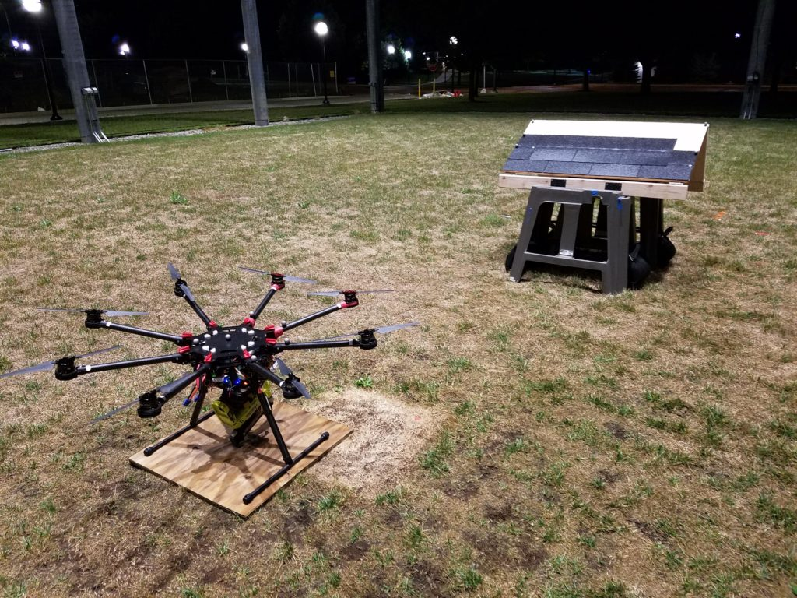

<figure>

<figcaption>

The roofing octocopter, equipped with a nail gun, is parked near the mock roof. By setting the wooden panel at different inclines, the researchers simulated roofs with different slopes. Image credit: Matthew Romano, Michigan Robotics.

</figcaption>

</figure>

An octocopter capable of attaching asphalt shingles to roofs with a nail gun has been demonstrated at the University of Michigan's [M-Air](https://robotics.umich.edu/about/mair/), an outdoor autonomous system testing lab.

This aerial vehicle can position the nail gun, place the nail, and move to the next point without needing a human at the controls.

“For me, the biggest excitement of this work is in recognizing that autonomous, useful, physical interaction and construction tasks are possible with drones,” said Ella Atkins, a professor of aerospace engineering and robotics.

<VideoCenter url="GA445Flxkjo" />

She added that tasks best suited to robotization are said to be “dull, dirty and dangerous,” presumably moving the human workforce on to cleaner, safer and more interesting jobs.

Already, drones spare humans some high-stakes fall risks by inspecting bridges, wind turbines and cell towers. The natural next step, according to Atkins, is to upgrade from surveillance alone to performing physical tasks.

The problem of nailing down a shingle breaks down into several smaller problems—among them telling the octocopter where the nails should go and triggering the nail gun. Atkins’ team used a system of markers and stationary cameras to enable the octocopter to precisely locate itself in space. They used this system to tell the octocopter where the nails should go.

To fire the nail gun, they first measured the force needed to compress the point of the nail gun, which must be done before a nail will deploy. Then, they wrote software that would enable the octocopter to apply that force.

The off-the-shelf version of this electric nail gun requires a trigger to be compressed as well, but the team turned that into a virtual switch. This activated when the octocopter was in position to place a nail.

For now, the drone is slow compared to human roofers.

“Initially, we tried using faster approach speeds to minimize nailing time,” said Matthew Romano, a Robotics Ph.D. student and first author on the paper submitted to the International Conference on Robotics and Automation. “However, for those attempts, the nail gun tip often bounced off the roof, which meant it either wouldn’t trigger or it would trigger in the wrong place.”

However, Atkins argues that it is already as fast as she and her spouse were when they put the first nails into the house they re-roofed as graduate students.

“A novice roofer—who’s never climbed on a roof, who’s never used a nail gun—they start out slow. That learning process, the evolution from them being a complete novice to being successful, is something that we’ll need to see in this system as well,” she said.

In addition to speed, the team identified other improvements that would be needed for a practical system. First, it should be powered by tether rather than battery. Because both batteries and nail guns are heavy, the system can only run for a little more than ten minutes at a time. A tether would enable it to run indefinitely. And with an air line running alongside the power cable, the nail gun could be a more effective pneumatic model.

Also, a system of cameras and markers is more complicated than a roofing drone would actually need. Shingles are marked with a shiny adhesive strip, in addition to the color difference between the exposed surface and the portion that lies beneath the next layer of shingles.

“It would be pretty easy to have a camera system mounted on the octocopter that understands both the orientation of the shingle and its position,” said Atkins.

A paper on this work, titled, “[Nailed it: Autonomous roofing with a nailgun-equipped octocopter](https://arxiv.org/pdf/1909.08162.pdf),” is submitted to the International Conference on Robotics and Automation. Co-authors on the paper include Yuxin Chen and Owen Marshall.

This study was funded by the National Science Foundation.

_[Original article on Michigan News.](https://news.umich.edu/roofing-drone-nails-down-shingles/)_
