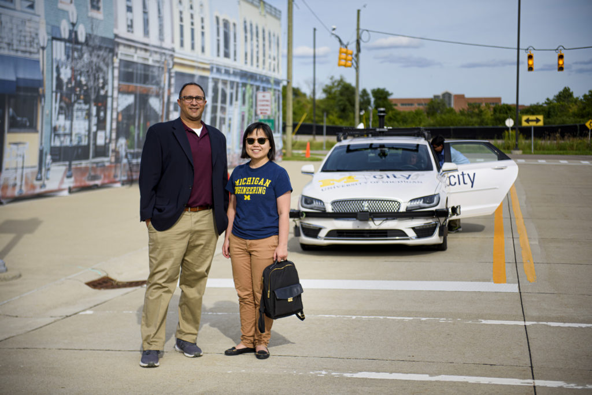

<figure>

<figcaption>Professors Lionel Robert and X. Jessie Yang stand in front of an autonomous vehicle at Mcity, an autonomous vehicle testing ground. Photo: Jeffrey M. Smith/School of Information.</figcaption>
</figure>

Agreeable, conscientious, and stable. These are three human personality traits that, it turns out, we want to see in our driverless cars regardless of whether we possess them ourselves, according to a new study from the University of Michigan.

The researchers set out to examine how a person’s perception of safety in an autonomous vehicle was influenced by the degree to which the vehicle and the rider seemed to share certain “personality” traits.

“We wanted to answer the question: if we want to encourage people to use autonomous vehicles, how can we design the vehicles’ perceived personalities, or driving styles, so that drivers are more willing to adopt them?” said [Lionel Robert](https://robotics.umich.edu/people/faculty/lionel-robert/), associate professor in the [School of Information](https://www.si.umich.edu/) and core faculty in U-M’s [Robotics Institute](https://robotics.umich.edu/).

“It’s all about perception,” said [X. Jessie Yang](https://robotics.umich.edu/people/faculty/xi-jessie-yang/), assistant professor of industrial and operations engineering. “Objectively, autonomous vehicles could have very reliable performance, but if the human does not perceive them as safe, then they will not use them.”

For this study, the team focused on a set of personality traits used in social science called “the Big Five”:

1. Extroversion, or being sociable
2. Agreeableness, or being considerate
3. Conscientiousness, or having self-control
4. Emotional stability, or being well-adjusted
5. Openness to experience, or tolerating new ideas

In the past, studies have found conflicting results on personality’s role in human-robot interaction. In some studies, when a human and robot shared personality traits, it led to positive interactions. In others, positive interactions were found when a human and robot had dissimilar personalities, or it depended on the context of the situation.

In an effort to shed new light on the topic, the researchers surveyed more than 440 drivers to determine how high or low they scored on each personality trait. Then, participants watched videos from the front seat point-of-view of an automated vehicle driving as the vehicle varied from normal to aggressive driving and the weather varied from sunny to snowy. Afterward, participants rated the vehicle’s “personality traits,” as well as how safe they felt in each situation.

The team found similar mixed results as previous studies: both similar personalities and divergent personalities improved the human-robot interaction. But, they were able to differentiate the data based on each trait.

Specifically for the traits of agreeableness, conscientiousness, and emotional stability, riders felt safest when both they and the vehicle scored highly in each trait. Riders who scored lower than average in these three traits nevertheless seemed to prefer a car that exhibited them. Depending on the trait and the rider’s own personality, riders reported safety scores between 8.9% and 13.8% higher, on a five-point scale, if they believed the car to possess one of these traits than if it lacked it.

Riders felt the least safe when they scored highly in agreeableness, conscientiousness, and emotional stability, but the car scored lower.

The traits of extroversion and openness to experience had no impact on feelings of safety.

“The takeaway is that we want to design the autonomous vehicle to be agreeable, conscientious, and emotionally stable to increase perceived safety.” Yang said.

And beyond a single automated vehicle personality for all drivers, Robert envisions a future with customized personalities.

“Imagine the moment you get into an autonomous ride sharing vehicle, it pings your cell phone to updates its driving style, voice, and the way it interacts with you,” Robert said.

The paper outlining the research, “[An Automated Vehicle (AV) like Me? The Impact of Personality Similarities and Differences between Humans and AVs,](https://arxiv.org/abs/1909.11766)” will be presented at the Association for the Advancement of Artificial Intelligence (AAAI) Fall Symposium on AI and Human Robot Interaction. Qiaoning Zhang, a PhD student in the School of Information, is first author on the paper, and Connor Esterwood, also a PhD student in the School of Information, is a contributor. The research team are all members of the [Michigan Autonomous Vehicle Research Intergroup Collaboration](https://mavric.si.umich.edu/home) (MAVRIC).

The research was supported by [Mcity.](http://mcity.umich.edu/)
