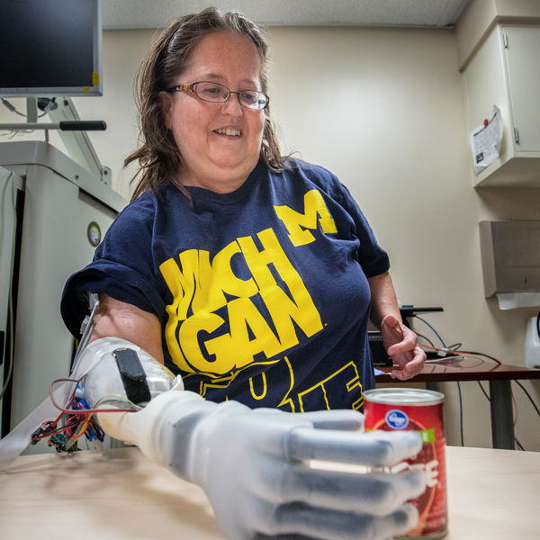
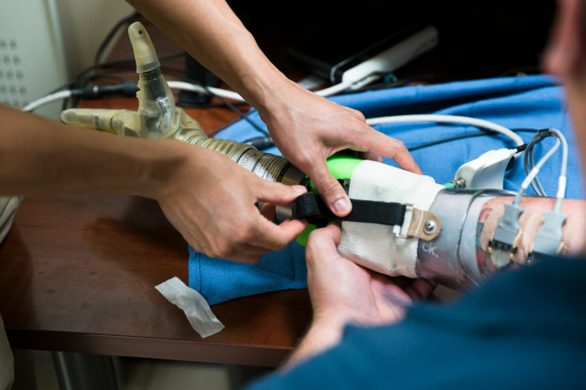
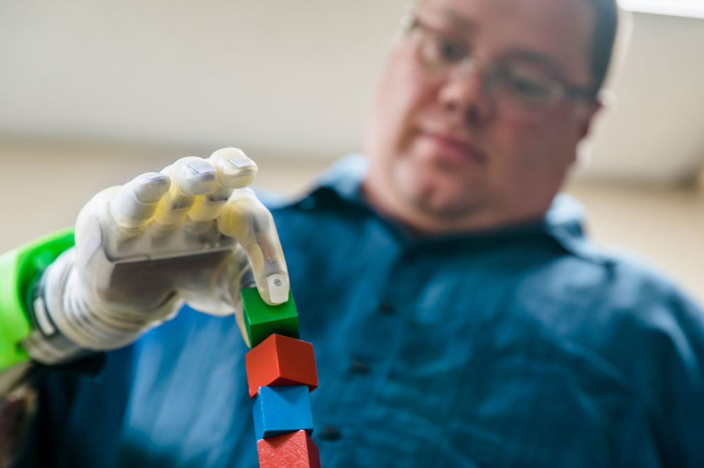

<VideoCenter url="PoKcRtDmKJw" />

In a major advance in mind-controlled prosthetics for amputees, University of Michigan researchers have tapped faint, latent signals from arm nerves and amplified them to enable real-time, intuitive, finger-level control of a robotic hand.

To achieve this, the researchers developed a way to tame temperamental nerve endings, separate thick nerve bundles into smaller fibers that enable more precise control, and amplify the signals coming through those nerves. The approach involves tiny muscle grafts and machine learning algorithms borrowed from the brain-machine interface field. 

“This is the biggest advance in motor control for people with amputations in many years,” said [Paul Cederna](https://bme.umich.edu/people/cederna-paul/), who is the Robert Oneal Collegiate Professor of Plastic Surgery at the University of Michigan Medical School, as well as a professor of biomedical engineering. 

[Take an interactive multimedia deep dive](https://spotlight.engin.umich.edu/mind-control-prosthesis/) into the research collaboration that's powering the unprecedented, intuitive control of next-gen bionics.

“We have developed a technique to provide individual finger control of prosthetic devices using the nerves in a patient’s residual limb. With it, we have been able to provide some of the most advanced prosthetic control that the world has seen.”

Cederna co-leads the research with [Cindy Chestek](https://robotics.umich.edu/people/faculty/cynthia-chestek/), core faculty in Robotics and an associate professor of biomedical engineering in the U-M College of Engineering. In a paper published March 4 in Science Translational Medicine, they describe results with four study participants using the Mobius Bionics LUKE arm.

## **Intuitive prosthetic control works on the first try**

“You can make a prosthetic hand do a lot of things, but that doesn’t mean that the person is intuitively controlling it. The difference is when it works on the first try just by thinking about it, and that’s what our approach offers,” Chestek said. “This worked the very first time we tried it. There’s no learning for the participants. All of the learning happens in our algorithms. That’s different from other approaches.”

While study participants aren’t yet allowed to take the arm home, in the lab, they were able to pick up blocks with a pincer grasp; move their thumb in a continuous motion, rather than have to choose from two positions; lift spherically-shaped objects; and even play in a version of Rock, Paper, Scissors called Rock, Paper, Pliers. 

“It’s like you have a hand again,” said study participant Joe Hamilton, who lost his arm in a fireworks accident in 2013. “You can pretty much do anything you can do with a real hand with that hand. It brings you back to a sense of normalcy.”

<figure>

<figcaption>Joe Hamilton, a participant in the University of Michigan RPNI study, has his DEKA prosthetic hand adjusted. Photo: Evan Dougherty/University of Michigan Engineering</figcaption>
</figure>

## **Turning a tiny muscle graft into a nerve signal amplifier**

One of the biggest hurdles in mind-controlled prosthetics is tapping into a strong and stable nerve signal to feed the bionic limb. Some research groups—those working in the brain-machine interface field—go all the way to the primary source, the brain. This is necessary when working with people who are paralyzed. But it’s invasive and high-risk.  

For people with amputations, peripheral nerves—the network that fans out from the brain and spinal cord—have been interesting, but they hadn’t yet led to a long-term solution for a couple of reasons: The nerve signals they carry are small. And other approaches to picking those signals up involved probes that eavesdropped by force. These “nails in nerves,” as researchers sometimes refer to them, lead to scar tissue, which muddles that already faint signal over time. 

The U-M team came up with a better way. They wrapped tiny muscle grafts around the nerve endings in the participants’ arms. These “regenerative peripheral nerve interfaces,” or RPNIs, offer severed nerves new tissue to latch on to. This prevents the growth of nerve masses called neuromas that lead to phantom limb pain. And it gives the nerves a megaphone. The muscle grafts amplify the nerve signals. Two patients had electrodes implanted in their muscle grafts, and the electrodes were able to record these nerve signals and pass them on to a prosthetic hand in real time.

“To my knowledge, we’ve seen the largest voltage recorded from a nerve compared to all previous results,” Chestek said. “In previous approaches, you might get 5 microvolts or 50 microvolts—very very small signals. We’ve seen the first ever millivolt signals.

“So now we can access the signals associated with individual thumb movement, multi-degree of freedom thumb movement, individual fingers. This opens up a whole new world for people who are upper limb prosthesis users.”

And their interface has already lasted years. Others degrade within months due to scar tissue.

<figure>

<figcaption>Joe Hamilton, a participant in the University of Michigan RPNI study, naturally uses his mind to control a DEKA prosthetic hand to pick up a small block. Photo: Evan Dougherty/University of Michigan Engineering</figcaption>
</figure>

## **The future of prosthetics research and industry**

The findings also open up new possibilities for the field, said Chestek, whose expertise is on real-time machine learning algorithms to translate neural signals into movement intent.

“What we found is now the nerve signals are good enough to apply the whole world of things we learned in brain control algorithms to nerve control,” Chestek said. 

The approach generates signals for finer movements than what today’s prosthetic hands are capable of. 

“Other research groups have contributed to this as well, but we’ve leapfrogged the capabilities of the prosthetic hands that are currently available. I think this is strong motivation for further developments from prosthetic hand companies,” said Philip Vu, a research fellow in biomedical engineering and first author of the paper.

A clinical trial is ongoing. The team is looking for participants. 

“So many times, the things we do in a research lab add to the knowledge in the field, but you never actually get a chance to see how that impacts a person,” Cederna said. “When you can sit and watch one person with a prosthetic device do something that was unthinkable 10 years ago, it is so gratifying. I’m so happy for our participants, and even more happy for all the people in the future that this will help.”

Added Chestek, “It’s going to be a ways from here, but we’re not going to stop working on this until we can completely restore able-bodied hand movements. That’s the dream of neuroprosthetics.”

The paper is titled, “[A regenerative peripheral nerve interface allows real-time control of an artificial hand in upper limb amputees](https://stm.sciencemag.org/content/12/533/eaay2857).” The research is funded by DARPA and the National Institutes of Health.
