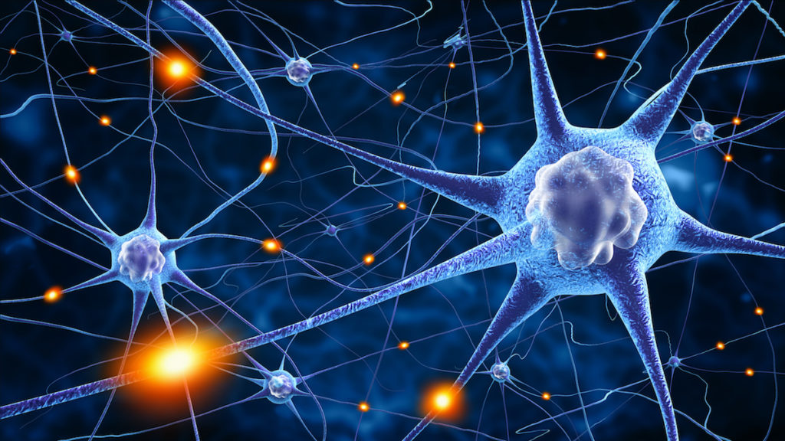

<figure>

<figcaption>_Drastically reducing the power and computation needed to identify our intentions, researchers open up a future of advanced therapies and machines enabled by our thoughts._</figcaption>
</figure>

By tuning into a subset of brain waves, University of Michigan researchers have dramatically reduced the power requirements of neural interfaces while improving their accuracy. This discovery could lead to long-lasting brain implants that can both treat neurological diseases and enable mind-controlled prosthetics and machines.

The team, led by [Cynthia Chestek](https://robotics.umich.edu/people/faculty/cynthia-chestek/ "Cynthia Chestek"), associate professor of biomedical engineering and core faculty at the Robotics Institute, estimated a 90% drop in power consumption of neural interfaces by utilizing their approach.

“Currently, interpreting brain signals into someone’s intentions requires computers as tall as people and lots of electrical power—several car batteries worth,” said Samuel Nason, PhD candidate in Chestek’s [Cortical Neural Prosthetics Laboratory](https://chestekresearch.engin.umich.edu/). 

“Reducing the amount of electrical power by an order of magnitude will eventually allow for at-home brain-machine interfaces.”

Neurons, the cells in our brains that relay information and action around the body, are noisy transmitters. The computers and electrodes used to gather neuron data are listening to a radio stuck in between stations. They must decipher actual content amongst the brain’s buzzing. Complicating this task, the brain is a firehose of this data, which increases the power and processing beyond the limits of safe implantable devices.

Currently, to predict complex behaviors such as grasping an item in a hand from neuron activity, scientists can use transcutaneous electrodes, or direct wiring through the skin to the brain. This is achievable with 100 electrodes that capture 20,000 signals per second, and enables feats such as reenabling an arm that was paralyzed, or allowing someone with a prosthetic hand to feel how hard or soft an object is. But not only is this approach impractical outside of the lab environment, it also carries a risk of infection.

Some wireless implants, created using highly-efficient, application-specific integrated circuits, can achieve almost equal performance as the transcutaneous systems. These chips can gather and transmit about 16,000 signals per second. However, they have yet to achieve consistent operation and their custom-built nature is a roadblock in getting approval as safe implants compared to industrial-made chips.

"This is a big leap forward," Chestek said. “To get the high bandwidth signals we currently need for brain machine interfaces out wirelessly would be completely impossible given the power supplies of existing pacemaker style devices." 

To reduce power and data needs, researchers compress the brain signals. Focusing on neural activity spikes that cross a certain threshold of power, called threshold crossing rate or TCR, means less data needs to be processed while still being able to predict firing neurons. However, TCR requires listening to the full firehose of neuron activity to determine when a threshold is crossed, and the threshold itself can change not only from one brain to another, but in the same brain on different days. This requires tuning the threshold, and additional hardware, battery, and time to do so.

Compressing the data in another way, Chestek’s lab dialed in to a specific feature of neuron data: spiking-band power or SBP. SBP is an integrated set of frequencies from multiple neurons, between 300 and 1,000 Hz. By listening only to this range of frequencies and ignoring others, taking in data from a straw as opposed to a hose, the team found a highly-accurate prediction of behavior with dramatically lower power needs.

Compared to transcutaneous systems, the team found the SBP technique to be just as accurate while taking in one-tenth as many signals, 2,000 versus 20,000 signals per second. Compared to other methods such as using a threshold crossing rate, the team’s approach not only requires much less raw data, but is also more accurate at predicting neuron firing, even among noise, and does not require tuning a threshold. 

The team’s SBP method solves another problem limiting an implant’s useful life. Over time, an interfaces’ electrodes fail to read the signals among noise. However, because the technique performs just as well when a signal is half of what is required from other techniques like threshold crossings, implants could be left in place and used longer.

While new brain-machine interfaces can be developed to take advantage of the team’s method, their work also unlocks new capabilities for many existing devices by reducing the technical requirements to translate neurons to intentions.

“It turns out that many devices have been selling themselves short,” Nason said. “These existing circuits, using the same bandwidth and power, are now applicable to the whole realm of brain-machine interfaces.”

The paper, “A low-power band of neuronal spiking activity dominated by local single units improves the performance of brain-machine interfaces,” is [published in Nature Biomedical Engineering](https://www.nature.com/articles/s41551-020-0591-0). Nason is first author on the paper.

The research was supported by NSF grant 1926576, Craig H. Neilsen Foundation project 315108, A. Alfred Taubman Medical Research Institute, NIH grant R01GM111293, MCubed project 1482, NIH grant R21EY029452 and NIH grant F31HD098804.
