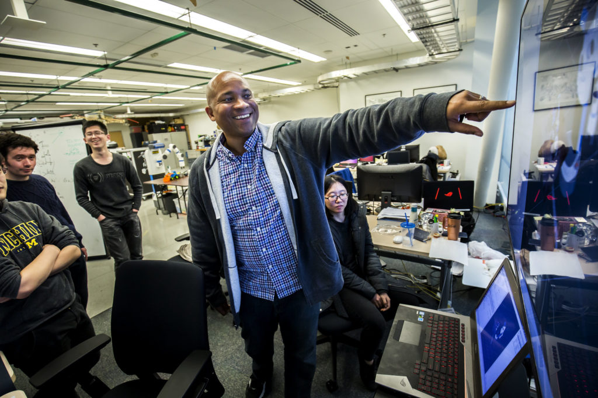

<figure>

<figcaption>

Recently promoted professor Chad Jenkins shows the 3-D environment that two of his research group's robots scanned in the Beyster Building in 2016. Photo: Joseph Xu, Michigan Engineering.

</figcaption>

</figure>

The University of Michigan Board of Regents approved a number of faculty promotions at their May meeting yesterday, including several Robotics members.

Core faculty celebrating a promotion are:

- [Chad Jenkins](https://robotics.umich.edu/people/faculty/chad-jenkins/), promoted to full professor
- [Chandramouli Krishnan](https://robotics.umich.edu/people/faculty/affiliate/), promoted to associate professor
- [Edwin Olson](https://robotics.umich.edu/people/faculty/affiliate/), promoted to full professor
- [Dimitra Panagou](https://robotics.umich.edu/people/faculty/dimitra-panagou/), promoted to associate professor

Congratulations to the professors on their advancement!

As the [Ford Motor Company Robotics Building](https://robotics.umich.edu/about/facilities/ford-robotics-building/) is completed this summer, we look forward to sharing the space and ideas with these newly promoted faculty, and our other excellent faculty, students, and staff to accelerate developments in robotics and translate those advancements into serving society.
