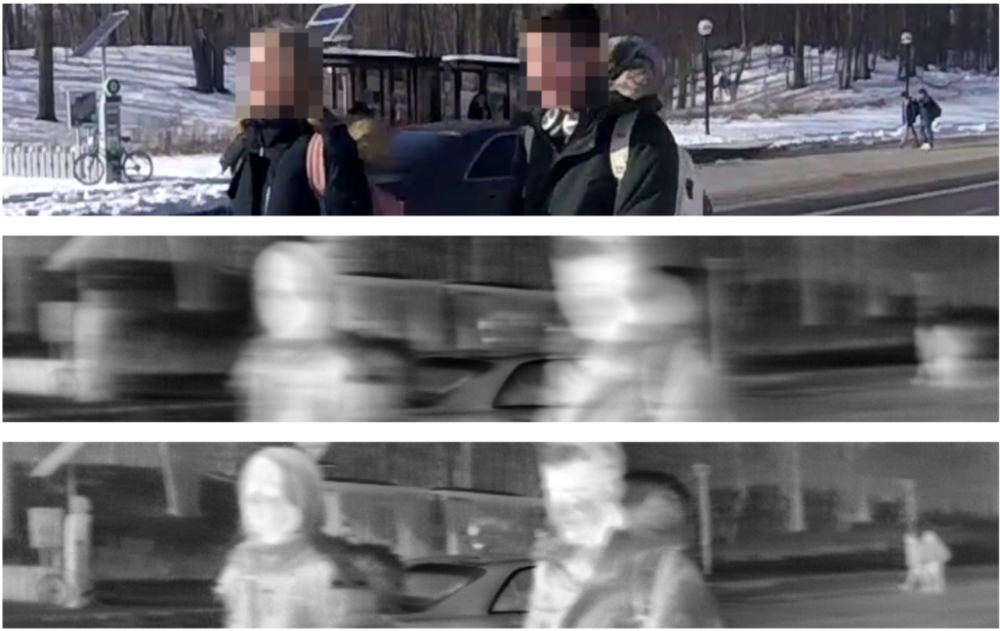

<figure>

<figcaption>Figure 1 from "Pixel-Wise Motion Deblurring of Thermal Videos," _Manikandasriram Srinivasan Ramanagopal, Zixu Zhang, Ram Vasudevan, Matthew Johnson Roberson_.</figcaption>
</figure>

Deblurred thermal imaging, safe trajectory of manipulator arms, and teaching robots multipart tasks are a few topics that University of Michigan researchers presented at the [Robotics: Science and Systems](https://roboticsconference.org/) (RSS) conference in 2020.

While the conference had to be held remotely this year, organizers still pulled together a wide range of robotics experts to showcase their latest work. Not only is top research featured, but the conference also offered participants the chance to examine the values embedded in their work.

## Better citizens

In the [Good Citizens of Robotics Research](https://sites.google.com/view/rss20-gcr) workshop, co-organized by Professor [Nima Fazeli](https://robotics.umich.edu/people/faculty/nima-fazeli/ "Nima Fazeli"), attendees were asked how they might "foster an ever improving, inclusive, and productive community." In this workshop, Professor [Chad Jenkins](https://robotics.umich.edu/people/faculty/chad-jenkins/ "Chad Jenkins") presented on how automated systems failed in the first known wrong accusation and arrest using facial recognition. Professor [Ella Atkins](https://robotics.umich.edu/people/ "Ella Atkins") spoke on how champion diversity of thought in the face of longstanding structures and expectations.

<VideoCenter url="WQfmMph8n0M" />

<VideoCenter url="ScDc9dwlKwc" />

## Chosen as pioneers

In addition to the research below, Patrick Holmes, PhD student in Mechanical Engineering, and [Manikandasriram Srinivasan Ramanagopal](https://robotics.umich.edu/people/ "Manikandasriram Srinivasan Ramanagopal"), PhD student in Robotics, were two of the 28 chosen worldwide to take part in the RSS Pioneers workshop. The Pioneers workshop invited top early career researchers to come together in order to spark creativity, collaboration, and careers while sharing their research focus. Ramanagopal shared work in robot vision, and Holmes shared work in [safe trajectory design](https://www.youtube.com/watch?v=2zpOhM4Eg_Q).

## Papers presented from Michigan

From the [complete list of content](http://www.roboticsproceedings.org/rss16/index.html) from RSS 2020, below are the papers from U-M:

**Reachable Sets for Safe, Real-Time Manipulator Trajectory Design**

_Patrick Holmes, Shreyas Kousik, Bohao Zhang, Daphna Raz, Corina Barbalata, Matthew Johnson Roberson, Ram Vasudevan_

<VideoCenter url="ySnux2owlAA" />

Abstract

For robotic arms to operate in arbitrary environments, especially near people, it is critical to certify the safety of their motion planning algorithms. However, there is often a trade-off between safety and real-time performance; one can either carefully design safe plans, or rapidly generate potentially-unsafe plans. This work presents a receding-horizon, real-time trajectory planner with safety guarantees, called ARMTD (Autonomous Reachability-based Manipulator Trajectory Design). The method first computes (offline) a reachable set of parameterized trajectories for each joint of an arm. Each trajectory includes a fail-safe maneuver (braking to a stop). At runtime, in each receding-horizon planning iteration, ARMTD constructs a parameterized reachable set of the full arm in workspace and intersects it with obstacles to generate sub-differentiable, provably-conservative collision-avoidance constraints on the trajectory parameters. ARMTD then performs trajectory optimization over the parameters, subject to these constraints. On a 6 degree-of-freedom arm, ARMTD outperforms CHOMP in simulation, never crashes, and completes a variety of real-time planning tasks on hardware.  
[Full paper](http://www.roboticsproceedings.org/rss16/p100.pdf)

**Explaining Multi-stage Tasks by Learning Temporal Logic Formulas from Suboptimal Demonstrations**

__Glen Chou, Necmiye Ozay, Dmitry Berenson__

<VideoCenter url="cpUEcWCUMqc" />

Abstract

We present a method for learning to perform multi-stage tasks from demonstrations by learning the logical structure and atomic propositions of a consistent linear temporal logic (LTL) formula. The learner is given successful but potentially suboptimal demonstrations, where the demonstrator is optimizing a cost function while satisfying the LTL formula, and the cost function is uncertain to the learner. Our algorithm uses the Karush-Kuhn-Tucker (KKT) optimality conditions of the demonstrations together with a counterexample-guided falsification strategy to learn the atomic proposition parameters and logical structure of the LTL formula, respectively. We provide theoretical guarantees on the conservativeness of the recovered atomic proposition sets, as well as completeness in the search for finding an LTL formula consistent with the demonstrations. We evaluate our method on high-dimensional nonlinear systems by learning LTL formulas explaining multi-stage tasks on 7-DOF arm and quadrotor systems and show that it outperforms competing methods for learning LTL formulas from positive examples.  
[Full paper](http://www.roboticsproceedings.org/rss16/p097.pdf)

**Pixel-Wise Motion Deblurring of Thermal Videos**

__Manikandasriram Srinivasan Ramanagopal, Zixu Zhang, Ram Vasudevan, Matthew Johnson Roberson__

<VideoCenter url="w6Z-9ykMDBA" />

Abstract

Uncooled microbolometers can enable robots to see in the absence of visible illumination by imaging the “heat” radiated from the scene. Despite this ability to see in the dark, these sensors suffer from significant motion blur. This has limited their application on robotic systems. As described in this paper, this motion blur arises due to the thermal inertia of each pixel. This has meant that traditional motion deblurring techniques, which rely on identifying an appropriate spatial blur kernel to perform spatial deconvolution, are unable to reliably perform motion deblurring on thermal camera images. To address this problem, this paper formulates reversing the effect of thermal inertia at a single pixel as a Least Absolute Shrinkage and Selection Operator (LASSO) problem which we can solve rapidly using a quadratic programming solver. By leveraging sparsity and a high frame rate, this pixel-wise LASSO formulation is able to recover motion deblurred frames of thermal videos without using any spatial information. To compare its quality against state-of-the-art visible camera based deblurring methods, this paper evaluated the performance of a family of pre-trained object detectors on a set of images restored by different deblurring algorithms. All evaluated object detectors performed systematically better on images restored by the proposed algorithm rather than any other tested, state-of-the-art methods.  
[Full paper](http://www.roboticsproceedings.org/rss16/p022.pdf)
