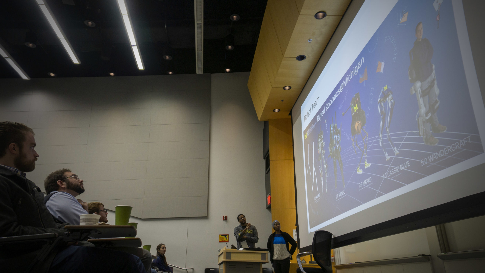

The [International Conference on Intelligent Robots and Systems](https://www.iros2020.org) (IROS) is free to access this year, giving anyone a look into the latest robotics research. Presentations and workshops will be on-demand, starting October 25th, allowing attendees to view the research they desire at any time.

## Workshops

From Michigan, there are several faculty participating in workshops, including:

- [Robotics-Inspired Biology](http://gravishlab.ucsd.edu/iros2020/) with [Talia Moore](https://robotics.umich.edu/profile/talia-moore/ "Talia Moore")
- [State of the Art in Robotic Leg Prostheses: Where We Are and Where We Want to Be](https://belab.mech.utah.edu/iros2020/) with [Bobby Gregg](https://robotics.umich.edu/profile/robert-gregg/ "Robert Gregg") and [Elliott Rouse](https://robotics.umich.edu/profile/elliott-rouse/ "Elliott Rouse")
- [MIT Mini-Cheetah Workshop](https://www.naverlabs.com/mini-cheetah) with [Jessy Grizzle](https://robotics.umich.edu/profile/jessy-grizzle/ "Jessy Grizzle") and [Maani Ghaffari](https://robotics.umich.edu/profile/maani-ghaffari/ "Maani Ghaffari")
- [Benchmarking Progress in Autonomous Driving](https://montrealrobotics.ca/driving-benchmarks/1-schedule.html) with [Ed Olson](https://robotics.umich.edu/profile/edwin-olson/ "Edwin Olson")
- [Mechanisms and Design: from Inception to Realization](https://haosu-robotics.github.io/2020iros-mechanismdesign-workshop.html) with [Elliott Rouse](https://robotics.umich.edu/profile/elliott-rouse/ "Elliott Rouse")
- [Managing Deformation: A Step Towards Higher Robot Autonomy](https://sites.google.com/view/madef-iros2020/home) with [Dmitry Berenson](https://robotics.umich.edu/profile/dmitry-berenson/ "Dmitry Berenson")

## Papers

In addition, several students and researchers are presenting their work:

- **Low Latency Trajectory Predictions for Interaction Aware Highway Driving**  
    _Cyrus Anderson, Ram Vasudevan, Matthew Johnson-Roberson_  
    \[[arXiv](https://arxiv.org/abs/1909.05227)\] \[[IEEE Xplore](https://ieeexplore.ieee.org/document/9140336)\] \[[code](https://github.com/umautobots/low_latency_predictions)\]
- **Polylidar - Polygons From Triangular Meshes**  
    _Jeremy Castagno, Ella Atkins_  
    \[[IEEE Xplore](https://ieeexplore.ieee.org/document/9117017)\] \[[code](https://github.com/JeremyBYU/polylidar)\]
- **Parts-based articulated object localization in clutter using belief propagation**  
    _Jana Pavlasek, Stanley Lewis, Karthik Desingh, Odest Chadwicke Jenkins_  
    \[[arXiv](https://arxiv.org/abs/2008.02881)\] \[[video](<VideoCenter url="qwIuUwkwykI)\] \[[talk](https://youtu.be/D5mnlvZ3bG4)\] \[[website](https://progress.eecs.umich.edu/projects/tool-parts)\] " />
- **TSBP: Tangent space belief propagation for manifold learning**  
    _Thomas Cohn, Odest Chadwicke Jenkins, Karthik Desingh, Zhen Zeng_  
    \[[IEEE Xplore](https://ieeexplore.ieee.org/document/9166624)\] \[[video](<VideoCenter url="fAFwI7ll3bg)\] \[[website](https://progress.eecs.umich.edu/projects/tsbp)\]" />
- **Monocular Depth Prediction through Continuous 3D Loss**  
    _Minghan Zhu, Maani Ghaffari, Yuanxin Zhong, Pingping Lu, Zhong Cao, Ryan M. Eustice, Huei Peng_  
    \[[arXiv](https://arxiv.org/abs/2003.09763)\] \[[video](<VideoCenter url="DBxbEwXKg6M&feature=youtu.be)\] \[[code](https://www.youtube.com/redirect?q=https%3A%2F%2Fgithub.com%2Fminghanz%2Fc3d&v=DBxbEwXKg6M&redir_token=QUFFLUhqbThybVl0cXNsRHlWa293OVQ4NWVUNEZ4c0wzd3xBQ3Jtc0treHpVd251Y2Q3V3ZBTGljSERheTdNVzF3Q09hZFhjNGNldTA0TDloWHlabjNNMlczZjBoaEN4Y244blpIX1o1TzBfOTdBNXlURjBCSVR2ZE5Zamp5czFVNDVHMzRDRUNWb1hRNmpsc1ZWNndNclRQVQ%3D%3D&event=video_description)\]" />
- **Heterogeneous Vehicle Routing and Teaming with Gaussian Distributed Energy Uncertainty**  
    _Bo Fu, William Smith, Denise Rizzo, Matthew Castanier, Kira Barton_  
    \[[arXiv](https://arxiv.org/pdf/2010.11376.pdf)\] \[[video](<VideoCenter url="uGFBUTt7GrM)\]" />
- **Image Transformation and CNNs: A Strategy for Encoding Human Locomotor Intent for Autonomous Wearable Robots**  
    _Ung Hee Lee, Justin Bi, Rishi Patel, David Fouhey, Elliott Rouse_  
    \[[IEEE Xplore](https://ieeexplore.ieee.org/abstract/document/9134897)\] \[code to be released at [Michigan AI Symposium](https://ai.engin.umich.edu/events/2020-ai-symposium/)\]
- **Unsupervised Pedestrian Pose Prediction — A deep predictive coding network-based approach for autonomous vehicle perception**  
    _Xiaoxiao Du, Ram Vasudevan, Matthew Johnson-Roberson_  
    \[[IEEE Xplore](https://ieeexplore.ieee.org/document/9042808)\] \[[video](<VideoCenter url="35MNoZSnbJM)\] \[[talk](https://youtu.be/5baDdBJ8Bss)\] \[[code](https://github.com/umautobots/unsupervised-pedestrian-pose-prediction)\] " />
- **SilhoNet-Fisheye: Adaptation of A ROI Based Object Pose Estimation Network to Monocular Fisheye Images**  
    _Gideon Billings, Matthew Johnson-Roberson_  
    \[[arXiv](https://arxiv.org/abs/2002.12415)\] \[[IEEE Xplore](https://ieeexplore.ieee.org/document/9091344)\] \[[IROS Video Link](https://www.iros2020.org/ondemand/episode?id=2762&id2=DL%20for%20Visual%20Perception%20II&1603732691646)\]

<VideoCenter url="qwIuUwkwykI&list=PLdPQZLMHRjDIRNmbHEE9-YPp4iQTAoe1D" />
