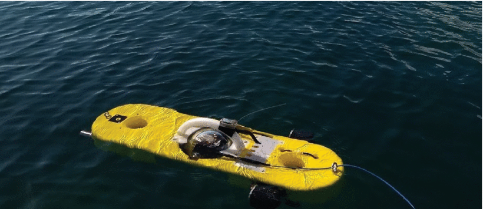
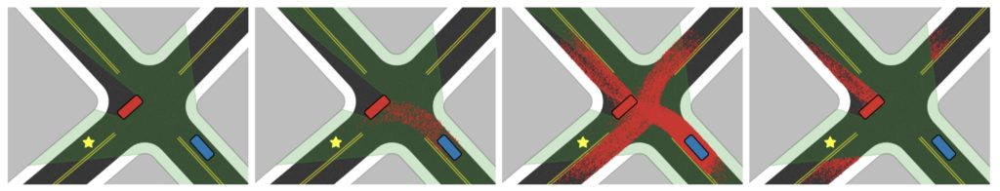
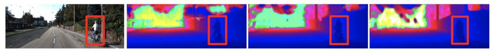
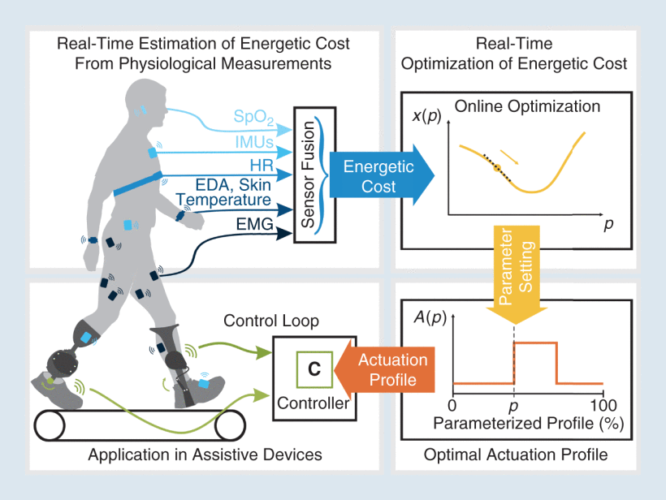
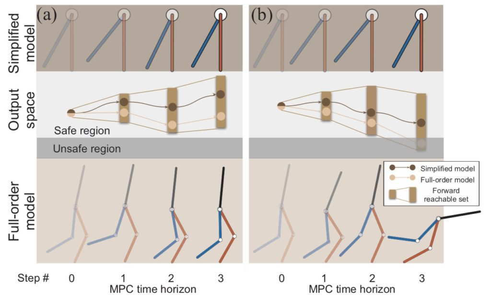
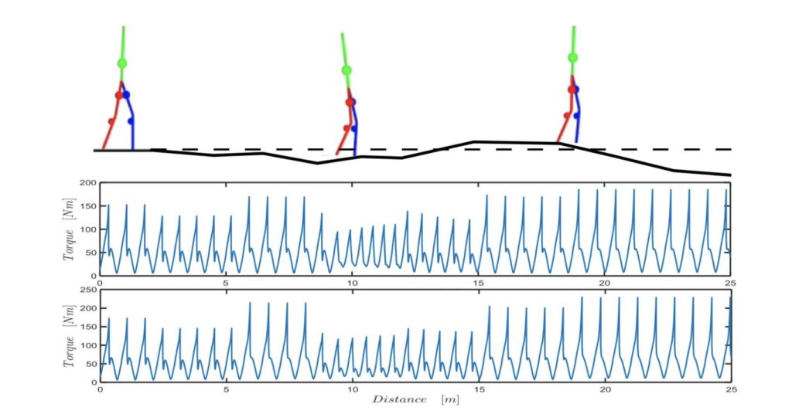
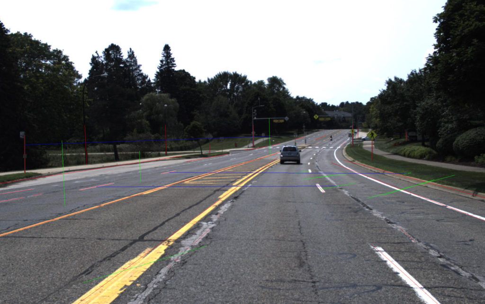

University of Michigan researchers will present work on topics such as unsupervised learning, motion and path planning, autonomous vehicle navigation, bipedal gaits, wearable robots, and even snakes at next week's International Conference on Robotics and Automation (ICRA) 2020.

Originally planned for Paris, the conference will be held remotely this year throughout the summer. It is a premier robotics research showcase, and thanks to conference organizers, [there are many opportunities to engage with peers](https://spectrum.ieee.org/automaton/robotics/robotics-hardware/virtual-icra-robotics-research-conference) beyond reading PDFs on your own computer, such as joining a Slack channel question and answer session, submitting a video to the funny robot challenge, playing robot trivia, or participating in the women in engineering mentoring event.

The work covers the spectrum of Michigan Robotics' research [focus areas](https://2024.robotics.umich.edu/research/focus-areas/), and illustrates the interdisciplinary effort from multiple departments and schools that furthers the potential for robotics to benefit society.

<!--more-->

From Michigan, the following research will be presented:

## Pedestrian Planar LiDAR Pose (PPLP) Network for Oriented Pedestrian Detection Based on Planar LiDAR and Monocular Images

_Fan Bu, Trinh Le, [Xiaoxiao Du](https://2024.robotics.umich.edu/profile/xiaoxiao-du/), [Ram Vasudevan](https://2024.robotics.umich.edu/profile/ram-vasudevan/), [Matthew Johnson-Roberson](https://2024.robotics.umich.edu/profile/matthew-johnson-roberson/)_

https://www.youtube.com/watch?v=LBOdEgxiN8o

Abstract

Pedestrian detection is an important task for human-robot interaction and autonomous driving applications. Most previous pedestrian detection methods rely on data collected from three-dimensional (3D) Light Detection and Ranging (LiDAR) sensors in addition to camera imagery, which can be expensive to deploy. In this letter, we propose a novel Pedestrian Planar LiDAR Pose Network (PPLP Net) based on two-dimensional (2D) LiDAR data and monocular camera imagery, which offers a far more affordable solution to the oriented pedestrian detection problem. The proposed PPLP Net consists of three sub-networks: an orientation detection network (OrientNet), a Region Proposal Network (RPN), and a PredictorNet. The OrientNet leverages state-of-the-art neural-network-based 2D pedestrian detection algorithms, including Mask R-CNN and ResNet, to detect the Bird's Eye View (BEV) orientation of each pedestrian. The RPN transfers 2D LiDAR point clouds into occupancy grid map and uses a frustum-based matching strategy for estimating non-oriented 3D pedestrian bounding boxes. Outputs from both OrientNet and RPN are passed through the PredictorNet for a final regression. The overall outputs of our proposed network are 3D bounding box locations and orientation values for all pedestrians in the scene. We present oriented pedestrian detection results on two datasets, the CMU Panoptic Dataset and a newly collected FCAV M-Air Pedestrian (FMP) Dataset, and show that our proposed PPLP network based on 2D LiDAR and monocular camera achieves similar or better performance to previous state-of-the-art 3D-LiDAR-based pedestrian detection methods in both indoor and outdoor environments.

[Full paper](https://ieeexplore.ieee.org/document/8943147)

## Robot-Supervised Learning for Object Segmentation

_Victoria Florence, [Jason Corso](https://2024.robotics.umich.edu/profile/jason-corso/), [Brent Griffin](https://2024.robotics.umich.edu/profile/brent-griffin/)_

https://www.youtube.com/watch?v=sebqFQRbYUM

Abstract

To be effective in unstructured and changing environments, robots must learn to recognize new objects. Deep learning has enabled rapid progress for object detection and segmentation in computer vision; however, this progress comes at the price of human annotators labeling many training examples. This paper addresses the problem of extending learning-based segmentation methods to robotics applications where annotated training data is not available. Our method enables pixelwise segmentation of grasped objects. We factor the problem of segmenting the object from the background into two sub-problems: (1) segmenting the robot manipulator and object from the background and (2) segmenting the object from the manipulator. We propose a kinematics-based foreground segmentation technique to solve (1). To solve (2), we train a self-recognition network that segments the robot manipulator. We train this network without human supervision, leveraging our foreground segmentation technique from (1) to label a training set of images containing the robot manipulator without a grasped object. We demonstrate experimentally that our method outperforms state-of-the-art adaptable in-hand object segmentation. We also show that a training set composed of automatically labelled images of grasped objects improves segmentation performance on a test set of images of the same objects in the environment.

[Full paper](https://arxiv.org/abs/1904.00952)

## Towards Distortion Based Underwater Domed Viewport Camera Calibration

_Eduardo Iscar, [Matthew Johnson-Roberson](https://2024.robotics.umich.edu/profile/matthew-johnson-roberson/)_

Abstract

Photogrammetry techniques used for 3D reconstructions and motion estimation from images are based on projective geometry that models the image formation process. However, in the underwater setting, refraction of light rays at the housing interface introduce non-linear effects in the image formation. These effects produce systematic errors if not accounted for, and severely degrade the quality of the acquired images. In this paper, we present a novel approach to the calibration of cameras inside spherical domes with large offsets between dome and camera centers. Such large offsets not only amplify the effect of refraction, but also introduce blur in the image that corrupts feature extractors used to establish image-world correspondences in existing refractive calibration methods. We propose using the point spread function (PSF) as a complete description of the optical system and introduce a procedure to recover the camera pose inside the dome based on the measurement of the distortions. Results on a collected dataset show the method is capable of recovering the camera pose with high accuracy.

## Semantic Linking Maps for Active Visual Object Search

_Zhen Zeng, Adrian Röfer (University of Bremen), [Odest Chadwicke Jenkins](https://2024.robotics.umich.edu/profile/chad-jenkins/)_ Finalist for Best Cognitive Robotics Paper

https://www.youtube.com/watch?v=uWWJ5aV6ScE

Abstract

We aim for mobile robots to function in a variety of common human environments. Such robots need to be able to reason about the locations of previously unseen target objects. Landmark objects can help this reasoning by narrowing down the search space significantly. More specifically, we can exploit background knowledge about common spatial relations between landmark and target objects. For example, seeing a table and knowing that cups can often be found on tables aids the discovery of a cup. Such correlations can be expressed as distributions over possible pairing relationships of objects. In this paper, we propose an active visual object search strategy method through our introduction of the Semantic Linking Maps (_SLiM_) model. _SLiM_ simultaneously maintains the belief over a target object’s location as well as landmark objects’ locations, while accounting for probabilistic inter-object spatial relations. Based on _SLiM_, we describe a hybrid search strategy that selects the next best view pose for searching for the target object based on the maintained belief. We demonstrate the efficiency of our _SLiM_\-based search strategy through comparative experiments in simulated environments. We further demonstrate the real- world applicability of _SLiM_\-based search in scenarios with a Fetch mobile manipulation robot.

[Full paper](https://7948cefb-1ef7-4c55-96df-fcb8d527c697.filesusr.com/ugd/0886ee_198d7d01f879448bbf00733b21bfcbe9.pdf)

## Emulating Duration and Curvature of Coral Snake Anti-Predator Thrashing Behaviors Using a Soft-Robotic Platform

_Shannon Danforth, Margaret Kohler, Daniel Bruder, Alison Davis Rabosky, Sridhar Kota, [Ram Vasudevan](https://2024.robotics.umich.edu/profile/ram-vasudevan/), [Talia Moore](https://2024.robotics.umich.edu/profile/talia-moore/)_

https://www.youtube.com/watch?v=wCZSd0FNb5Y

Abstract

This paper presents a soft-robotic platform for exploring the ecological relevance of non-locomotory movements via animal-robot interactions. Coral snakes (genus Micrurus) and their mimics use vigorous, non-locomotory, and arrhythmic thrashing to deter predation. There is variation across snake species in the duration and curvature of anti-predator thrashes, and it is unclear how these aspects of motion interact to contribute to snake survival. In this work, soft robots composed of fiber-reinforced elastomeric enclosures (FREEs) are developed to emulate the anti-predator behaviors of three genera of snake. Curvature and duration of motion are estimated for both live snakes and robots, providing a quantitative assessment of the robots' ability to emulate snake poses. The curvature values of the fabricated soft-robotic head, midsection, and tail segments are found to overlap with those exhibited by live snakes. Soft robot motion durations were less than or equal to those of snakes for all three genera. Additionally, combinations of segments were selected to emulate three specific snake genera with distinct anti-predatory behavior, producing curvature values that aligned well with live snake observations.

[Full paper](https://arxiv.org/abs/2002.09577)

## Risk Assessment and Planning with Bidirectional Reachability for Autonomous Driving

_[Ming-Yuan Yu](https://2024.robotics.umich.edu/profile/ming-yuan-yu/), [Matthew Johnson-Roberson](https://2024.robotics.umich.edu/profile/matthew-johnson-roberson/), [Ram Vasudevan](https://2024.robotics.umich.edu/profile/ram-vasudevan/)_

Abstract

Knowing and predicting dangerous factors within a scene are two key components during autonomous driving, especially in a crowded urban environment. To navigate safely in environments, risk assessment is needed to quantify and associate the risk of taking a certain action. Risk assessment and planning is usually done by first tracking and predicting trajectories of other agents, such as vehicles and pedestrians, and then choosing an action to avoid collision in the future. However, few existing risk assessment algorithms handle occlusion and other sensory limitations effectively. This paper explores the possibility of efficient risk assessment under occlusion via both forward and backward reachability. The proposed algorithm can not only identify where the risk-induced factors are, but also be used for motion planning by executing low-level commands, such as throttle. The proposed method is evaluated on various four-way highly occluded intersections with up to five other vehicles in the scene. Compared with other risk assessment algorithms, the proposed method shows better efficiency, meaning that the ego vehicle reaches the goal at a higher speed. In addition, it also lowers the median collision rate by 7.5x.

[Full paper](https://arxiv.org/abs/1909.08059)

## Learning When to Trust a Dynamics Model for Planning in Reduced State Spaces

_[Dale Steven McConachie](https://2024.robotics.umich.edu/profile/dale-mcconachie/), [Thomas Power](https://2024.robotics.umich.edu/profile/tom-power/), [Peter Mitrano](https://2024.robotics.umich.edu/profile/peter-mitrano/), [Dmitry Berenson](https://2024.robotics.umich.edu/profile/dmitry-berenson/)_

https://www.youtube.com/watch?v=esgWD8Iqi34

Abstract

When the dynamics of a system are difficult to model and/or time-consuming to evaluate, such as in deformable object manipulation tasks, motion planning algorithms struggle to find feasible plans efficiently. Such problems are often reduced to state spaces where the dynamics are straightforward to model and evaluate. However, such reductions usually discard information about the system for the benefit of computational efficiency, leading to cases where the true and reduced dynamics disagree on the result of an action. This paper presents a formulation for planning in reduced state spaces that uses a classifier to bias the planner away from state-action pairs that are not reliably feasible under the true dynamics. We present a method to generate and label data to train such a classifier, as well as an application of our framework to rope manipulation, where we use a Virtual Elastic Band (VEB) approximation to the true dynamics. Our experiments with rope manipulation demonstrate that the classifier significantly improves the success rate of our RRT-based planner in several difficult scenarios which are designed to cause the VEB to produce incorrect predictions in key parts of the environment.

[Full paper](https://arxiv.org/abs/2001.11051)

## Fast Planning Over Roadmaps Via Selective Densification

_[Brad Saund](https://2024.robotics.umich.edu/profile/brad-saund/), [Dmitry Berenson](https://2024.robotics.umich.edu/profile/dmitry-berenson/)_

https://www.youtube.com/watch?v=x\_XOuBVk170

Abstract

We propose the Selective Densification method for fast motion planning through configuration space. We create a sequence of roadmaps by iteratively adding configurations. We organize these roadmaps into layers and add edges between identical configurations between layers. We find a path using best-first search, guided by our proposed estimate of remaining planning time. This estimate prefers to expand nodes closer to the goal and nodes on sparser layers.

We present proofs of the path quality and maximum depth of nodes expanded using our proposed graph and heuristic. We also present experiments comparing Selective Densification to bidirectional RRT-connect, as well as many graph search approaches. In difficult environments that require exploration on the dense layers we find Selective Densification finds solutions faster than all other approaches.

[Full paper](https://arxiv.org/abs/2002.04941)

## Analysis and Prediction of Pedestrian Crosswalk Behavior During Automated Vehicle Interactions

_Suresh Kumaar Jayaraman, [Dawn Tilbury](https://2024.robotics.umich.edu/profile/dawn-tilbury/), [X. Jessie Yang](https://2024.robotics.umich.edu/profile/xi-jessie-yang/), Anuj Pradhan (University of Massachusetts Amherst), [Lionel Robert](https://2024.robotics.umich.edu/profile/lionel-robert/)_

https://www.youtube.com/watch?v=52LkjchUZy4

Abstract

For safe navigation around pedestrians, automated vehicles (AVs) need to plan their motion by accurately predicting pedestrians trajectories over long time horizons. Current approaches to AV motion planning around crosswalks predict only for short time horizons (1-2 s) and are based on data from pedestrian interactions with human-driven vehicles (HDVs). In this paper, we develop a hybrid systems model that uses pedestrians gap acceptance behavior and constant velocity dynamics for long-term pedestrian trajectory prediction when interacting with AVs. Results demonstrate the applicability of the model for long-term (> 5 s) pedestrian trajectory prediction at crosswalks. Further we compared measures of pedestrian crossing behaviors in the immersive virtual environment (when interacting with AVs) to that in the real world (results of published studies of pedestrians interacting with HDVs), and found similarities between the two. These similarities demonstrate the applicability of the hybrid model of AV interactions developed from an immersive virtual environment (IVE) for real-world scenarios for both AVs and HDVs.

[Full paper](https://arxiv.org/abs/2003.09996)

## Learning Constraints from Locally-Optimal Demonstrations under Cost Function Uncertainty

_Glen Chou, [Necmiye Ozay](https://2024.robotics.umich.edu/profile/necmiye-ozay/), [Dmitry Berenson](https://2024.robotics.umich.edu/profile/dmitry-berenson/)_

https://www.youtube.com/watch?v=TM6DKFmRCIc

Abstract

We present an algorithm for learning parametric constraints from locally-optimal demonstrations, where the cost function being optimized is uncertain to the learner. Our method uses the Karush-Kuhn-Tucker (KKT) optimality conditions of the demonstrations within a mixed integer linear program (MILP) to learn constraints which are consistent with the local optimality of the demonstrations, by either using a known constraint parameterization or by incrementally growing a parameterization that is consistent with the demonstrations. We provide theoretical guarantees on the conservativeness of the recovered safe/unsafe sets and analyze the limits of constraint learnability when using locally-optimal demonstrations. We evaluate our method on high-dimensional constraints and systems by learning constraints for 7-DOF arm and quadrotor examples, show that it outperforms competing constraint-learning approaches, and can be effectively used to plan new constraint-satisfying trajectories in the environment.

[Full paper](https://arxiv.org/abs/2001.09336)

## Robust Humanoid Contact Planning with Learned Zero and One-Step Capturability Prediction

_[Yu-Chi Lin](https://2024.robotics.umich.edu/profile/yu-chi-lin/), Ludovic Righetti (New York University), [Dmitry Berenson](https://2024.robotics.umich.edu/profile/dmitry-berenson/)_

https://www.youtube.com/watch?v=hEIpeZy3GWQ

Abstract

Humanoid robots maintain balance and navigate by controlling the contact wrenches applied to the environment. While it is possible to plan dynamically-feasible motion that applies appropriate wrenches using existing methods, a humanoid may also be affected by external disturbances. Existing systems typically rely on controllers to reactively recover from disturbances. However, such controllers may fail when the robot cannot reach contacts capable of rejecting a given disturbance. In this paper, we propose a search-based footstep planner which aims to maximize the probability of the robot successfully reaching the goal without falling as a result of a disturbance. The planner considers not only the poses of the planned contact sequence, but also alternative contacts near the planned contact sequence that can be used to recover from external disturbances. Although this additional consideration significantly increases the computation load, we train neural networks to efficiently predict multi-contact zero-step and one-step capturability, which allows the planner to generate robust contact sequences efficiently. Our results show that our approach generates footstep sequences that are more robust to external disturbances than a conventional footstep planner in four challenging scenarios.

[Full paper](https://arxiv.org/abs/1909.09233)

## LiStereo: Generate Dense Depth Maps from LIDAR and Stereo Imagery

_Zhang Junming, [Manikandasriram Srinivasan Ramanagopal](https://2024.robotics.umich.edu/profile/manikandasriram-srinivasan-ramanagopal/), [Ram Vasudevan](https://2024.robotics.umich.edu/profile/ram-vasudevan/), [Matthew Johnson-Roberson](https://2024.robotics.umich.edu/profile/matthew-johnson-roberson/)_

Abstract

An accurate depth map of the environment is critical to the safe operation of autonomous robots and vehicles. Currently, either light detection and ranging (LIDAR) or stereo matching algorithms are used to acquire such depth information. However, a high-resolution LIDAR is expensive and produces sparse depth map at large range; stereo matching algorithms are able to generate denser depth maps but are typically less accurate than LIDAR at long range. This paper combines these approaches together to generate high-quality dense depth maps. Unlike previous approaches that are trained using ground-truth labels, the proposed model adopts a self-supervised training process. Experiments show that the proposed method is able to generate high-quality dense depth maps and performs robustly even with low-resolution inputs. This shows the potential to reduce the cost by using LIDARs with lower resolution in concert with stereo systems while maintaining high resolution.

[Full paper](https://arxiv.org/abs/1905.02744)

## Accelerating the Estimation of Metabolic Cost Using Signal Derivatives: Implications for Optimization and Evaluation of Wearable Robots

_Kimberly Ingraham, [Elliott Rouse](https://2024.robotics.umich.edu/profile/elliott-rouse/), C. David Remy (University of Stuttgart)_

Abstract

A chief goal for lower-limb wearable robots (e.g., exoskeletons) is to augment the user's natural motion in a helpful, intuitive way. Accordingly, a common evaluation metric for such systems is the effect of the robotic assistance on the metabolic cost of the wearer. Recent hardware and control advancements have enabled researchers to achieve the challenging task of reducing the metabolic cost of walking below that of walking without an exoskeleton, using autonomous, tethered, and even passive devices. Although energy expenditure has long been used as an evaluation metric for device efficacy, it has also been proposed as a design specification (i.e., the Augmentation Factor) and, recently, used as a physiological cost function for the realtime control of wearable robotic devices-a strategy known as _body-in-the-loop_ or _human-in-the-loop optimization_. These algorithms use real-time estimates of metabolic cost to iteratively tune the actuation profile of an assistive device to minimize the wearer's energetic cost.

[Full paper](https://ieeexplore.ieee.org/document/8933354)

## Leveraging the Template and Anchor Framework for Safe, Online Robotic Gait Design

_[Jinsun Liu](https://2024.robotics.umich.edu/profile/jinsun-liu/), Pengcheng Zhao, Zhenyu Gan, [Matthew Johnson-Roberson](https://2024.robotics.umich.edu/profile/matthew-johnson-roberson/), [Ram Vasudevan](https://2024.robotics.umich.edu/profile/ram-vasudevan/)_

Abstract

Online control design using a high-fidelity, full-order model for a bipedal robot can be challenging due to the size of the state space of the model. A commonly adopted solution to overcome this challenge is to approximate the full-order model (anchor) with a simplified, reduced-order model (template), while performing control synthesis. Unfortunately it is challenging to make formal guarantees about the safety of an anchor model using a controller designed in an online fashion using a template model. To address this problem, this paper proposes a method to generate safety-preserving controllers for anchor models by performing reachability analysis on template models while bounding the modeling error. This paper describes how this reachable set can be incorporated into a Model Predictive Control framework to select controllers that result in safe walking on the anchor model in an online fashion. The method is illustrated on a 5-link RABBIT model, and is shown to allow the robot to walk safely while utilizing controllers designed in an online fashion.

[Full paper](https://arxiv.org/abs/1909.11125)

## Nonholonomic Virtual Constraint Design for Variable-Incline Bipedal Robotic Walking

_Jonathan Horn (University of Texas at Dallas), Alireza Mohammadi (University of Michigan, Dearborn), Kaveh Akbari Hamed (Virginia Tech), [Robert D. Gregg](https://2024.robotics.umich.edu/profile/robert-gregg/)_

Abstract

This letter presents a method of designing relative-degree-two nonholonomic virtual constraints (NHVCs) that allow for stable bipedal robotic walking across variable terrain slopes. Relative-degree-two NHVCs are virtual constraints that encode velocity-dependent walking gaits via momenta conjugate to the unactuated degrees of freedom for the robot. We recently introduced a systematic method of designing NHVCs, based on the hybrid zero dynamics (HZD) control framework, to achieve hybrid invariant flat ground walking without the use of dynamic reset variables. This work addresses the problem of walking over variable-inclined terrain disturbances. We propose a methodology for designing NHVCs, via an optimization problem, in order to achieve stable walking across variable terrain slopes. The end result is a single controller capable of walking over variable-inclined surfaces, that is also robust to inclines not considered in the optimization design problem, and uncertainties in the inertial parameters of the model.

[Full pape](https://ieeexplore.ieee.org/document/9018143)[r](https://web.eecs.umich.edu/locolab/documents/HornGregg-RAL20final.pdf)

## 2D to 3D Line-Based Registration with Unknown Associations Via Mixed-Integer Programming

_Steven Parkison, Jeffrey Walls, Ryan Wolcott, Mohammad Saad (Toyota Research Institute), [Ryan Eustice](https://2024.robotics.umich.edu/profile/ryan-eustice/)_

Abstract

Determining the rigid-body transformation between 2D image data and 3D point cloud data has applications for mobile robotics including sensor calibration and localizing into a prior map. Common approaches to 2D-3D registration use least-squares solvers assuming known associations often provided by heuristic front-ends, or iterative nearest-neighbor. We present a linear line-based 2D-3D registration algorithm formulated as a mixed-integer program to simultaneously solve for the correct transformation and data association. Our formulation is explicitly formulated to handle outliers, by modeling associations as integer variables. Additionally, we can constrain the registration to SE(2) to improve runtime and accuracy. We evaluate this search over multiple real-world data sets demonstrating adaptability to scene variation.

For more of the latest research from Michigan Robotics, subscribe to our quarterly newsletter:
