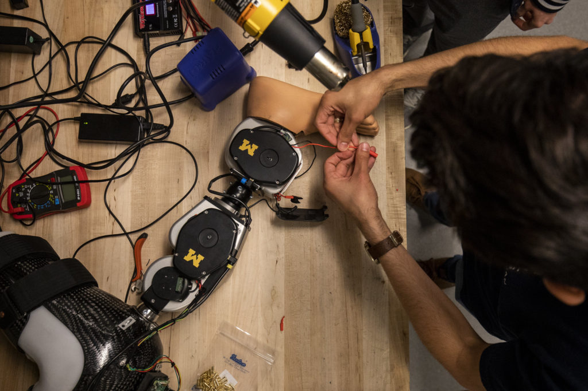

<figure>

<figcaption>

Alejandro Azocar puts the finishing connections together before testing an open-source robotic leg designed by Elliott Rouse. Photo: Robert Coelius, Michigan Engineering

</figcaption>

</figure>

A new paper on the [Open Source Leg](https://opensourceleg.com/), an artificially-intelligent bionic prosthetic leg developed by University of Michigan researchers, was recently [published in Nature Biomedical Engineering](https://www.nature.com/articles/s41551-020-00619-3).

The open-source project, [launched publicly](https://robotics.umich.edu/2019/open-source-bionic-leg-first-of-its-kind-platform-aims-to-rapidly-advance-prosthetics/) last year, is meant to ease the research of controls for prostheses by offering an accessible, comparable, and universal platform available to a broad array of scientists and engineers.

“We hope our bionic leg will unite researchers with a common hardware platform and enable new investigators from related fields to develop innovative control strategies,” said lead designer Elliott Rouse, core faculty at U-M’s Robotics Institute and assistant professor of mechanical engineering.

As the paper describes, the Open Source Leg (OSL) was designed to be:

> _Simple: the OSL can be assembled, controlled and maintained with moderate ‘hands-on’ skills. To this end, we reduced the number of components and suppliers; the vast majority of parts are machined from a single supplier, without dependencies on other precision machine components or mechanisms._
> 
> _Portable: the OSL weighs less than the biological counterpart, and each joint has on-board batteries, sensing and control, facilitating research outside of the laboratory._
> 
> _Scalable: the knee and ankle joints can operate independently, enabling research in patients with above-knee and below-knee amputations._
> 
> _Customizable: the OSL includes several design and control features that can be customized depending on the specific requirements of the researcher, including the knee’s series elastic element, foot type and inclusion of a load cell, among other options._
> 
> _Economical: the OSL costs approximately US$10,000–30,000 in prototype quantities, depending on degrees of freedom and sensing options, given the present manufacturing and material costs. By contrast, commercially available powered prostheses—such as the Ottobock Empower ankle and the Ossur POWER KNEE—cost up to US$100,000 each, without access to control modifications._

The team includes first-author Alejandro Azocar, a PhD candidate in mechanical engineering at U-M, Luke Mooney and Jean-François Duval of Dephy, Inc., and [Levi Hargrove](https://www.sralab.org/researchers/levi-hargrove-phd) and [Ann Simon](https://www.sralab.org/researchers/ann-simon-phd) of the Center for Bionic Medicine at the Shirley Ryan AbilityLab.

Previously, the team [presented progress](https://ieeexplore.ieee.org/document/8488057) on the leg at the 2018 IEEE International Conference on Biomedical Robotics and Biomechatronics.

This work was supported by the National Science Foundation Graduate Research Fellowship, National Science Foundation National Robotics Initiative, and the MSL Renewed Hope Foundation.

