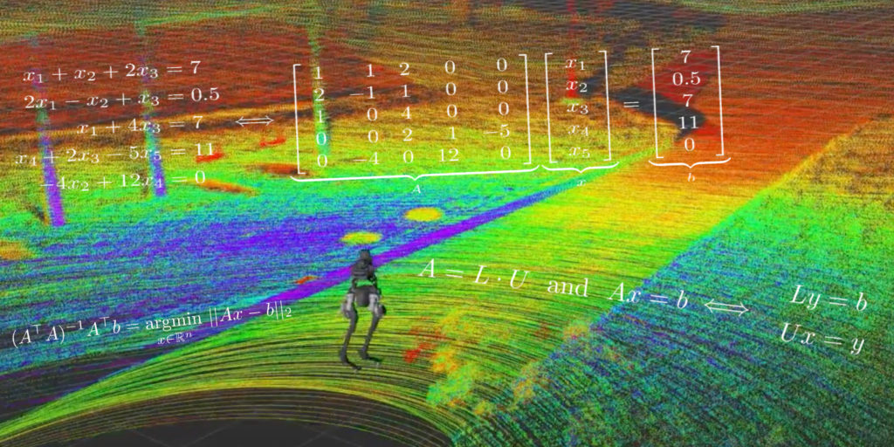

A pilot course for an undergraduate robotics curriculum at the University of Michigan, Robotics 101: Computational Linear Algebra, is now available for free online. All lectures, notes, projects, and the textbook can be accessed on [GitHub](http://github.com/michiganrobotics/rob101) and [YouTube](https://www.youtube.com/playlist?list=PLdPQZLMHRjDK8ZbLIcq1Q2PQobIi68dpv).

The course is meant to inspire and welcome students to learn key mathematical concepts that can immediately be applied to hands-on, interesting engineering problems, such as building a map from LiDAR data and balancing a Segway.

"Linear algebra has become the language of computer vision, machine learning, robotics, and autonomy," said Professor Jessy Grizzle, Director of Michigan Robotics.

"Instead of students taking four semesters of calculus before robotics coursework, we start with the most impactful math for robotics and real robotics projects," said Professor Chad Jenkins, Associate Director of Undergraduate Programs.

As the first building block in a complete Robotics undergraduate curriculum being developed by Professor Jenkins, the course prioritizes accessibility and inclusivity:

- The course assumes no background in programming or Calculus in order to open up mathematics and programming to everyone, no matter what their high school offered.
- The students utilize a no-cost textbook that was developed over the summer.
- Assignments are completed in the cloud, so that students with access to older technology had equally fast computing.
- This past fall, lectures were streamed not only to U-M students who preferred not to attend in-person, but to Morehouse College and Spelman College students interested in learning the material.

<VideoCenter url="v1jneRWVrxY" />

Professors Grizzle and Maani Ghaffari taught [the course in Fall 2020](https://robotics.umich.edu/academic-program/course-offerings/rob101-fall-2020/ "ROB 101: Computational Linear Algebra"), introducing a wide range of concepts that power many modern autonomous systems. Tribhi Kathuria, Robotics PhD student, led recitations as a Graduate Student Instructor and Kira Biener, undergraduate Engineering student, served as an Instructional Aide. In addition, both Kathuria and Biener helped develop the course material over the summer.

Shaoxiong Yao, undergraduate Computer Science & Engineering student, also served as an Instructional Aide.

Others who contributed to the course include Madhav Achar, Fangtong (Miley) Liu, Eva Mungai, Bruce JK Huang, Grant A. Gibson, Oluwami Dosunmu-Ogunbi, Lu Gan, and Ray Zhang.

Further undergraduate robotics courses at U-M are under development. The Robotics Institute started master's and PhD programs in 2015, and will enter a new home, the [Ford Motor Company Robotics Building](https://robotics.umich.edu/about/ford-motor-company-robotics-building/ "Ford Robotics Building"), in 2021.

## ROB 101 Course Material

- [On Github](https://github.com/michiganrobotics/rob101)
- [On YouTube](https://www.youtube.com/playlist?list=PLdPQZLMHRjDK8ZbLIcq1Q2PQobIi68dpv)
