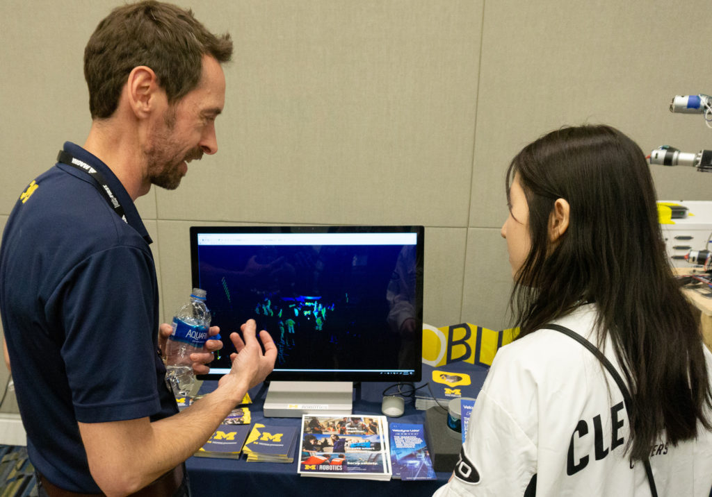

<figure>

<figcaption>Damen Provost (left), Managing Director of the Robotics Institute, explains a LIDAR demonstration to young roboticists at the 2019 FIRST World Championships in Detroit in April 24, 2019.</figcaption>
</figure>

A portion of a [$2.5M gift from the Daniel E. Offutt III Charitable Trust to endow the Computer Science and Engineering Division Chair](https://cse.engin.umich.edu/stories/gift-from-daniel-e-offutt-iii-charitable-trust-endows-cse-chair-and-funds-targeted-activities) will support the Managing Director of the University of Michigan Robotics Institute. 

The late Mr. Offutt graduated from the University of Maryland and received an MBA from Columbia University in 1965. His career was as a stock trader. His longtime friend and colleague, Richard Orenstein, made the gift on behalf of the Trust.

Richard Orenstein (BS Math 1962) was a student at U-M from 1958–1962, a time period during which computing was still emerging as an area of research and as a discipline at the University. Some classes in computation were being developed and offered, but an undergraduate program would not be formed until 1965. Orenstein, who had a strong interest in the nascent field, took as many classes in computing as he could and majored in math. He continues to hold a strong interest in computing related research at Michigan.

After completion of his degree, Orenstein took a post at MIT, where he was a part of the team that developed and implemented the Compatible Time-Sharing System (CTSS) at the MIT Computation Center in 1963. CTSS was created to increase the efficiency of debugging and running large applications, and to make feasible new classes of applications. In 1967, along with others, he founded Computer Software Systems, later renamed National CSS, which was sold in 1979.

In addition to supporting the CSE chair and David Chesney, lecturer in CSE, Orenstein’s gift will help fund the Robotics Institute’s efforts to accelerate the capabilities of smart machines, such as powered prosthetics, and to enable access to all in studying, creating, and utilizing robotics. This support will directly apply to the Managing Director of the Robotics Institute, [Damen Provost](https://robotics.umich.edu/people/staff/damen-provost/ "Damen Provost").

“One of the true strengths of Robotics at Michigan is the diversity in people, and through them, the ideas needed to tackle the hardest problems of today and tomorrow,” Provost said.

“The generosity of Richard Orenstein allows us to leverage the best staff, students, and faculty to cultivate a pipeline of talented roboticists from elementary school to graduate school and produce tomorrow’s engineers and leaders.”

Provost, an engineer who helped launch NASA and U-M’s CYGNSS satellite constellation, champions new initiatives that actively define and differentiate the relatively new Robotics program. This includes comanaging, with Unit Administrator Kimberly Mann, the outfitting of the new home to Robotics, the $75M [Ford Motor Company Robotics Building](https://robotics.umich.edu/about/facilities/ford-robotics-building/ "Ford Robotics Building"). Provost has also helped secure grants to upgrade the outdoor autonomous system testing site, [M-Air](https://robotics.umich.edu/about/facilities/m-air-net/ "M-Air"), with over 30 motion capture cameras and next-generation wireless communication. In addition, Provost connected with corporate partners to launch the Robotics Fellowship Program, providing students an opportunity to combine a summer position in the industry with fall coursework and winter symposium.

“With ‘robotics is a team sport’ as our motto, this gift will indirectly but undoubtedly help our staff, students, and faculty, all of which are second to none.” Provost added.
