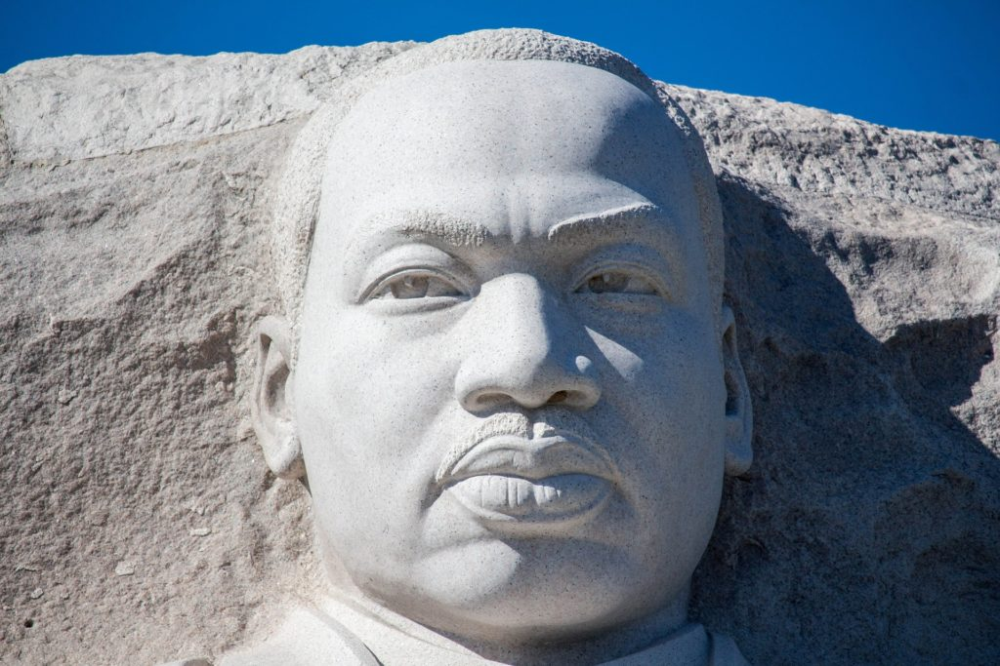
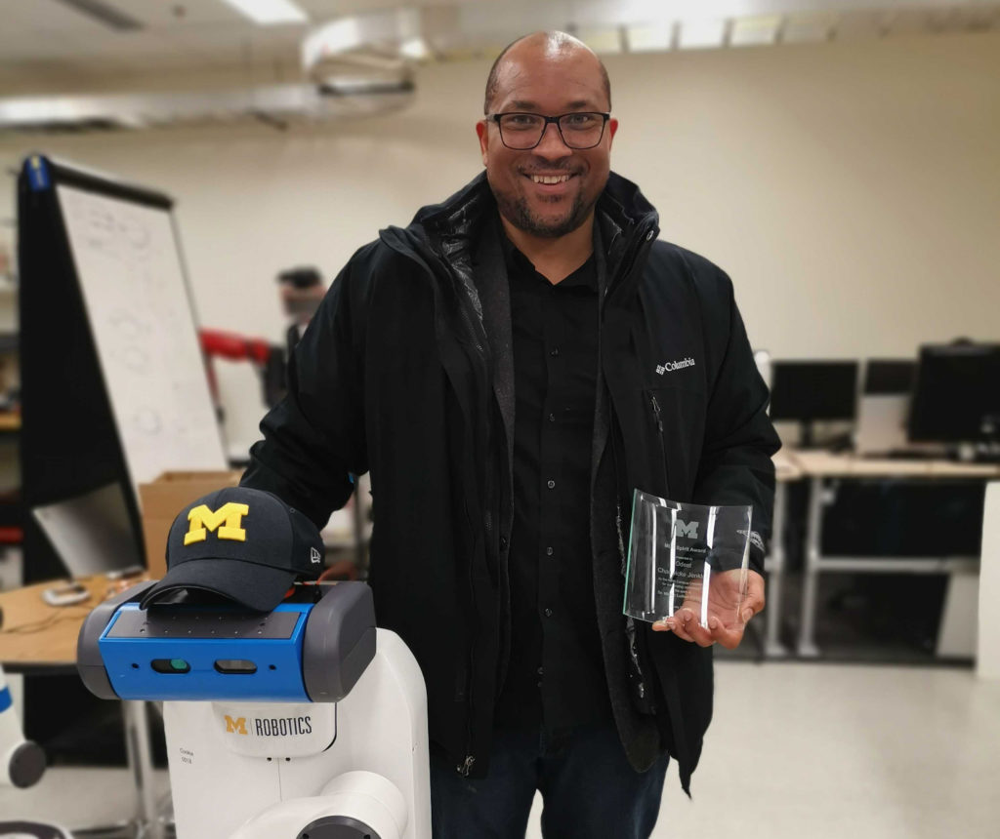

[Chad Jenkins](https://robotics.umich.edu/people/faculty/chad-jenkins/), associate professor of computer science, received an MLK Spirit Award for "exemplifying the leadership and vision of Dr. King through their commitment to social justice, diversity, equity, and inclusion."

An excerpt from his nomination:

> If you want to call Professor Chad Jenkins a leading roboticist, you must also call him a leading roboticist who understands the great equalizing potential of robotics, a roboticist who integrates that belief into his cutting-edge research, outreach, and everyday faculty duties, and a roboticist who is determined to include others into his aspirational efforts.

<figure>

<figcaption>

Professor Jenkins poses with his MLK Spirit Award and a Fetch Robotics robot in his lab.

</figcaption>

</figure>

> **On campus, he established “Minoriteas in Computing,” a weekly social to foster participation in computing by underrepresented minorities, and he served as Chair and a founding member of the University of Michigan College of Engineering Dean’s Advisory Committee on Faculty of Color.  For the Robotics Institute, Professor Jenkins is a powerhouse for good, providing leadership on the Executive Committee. As Robotics’ Associate Director of Undergraduate Programs, he is leading our efforts to create an undergraduate curriculum that will be accessible to all students interested in Robotics, not just those privileged enough to be offered high school AP courses.  Off campus, Professor Jenkins serves on the steering committee for Computing Research Association Graduate Cohort Symposium for Underrepresented Minorities in Computing and is on the Board of Directors for The Computing Research Association’s Committee on the Status of Women in Computing Research (CRA-W). He attends the National Society of Black Engineers (NSBE) annual conventions and brings students to participate in the Richard Tapia Celebration of Diversity in Computing Conference.  The Robotics Institute is grateful for Professor Jenkins’ leadership and the constant challenge to lead roboticists for good.**

The [North Campus Deans' MLK Spirit Award](https://artsengine.engin.umich.edu/mlk-spirit-awards/) is given to students, organizations, faculty and staff.
