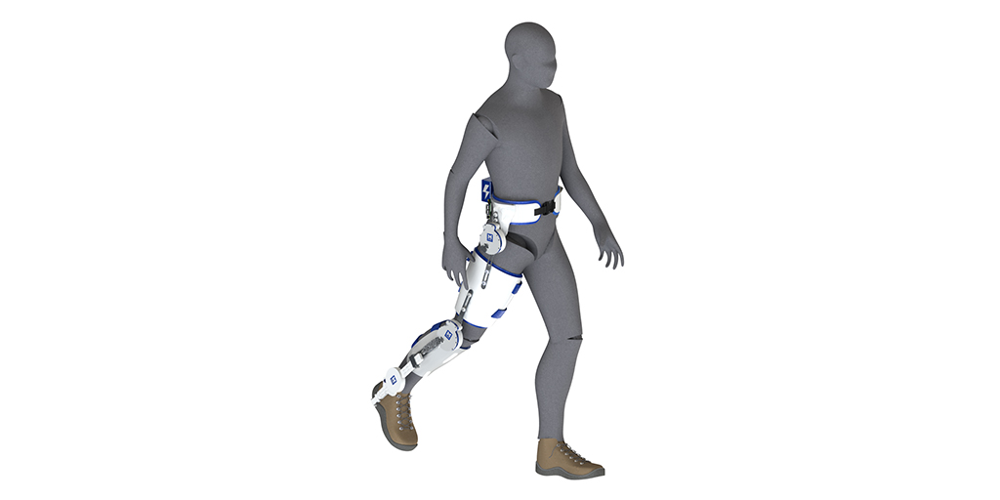
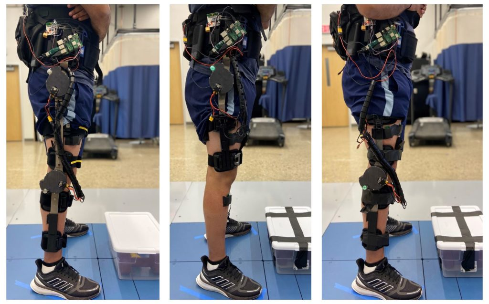

<figure>

<figcaption>

A model of the powered exoskeleton on the hip, knee and ankle joints. The modular system will be able to assist any combination of these joints, no matter the activity. Credit: Locomotor Control Systems Laboratory, University of Michigan

</figcaption>

</figure>

In an effort to bring robotic assistance to workers, the elderly and more, a University of Michigan team is developing a new type of powered exoskeleton for lower limbs—funded by $1.7 million from the National Institutes of Health.

One in eight Americans faces a mobility disability, with serious difficulty walking or climbing stairs, but a robotic solution could be far less bulky than sci-fi’s full-body suits. The U-M team plans to develop a modular, powered exoskeleton system that could be used on one or multiple joints of the legs. The three-year project will first study workers who lift and lower objects and the elderly who have lost mobility with age. In future work, the team would like to include people with other disabilities.

“Imagine adding a small motor to a bicycle—the rider still pedals, but there’s that extra power to get up hills without breaking too much of a sweat,” said project lead [Robert Gregg](https://gregg.engin.umich.edu), member of the [Robotics Institute](https://robotics.umich.edu) and associate professor of electrical and computer engineering.

“Similarly, we can take the conventional ankle, hip or knee braces used today, add a self-contained specialized motor and gear system, and provide power at a specific joint to increase mobility.”

Conventional braces, or orthotics, cannot actively assist human joints during challenging activities. State-of-the-art exoskeletons, on the other hand, are built in a way that makes it difficult for users to move against the motor, also known as backdriving the motor. This is in part because these exoskeletons are usually designed to replace the complete function of an entire limb. Partially assisting specific joints is a different challenge.

However, one of the greatest hurdles for exoskeletons is that they must accurately recognize the user’s intent, and match that intent with a correct action. Otherwise, the exoskeleton adds to the effort required from the user.

“There is a continuum of human movement possibilities, from jumping jacks to walking up a slightly different incline. If the exoskeleton recognizes the wrong activity, then it’s getting in the way of the human,” Gregg said.

<figure>

<figcaption>

Preliminary knee and hip designs for a new powered exoskeleton system. It attaches motors to off-the-shelf orthotic braces to provide better mobility to the wearer. Credit: Locomotor Control Systems Laboratory, University of Michigan

</figcaption>

</figure>

There are two keys to the system Gregg and his team envision will make up for these shortcomings: a newer style of motor and transmission and a different kind of control algorithm.

The challenge with the motor is delivering enough torque—the exoskeleton equivalent of muscle strength—while being small and lightweight enough to wear. Usually, this is achieved by using a small motor that spins quickly and converting that speed into torque with a highly-geared transmission. That transmission makes it hard for a user to move against the motor.

Gregg’s team will solve this problem by using flat, “pancake” style motors that were originally utilized in drones and have more recently been used in the Open Source Leg—a project from team member Elliott Rouse, faculty in the Robotics Institute and assistant professor of mechanical engineering. These motors don’t need as many gears to deliver enough torque to help power a human, which makes them easy to backdrive.

To control the motor and transmission, the team will develop a “task-invariant” control algorithm, which will not rely on knowing the task the user is trying to complete in order to effectively provide assistance.

“You have to make sure that when you tell the motor what to do, it’s not fighting the human, but that’s a big challenge because you don’t always know the human’s intent,” Gregg said. Instead of predicting where a human will move, the team will simplify the problem and work on altering how the human moves.

“With this method, we may compensate for gravity: no matter where you move, the motor can assist with that. Another example is inertia: no matter where you move, the motor can compensate for limb inertia to make movement easier,” Gregg said.

Working with Chandramouli Krishnan, a Robotics Institute member and associate professor of physical medicine and rehabilitation, and Alicia Foster, a certified prosthetist orthotist at U-M’s Orthotics and Prosthetics Center, the team will determine the best configurations of the modular system for different populations. The team will also study whether the additional weight of the motor is helpful overall.

Gregg hopes that the project will result in a low-cost system that any clinician would be able to replicate by simply adding it to current off-the-shelf ankle, hip and knee orthoses. And beyond the workers and elderly populations of this project, Gregg hopes the system could be helpful to the broad populations that require just a bit, but not complete, assistance with getting around.

The project is funded by NIH grant 1R01EB031166-01, “[Enhancing Voluntary Motion in Broad Patient Populations with Modular Powered Orthoses](https://reporter.nih.gov/search/ciNYgTVWnE2skSMPmuXESA/project-details/10190208).”
