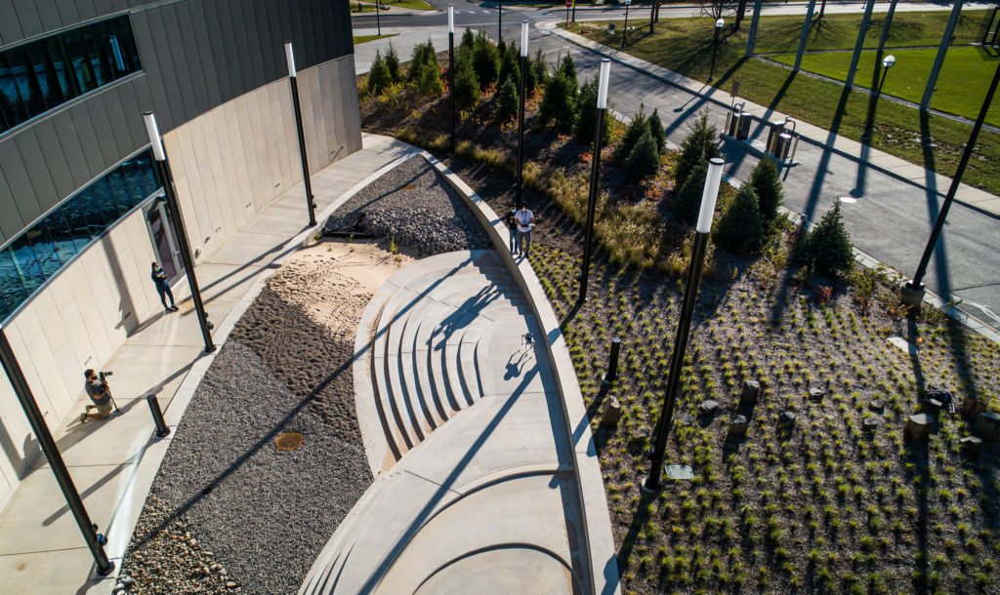
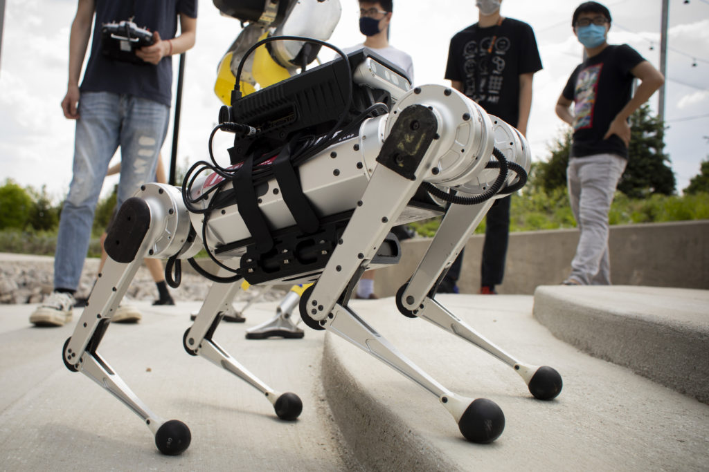
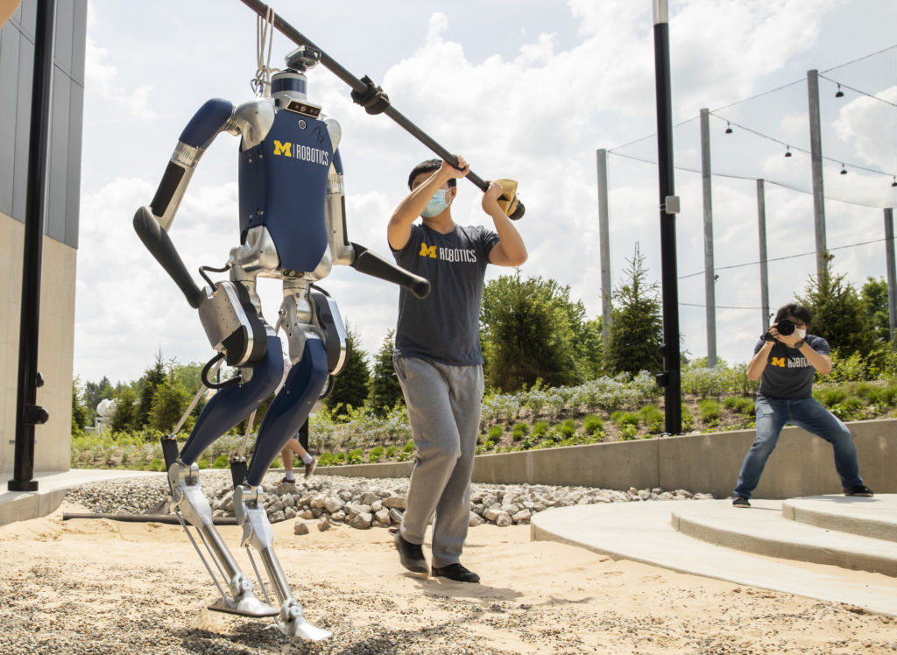

<figure>

<figcaption>

A mini-cheetah out on the Robot Garden at the Ford Motor Company Robotics Building. Photo: Levi Hutmacher.

</figcaption>

</figure>

Tomorrow’s wildfire fighters and other first responders may tag-team with robotic assistants that can hike through wilderness areas and disaster zones, thanks to a University of Michigan research project funded by a new $1 million grant from the National Science Foundation. 

A key goal of the three-year project is to enable robots to navigate in real time, without the need for a preexisting map of the terrain they’re to traverse.

The project aims to take bipedal (or two-legged) walking robots to a new level, equipping them to adapt on the fly to treacherous ground, dodge obstacles or decide whether a given area is safe for walking. The technology could enable robots to go into areas that are too dangerous for humans, including collapsed buildings and other disaster areas. It could also lead to prosthetics that are more intuitive for their users.

<!--more-->

“I envision a robot that can walk autonomously through the forest here on North Campus and find an object we’ve hidden. That’s what’s needed for robots to be useful in search and rescue, and no robot right now can do it,” said [Jessy Grizzle](https://2024.robotics.umich.edu/profile/jessy-grizzle/), principal investigator on the project and the Elmer G. Gilbert Distinguished University Professor of Engineering at U-M.

Grizzle, an expert in walking robots, is partnering on the project with [Maani Ghaffari Jadidi](https://2024.robotics.umich.edu/profile/maani-ghaffari/), an assistant professor of naval architecture and marine engineering and expert in robotic perception. Grizzle says the pair’s complementary areas of expertise will enable them to work on broader swathes of technology than has been possible in the past.

To make it happen, the team will embrace an approach called “full-stack robotics,” integrating a series of new and existing pieces of technology into a single, open-source perception and movement system that can be adapted to robots beyond those used in the project itself. The technology will be tested on Digit and Mini Cheetah robots.

“What full-stack robotics means is that we’re attacking every layer of the problem at once and integrating them together,” Grizzle said. “Up to now, a lot of roboticists have been solving very specific individual problems. With this project, we aim to integrate what has already been done into a cohesive system, then identify its weak points and develop new technology where necessary to fill in the gaps.”

One area of particular focus will be mapping—the project aims to find ways for robots to develop rich, multidimensional maps based on real-time sensory input so that they can determine the best way to cover a given patch of ground.

<figure>

- <figure>
    
    
    
    <figcaption>
    
    Close-up of the Mini Cheetah. Photo: Robert Coelius.
    
    </figcaption>
    
    </figure>
    
- <figure>
    
    
    
    <figcaption>
    
    A Digit robot crossing sand. Photo: Robert Coelius.
    
    </figcaption>
    
    </figure>
    

</figure>

“When we humans go hiking, it’s easy for us to recognize areas that are too difficult or dangerous and stay away,” Ghaffari said. “We want a robot to be able to do something similar by using its perception tools to build a real-time map that looks several steps ahead and includes a measure of walkability. So it will know to stay away from dangerous areas, and it will be able to plan a route that uses its energy efficiently.”

Grizzle predicts that robots will be able to do this using math—for example, by calculating a standard deviation of ground height variation or how slippery a surface is. He plans to build more sophisticated perceptual tools that will help robots gather data by analyzing what their limbs are doing—a slip on an icy surface or a kick on a mogul, for example, would generate a new data point. The system will also help robots navigate loose ground and moving objects, such as rolling branches.

Rich and easily understandable maps, Ghaffari explains, will be equally important to the humans who may one day be operating those robots remotely in search-and-rescue operations or other applications.

“A shared understanding of the environment between humans and robots is essential, because the more a human team can see, the better they can interpret what the robot team is trying to accomplish,” Ghaffari said. “And that can help humans to make better decisions about what other resources need to be brought in or how the mission should proceed.”

In addition to developing new technology, the project will also collaborate with the U-M School of Education on outreach to a Detroit high school, working to share the project’s material with them and develop interest in robotics. Grizzle and Ghaffari have already piloted a first-year course at U-M to show students how engineers use math to solve problems like map-building from LiDAR point clouds, machine learning to enable robots to learn from map data they’ve gathered, and feedback control on robots and other mobile platforms.

Grizzle is also the Jerry W. and Carol L. Levin Professor of Engineering, director of the U-M Robotics Institute Academic Program, a professor of electrical engineering and computer science and a professor of mechanical engineering.

The project is titled “[Learning-Aided Integrated Control and Semantic Perception Architecture for Legged Robot Locomotion and Navigation in the Wild](https://www.nsf.gov/awardsearch/showAward?AWD_ID=2118818&HistoricalAwards=false).”
