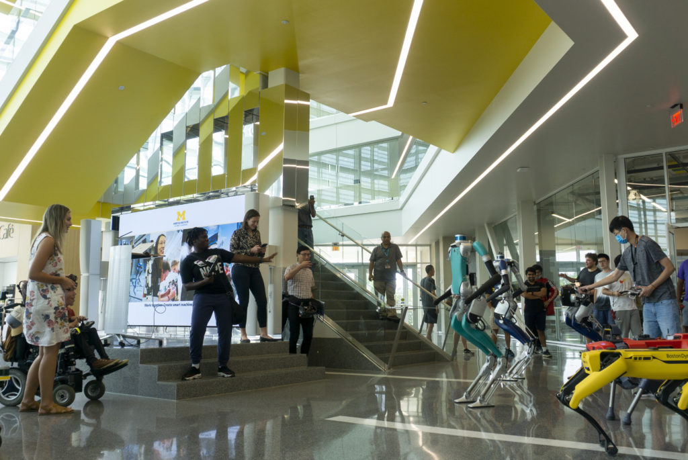

Robotics can inspire, and we can leverage that power to create more roboticists, keep the public properly informed on its future, and ensure robotics meets our vision of a field that improves society.

To do much of this outreach, we rely on our students. These students find time among classes and research to meet with children, middle and high schoolers, prospective graduate students and faculty, local and national community members, and media. The students present their work, run classes and demonstrations, and build up our own community–activities that bolster the culture and [values](https://2024.robotics.umich.edu/about/values/) of the University of Michigan Robotics Institute.

<figure>

<figcaption>

Wami Ogunbi explains the latest robots to visitors after the first Robotics Colloquium organized by Andrea Sipos and Michael Gonzalez with the Robotics Student Graduate Council.

</figcaption>

</figure>

<!--more-->

There are several standout members who have dedicated a significant portion of their time to outreach activities this past year. In honor of their work, Michigan Robotics is proud to award the following individuals with the 2021 Robotics Outreach Ambassador Award:

- Arsha Ali
- Andrea Sipos
- Kevin Lieberman
- Michael Gonzalez
- Pouyan Firouzabadi
- Prince Kuevor
- Karthik Urs
- Wami Ogunbi

Examples of their service include:

- Organizing a [colloquium on assistive technology](https://www.youtube.com/watch?v=kntWkuRc9oY) with guests Hannah and Shane Burcaw
- Chatting with prospective students during Visit Week, for the EMERGE program, or casually
- Meeting with prospective faculty members to evaluate their potential at Michigan and give them a better idea if Michigan was right for them
- Giving public talks, [like on A Scientist Walks into a Bar](https://drive.google.com/file/d/1zUPRgpg2YZsdXnYuWTH36QVEP7hoDMgt/view?usp=sharing), on the state of robotics, what research looks like, and where we want to take it
- Mentoring elementary, middle, and high schoolers who have an interest in technology by advising on science fair projects at the Science and Engineering Fair of Metro Detroit, inspiring career choices through [GET-IT](https://mcwt.org/programs/list/K-12-Initiatives/GET-IT-PROGRAM), helping at SWE’s [SEE Camp](https://www.seecamp.org/), guiding in the [NAF Scholars Program](https://mez.engin.umich.edu/naf-future-ready-scholars/), and teaching with the [MI-LSAMP](https://www.milsamp.org/about-us/) program
- Organized much-needed community events and dinners to provide fellowship during the pandemic

By being leading examples of our values, robotics with respect, enthusiastic outreach, and integrity in action, we thank and congratulate the first set of Robotics Outreach Ambassadors.

**Looking for volunteer opportunities and want to learn more about the Robotics Outreach Ambassador Program?**

[Check out our list of outreach events](https://docs.google.com/spreadsheets/d/19nhZK_DM6uF_YKqY0mlQarLoiZuDJGgBw6g0dWkxZkg/edit).
