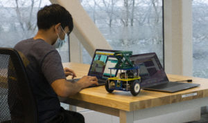

https://youtu.be/95xv9ae5rcE

Students in the new ROB 103: Robotic Systems course came in with a range of prior knowledge, from zero previous robotics exposure to participating in robotics teams in high school. However, all the first-year students completed labs on manufacturing, CAD, 3D printing, electronics, and control.

<!--more-->

ROB 103: Robotic Mechanisms was first offered in Winter 2021 at the University of Michigan Robotics Institute as a first-year, hands-on robotics engineering course.

Ilya Kovalenko, a Mechanical Engineering postdoc in the Barton Research Group, and Matt Romano, a Robotics PhD student in the Autonomous Aerospace Systems Laboratory taught the course.

The course culminated with a final project and competition: creating a robot that could complete a number of tasks with a pallet–similar to today's warehouse robots. The students received a basic robot kit to assemble as a start, but had to design, build, code, and test additions to their robot in order to enable remote operation and maneuvering a pallet.

With COVID-19 restrictions still in place during the course, only 10 students were in-person, with about 30 students participating remotely. The students teamed up with at least one in-person student on each team, and utilized Discord to work together.

With broad exposure to the many disciplines that go into robotics, students were able to zero in on topics of further interest. As one student remarked, "it made me reconsider my major from computer engineering to mechanical engineering because of the deep interest in controls, CAD, and manufacturing that I was able to find."

The course is the second undergraduate offering in the Robotics Institute at U-M. [ROB 101: Computational Linear Algebra](https://2024.robotics.umich.edu/2020/now-available-robotics-101-online/ "Now available: Robotics 101 online"), was offered in Fall 2020.
