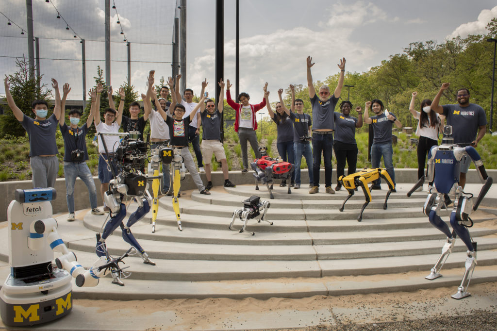

Robotics faculty have received a plethora of recognition for their exemplary work this past year, including awards and promotions.

## Awards

- [Peter Gaskell](https://robotics.umich.edu/profile/peter-gaskell/ "Peter Gaskell"): Robotics Department Faculty Award his outstanding contributions in education and service, and his growing contributions to research as well.
- [Maani Ghaffari](https://robotics.umich.edu/profile/maani-ghaffari/ "Maani Ghaffari"), [Jessy Grizzle](https://robotics.umich.edu/profile/jessy-grizzle/ "Jessy Grizzle"), [Chad Jenkins](https://robotics.umich.edu/profile/chad-jenkins/ "Chad Jenkins"), and Dwayne Joseph (Morehouse College): [Provost's Teaching Innovation Prize](https://record.umich.edu/articles/six-projects-to-be-awarded-provosts-teaching-innovation-prizes/) for the creation and teaching of [Robotics 101](https://robotics.umich.edu/academic-program/course-offerings/rob101-fall-2020/ "ROB 101: Computational Linear Algebra") and the undergraduate program.
- [Ben Kuipers](https://robotics.umich.edu/profile/benjamin-kuipers/ "Benjamin Kuipers"): Herbert Kopf Service Excellence Award for [numerous contributions to the CSE Division and Robotics](https://cse.engin.umich.edu/stories/ben-kuipers-recognized-for-outstanding-service-in-cse-robotics), as well as contributed to national-level efforts to promote more ethical and diverse research in robotics and AI.
- [Ram Vasudevan](https://robotics.umich.edu/profile/ram-vasudevan/ "Ram Vasudevan"): 1938E Award for outstanding teacher in both elementary and advanced courses.
- [Xi Jessie Yang](https://robotics.umich.edu/profile/xi-jessie-yang/ "Xi Jessie Yang"): [NSF CAREER Award](https://ioe.engin.umich.edu/2021/04/20/jessie-yang-receives-nsf-career-award/) for research on facilitating trust in autonomous technology.
- [Lionel Robert](https://robotics.umich.edu/profile/lionel-robert/ "Lionel Robert"), [Dawn Tilbury](https://robotics.umich.edu/profile/dawn-tilbury/ "Dawn Tilbury"), [Xi Jessie Yang](https://robotics.umich.edu/profile/xi-jessie-yang/ "Xi Jessie Yang"), and Luke Petersen: [Vincent Bendix Automotive Electronics Engineering Award](https://arc.engin.umich.edu/news/announcements/arc-2019-sae-paper-receives-vincent-bendix-automotive-electronics-engineering-award/).

## Promotions

At their May meeting, the University of Michigan Board of Regents approved a number of faculty promotions.

Core faculty promoted:

- [Ram Vasudevan](https://robotics.umich.edu/profile/ram-vasudevan/ "Ram Vasudevan"), promoted to associate professor of mechanical engineering

Affiliate faculty promoted:

- [Shorya Awtar](https://robotics.umich.edu/profile/shorya-awtar/ "Shorya Awtar"), promoted to professor of mechanical engineering
- [Sophia Brueckner](https://robotics.umich.edu/profile/sophia-brueckner/ "Sophia Brueckner"), associate professor of art and design
- [Matias del Campo](https://robotics.umich.edu/profile/matias-del-campo/ "Matias del Campo"), promoted to associate professor of architecture
- [Anouck Girard](https://robotics.umich.edu/profile/anouck-girard/ "Anouck Girard"), promoted professor of aerospace engineering
- [Zhengya Zhang](https://robotics.umich.edu/profile/zhengya-zhang/ "Zhengya Zhang"), promoted to professor of electrical engineering and computer science

In addition, [Peter Gaskell](https://robotics.umich.edu/profile/peter-gaskell/ "Peter Gaskell") was promoted to Lecturer IV.

Congratulations to all our community has achieved this year! As we settle into our new home in the [Ford Robotics Building](https://robotics.umich.edu/about/ford-motor-company-robotics-building/ "Ford Robotics Building"), we look forward to seeing one another in person much more frequently, and collaborating even more so to fulfill our mission of robotics that serve society.
