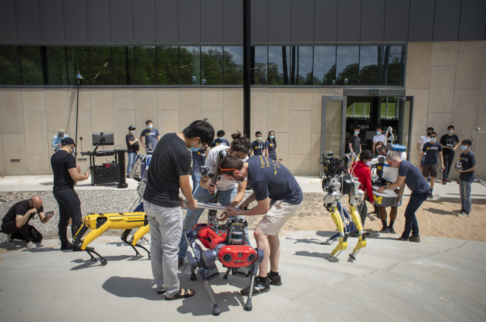
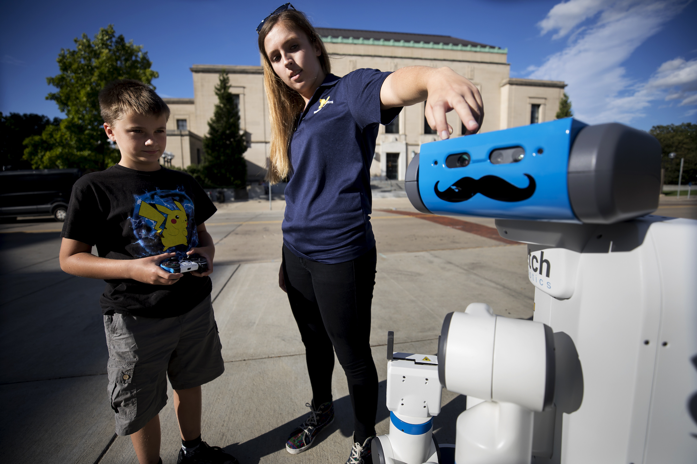
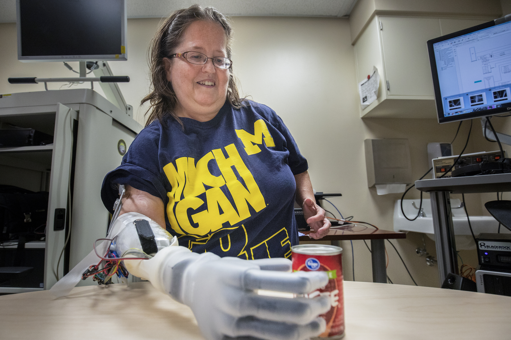
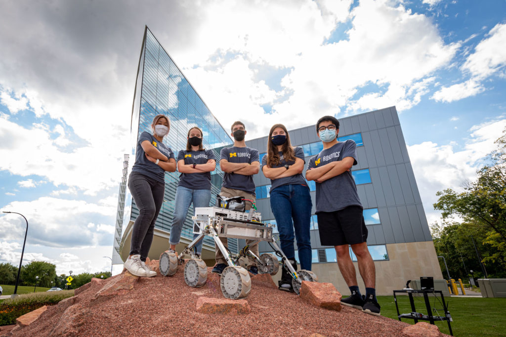

University of Michigan Regents have approved the creation of the Department of Robotics, a first among the nation’s top 10 engineering schools. The new department will define robotics as a discipline, teaching students the skills needed to help drive a rapidly expanding field.

The U.S. Bureau of Labor Statistics reported that the annual demand for qualified robotics professionals grew by more than 13% in 2018 alone. The global industrial and service robotics markets are expected to grow by more than 20% year over year, reaching a total market of $210 billion by 2025. 

“With this bold step forward, we are poised to lead the field in robotics, addressing the nation’s growing demand for roboticists with graduates equipped to design equity-centered solutions to society’s challenges,” said Alec D. Gallimore, the Robert J. Vlasic Dean of Engineering.

Around the country, engineering schools have been watching the field of robotics grow and weighing whether it qualifies as its own discipline—separate from conventional disciplines such as mechanical engineering and computer science. In deciding that it is distinct, the University of Michigan is seizing a rare opportunity to formalize the field and its aims.

<figure>

<figcaption>

Elizabeth Olsen, robotics PhD student, teaches Andrei Irwin, 6, about a robot from the Laboratory for Progress on Ingalls Mall  
   
Photo: Joseph Xu, Michigan Engineering Communications & Marketing

</figcaption>

</figure>

“This is an inflection point for the field of robotics and Michigan’s role in its future,” said Jessy Grizzle, director of the U-M Robotics Institute and the Elmer G. Gilbert Distinguished University Professor of Engineering.

“We will leverage the resources of a dedicated department to accelerate our work in building smart machines that serve society and respect humanity—everything from safe industrial robots and bipedal humanoids to inclusive prosthetics and automated vehicles. Our roboticists put people, rather than technology, first. We call it robotics with respect.”

The new department will take shape from the existing [U-M Robotics Institute](https://2024.robotics.umich.edu/), adding more capacity and resources for students and faculty to move the field of robotics forward. As of now, the Robotics Institute has 30 core faculty members that span 12 departments and 42 affiliate faculty from fields as diverse as architecture and anthropology.

“The new Department of Robotics will allow Michigan to recruit outstanding experts on the leading edge of robotics research and development, train the next generation of roboticists, and have a broad impact on the state of Michigan and beyond,” said U-M President Mark Schlissel. “The creation of this department advances U-M’s ability to unlock new dimensions of human potential through innovations in robotics.”  

Housed in the recently completed $75 million, 134,000-square-foot Ford Motor Company Robotics Building—the world’s most advanced dedicated robotics facility—the institute currently runs a graduate program, with its first students matriculating in 2014. More than 200 master’s and doctoral students are now enrolled.

“Leveraging the university’s strength across breadth, the new robotics department will truly transform the field, while serving our students, supporting our faculty and enhancing the cutting-edge research that is a hallmark of our university,” said Susan Collins, provost and ​​executive vice president for academic affairs of the University of Michigan.

<figure>

<figcaption>

Karen Sussex, an upper-limb amputee from Jackson, Mich., operates a Touch Bionics I-LIMB prosthetic hand to move a can of tomato paste during a testing session for an advanced prosthetics study at U-M.  
   
Photo: Robert Coelius/University of Michigan Engineering, Communications & Marketing  
  

</figcaption>

</figure>

In addition to enabling the robotics faculty to recruit and hire an additional 15 robotics experts over the next three to five years, one aim of the new department is to create a four-year undergraduate degree. This should help ease the bottleneck in Michigan robotics talent, including high-demand fields like computer vision and autonomous control. Currently, a U-M robotics degree requires a four-year bachelor’s degree in a related discipline, followed by a two-year master’s program in robotics.

Pilot undergraduate courses in robotics began last year, offering first-year topics such as computational linear algebra, robotic mechanisms, and introduction to programming and artificial intelligence. Through an approach the robotics faculty call “coding is believing,” they teach engineering fundamentals through robotics projects, addressing the core interests of students from day one.

Already leading beyond Michigan, the course developers are partnering with institutions, including Morehouse College, that serve communities that are historically excluded from technology. Through these partnerships, students participate in a multi-university community through courses developed collaboratively with U-M.

<figure>

<figcaption>

The Michigan Mars Rover team shows off their latest rover on the Mars Yard outside of the Ford Motor Company Robotics Building in fall, 2021. 
  
Photo: Daryl Marshke, Michigan Photography

</figcaption>

</figure>

“As we design our new undergraduate curriculum, Michigan has the unique opportunity to define the discipline of robotics with a priority on both equity and excellence,” said Chad Jenkins, associate director of the undergraduate program and professor of electrical engineering and computer science. “Through its leadership in robotics, Michigan is well poised to cultivate the leaders, innovators and contributors who will tackle the needs of the 21st century.”

Gallimore is also the Richard F. and Eleanor A. Towner Professor of Engineering, an Arthur F. Thurnau Professor and professor of aerospace engineering. Grizzle is also the Jerry W. and Carol L. Levin Professor of Engineering and professor of electrical and computer engineering and mechanical engineering. Collins is also the Edward M. Gramlich Collegiate Professor of Public Policy and professor of economics.
