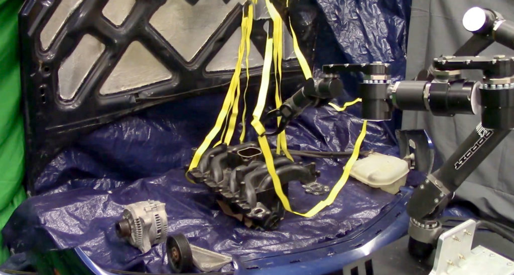

<VideoCenter url="94uvtRcCPts" />

The models that robots use to do tasks work well in the structured environment of the laboratory. Outside the lab, however, even the most sophisticated models may prove inadequate in new situations or in difficult to model tasks, such as working with soft materials like rope and cloth. 

To overcome this problem, University of Michigan researchers have created a way for robots to predict when they can’t trust their models, and to recover when they find that their model is unreliable. 

“We’re trying to teach the robot to make do with what it has,” said Peter Mitrano, Robotics PhD student.

“When a robot is picking things up and moving them around, it may not know the physics or geometry of everything. Our goal was to have the robot still accomplish useful tasks even with this limited dynamics model that characterises how things move.”

To enable robots to handle complex objects or environments, engineers usually rely on one of two approaches.

One is to collect a lot of data, using it to develop a detailed model that attempts to cover every possible scenario. This full dynamics model, however, is usually only accurate for small movements and in fixed settings.

Another method is to check how inaccurate a model is in order to generate the best possible action. However, the inaccuracy of a model is difficult to measure, especially if new, unmodeled items have appeared, and if the robot overestimates error it may incorrectly determine that it is impossible to complete a task.

“So you can try to accurately learn the dynamics everywhere, you can try to be conservative and estimate when a model is right, or you can utilize our approach, which is to learn from interacting with the environment where your model is or is not accurate,” said Mitrano.

In experiments, the team created a simple model of a rope’s dynamics while moving it around an open space. Then, they added obstacles and created a classifier, which learned when this simple rope model was reliable—but did not attempt to learn the more complex behavior of how the rope interacted with the objects. Finally, the team added recovery steps if the robot encountered a situation—such assay, when the rope collided with an obstacle—and the classifier determined that the simple model was unreliable. 

<figure>

<figcaption>A robot performs the difficult to model task of manipulating straps without tangling them around a mock car engine in the Autonomous Robotic Manipulation Lab. Courtesy Peter Mitrano.</figcaption>
</figure>

The team tested their simple model, classifier, and recovery approach against the current state-of-the-art, full dynamic approach. Given the task of dragging a rope to a goal position among obstacles, the team’s method was successful 84% of the time, compared to 18% of the time for the full dynamic model.

“In our approach, we took inspiration from other realms of science and robotics where simple models, despite their limitations, are still very useful,” said Dmitry Berenson, Associate Professor of Electrical Engineering and Computer Science and core faculty member in the [Robotics Institute](https://robotics.umich.edu/).

“Here, we have a simple model of a rope, and we develop ways to make sure that we are using it in appropriate situations where the model is reliable,” said Berenson. “This method can allow robots to generalize their knowledge to new situations that they have never encountered before.”

The team also demonstrated the success of their model in two real-world settings: grabbing a phone charging cable and manipulating hoses and straps under the hood of a car.

These examples also show the limitations of their method, in that it doesn’t provide a solution for the contact actions necessary to completely finish a task. For example, while it enables moving the charging cord into place, you need a different method in order to plug in the phone. Additionally, as the robot is exploring its capabilities by moving things in the world, the robot must be equipped with safety constraints so that it can explore safely.

The next step in this research is exploring where else a given model might be useful, said Mitrano.

“We have our setup that can drag a phone cable around a table, but can we apply the model to dragging something like a fire hose across a ship?” 

The paper, “[Learning where to trust unreliable models in an unstructured world for deformable object manipulation](https://robotics.sciencemag.org/content/6/54/eabd8170),” is published in _Science Robotics_. Dale McConachie, Robotics PhD ‘20 and Research Scientist at the Toyota Research Institute (TRI), also contributed to the work.

This work was supported by NSF Grant IIS-1750489 and ONR grant N000141712050, and by Toyota Research Institute (TRI).
