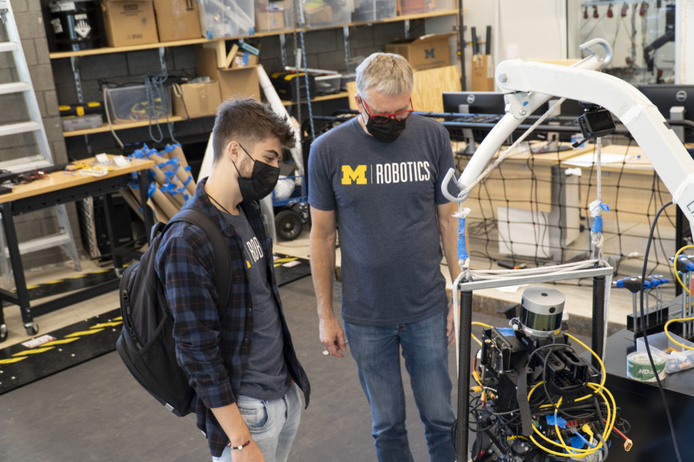
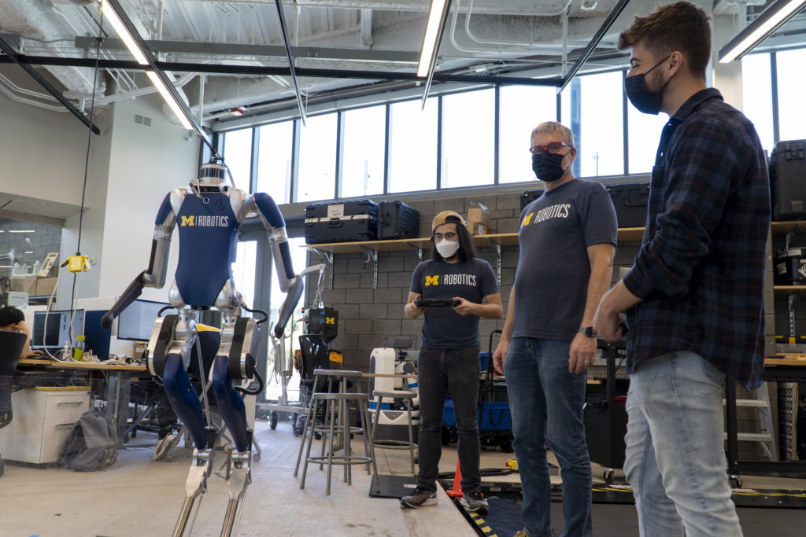
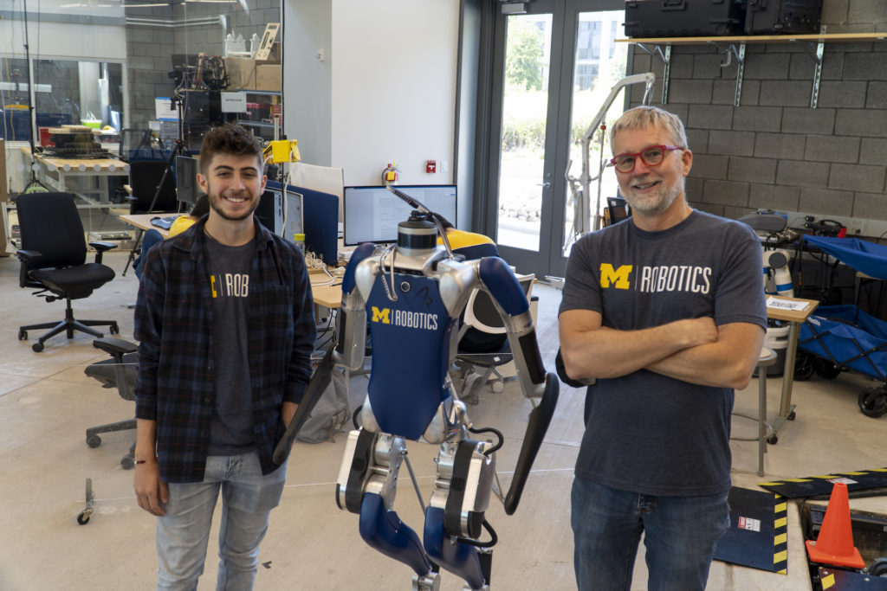

<figure>

<figcaption>

Professor Jessy Grizzle shows Victor Popa-Simil a Cassie robot with a lidar sensor on top. Papa-Simil, who studied remotely in 2020, utilized that lidar data while taking ROB 101.

</figcaption>

</figure>

Victor Popa-Simil, an engineering undergraduate, recently shared this letter he sent to Professor Jessy Grizzle, Director of the Robotics Institute, earlier this year:

_Dr. Grizzle,_

_My name is Victor Popa-Simil and I was in your ROB 101 class last semester. I'm a freshman from Los Alamos, New Mexico looking to go into biomedical engineering (robotic integration in the medical field). I'm not sure if you remember, but I walked into your office about 5 years ago and we had a conversation that shaped my educational career._

_I was about 14 years old, I just started getting involved with robotics and we decided to visit my sister, who happens to live in Ann Arbor. While we were in town, my dad suggested that we go walk around campus to see if I was interested in coming here for college. We walked into the building and stumbled upon you in your office. We had a quick chat and you mentioned there was no current undergraduate curriculum but that a new robotics building was going to be in place sometime in 2020 (four years in the future) and that an undergrad curriculum might be made possible. You asked me when I would be graduating and I responded with May of 2020, lining up perfectly with the timing of my freshman year in college. You made a remark that I should apply in four years and we might see each other in a different setting of professor and student instead of a random campus visit. After I left your office that afternoon, the University of Michigan became my top priority._

_I spent the next four years of high school working to be at the top of my class and I ended up getting over 90+ college credits as I was also heavily involved at University of New Mexico. I ended up graduating from UNM in 2019 with an Associate's of Applied Science in Robotics and later graduating high school in May 2020. I got accepted here (very happily) and last semester, I was in the class you told me about four years prior when I randomly walked in. It meant so much to me to be a student at my dream college in my dream program. Getting that ROB 101 t-shirt last semester meant the world to me and symbolizes all the hard work I put in following our conversation four years ago._

_Just thought I'd send you an email to let you know my story about why I'm here and how much of an impact you had on my educational career. Thank you so much. I'm sure we'll speak soon._

_Take care,_

_Victor Popa-Simil_

Popa-Simil ended up taking the first offering of [ROB 101](https://robotics.umich.edu/academics/courses/course-offerings/rob-101-fall-2020/) in Fall 2020, taught by Grizzle. However, due to the pandemic, he studied remotely for the entire year.

<figure>

<figcaption>

PhD student Bruce Huang and Grizzle shows Popa-Simil how Digit can stand up.

</figcaption>

</figure>

Last week, Popa-Simil had the chance to meet up with Grizzle for the first time in person, and took a tour of the Ronald D. and Regina C. McNeil Walking Robotics Lab, where Grizzle creates and tests the algorithms to improve how robots walk in any environment. Grizzle’s lab also helps create the control methods required for prosthetics and exoskeletons to assist their users.

Popa-Simil is majoring in biomedical engineering, and hopes to integrate robotics into his future work in the field.

<figure>

<figcaption>

Popa-Simil and Grizzle with a Digit Robot.

</figcaption>

</figure>
