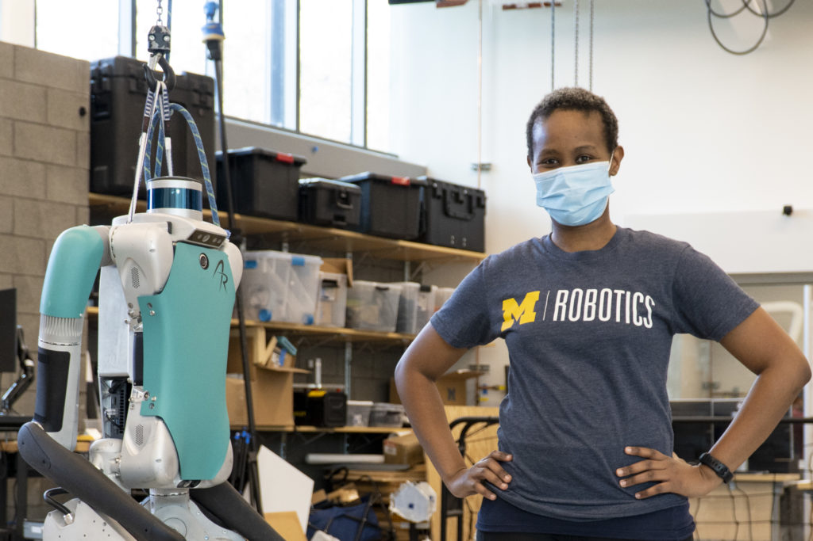

<figure>

<figcaption>

Eva Mungai stands next to a Digit, a bipedal Agility Robotics robot, in her lab.

</figcaption>

</figure>

As the University of Michigan Robotics Institute grew its graduate program from scratch, leaders like [Eva Mungai](https://www.evamungai.com) stepped up to represent student needs and be an example for its outreach culture. The Institute recently recognized Mungai with an award for her work in bringing a student-first mentality to the new program, as well as the multiple volunteer efforts of which she’s been a part.

In this interview, Mungai shares her path into robotics, discusses the current state of robotics at Michigan, and talks about her hopes for the entire robotics field.

<!--more-->

**How do you feel you’ve shaped robotics at Michigan?**

Students in robotics come from a variety of departments, and typically much larger departments. One of the things most students like about the Robotics Institute, regardless of race, gender, or ethnicity, is its smaller size: there is a greater chance for building personal relationships, and all the professors seem to be invested. 

As the program grows, one of the fears is how do we not lose those positive qualities? How can we ensure that all students, regardless of their race, ethnicity, gender or how they identify themselves, are being seen? Once leadership changes, how do we ensure the program doesn’t change and rather than being student-forward, it’s just research forward?

Those are the questions that I, and many other students, have tried to answer. We can keep the same student focus of the program, and strive to be more accountable for the students that we do bring in. As the program grows, we can ensure that new students get through the program and get the mentorship they need.

I think we all see the possibilities that robotics has -- whether that’s making sure the students who come in do indeed graduate or bringing in more people through the pipeline and increasing diversity. That’s what we are all striving for, from a student perspective.

**What else would you like to see done within the robotics program?**

One thing is to ensure that there are no students who fall through the cracks for whatever reason. This includes making sure that if a student reaches out to professors, professors are there and listening–I think that’s very, very important, and vice versa for the students. How can we build that sort of relationship where we are getting research done, but it’s not done in such a way that graduate students aren’t getting the mentorship that they need, and professors aren’t concerned about students not doing the work that they need to do. 

And this is even more imperative as we bring in undergraduate students. As of now, we’re super excited to teach these students in ROB 101, 102, and 103 and the students are excited. How do we keep that excitement and not turn these classes into people who are just here to fulfill requirements?

**So you’ve represented black students in robotics, worked with PhD [Grant Gibson](https://2024.robotics.umich.edu/profile/grant-gibson/ "Grant Gibson") on a legged locomotion seminar across labs, have been on two podcasts, were an executive board member for Students of Color of Rackham, a mentorship program, anything else in terms of outreach?**

The various random lab tours, which I do enjoy. 

But I think for most things that I do, it’s a team effort where I may take the lead in one thing, but others will take the lead in another. If it were up to me, I’d have given the award to everybody.

**A lot of people who deserve awards say that. How did you get into robotics?**

Accidentally is how I got into robotics. My path was not linear in any way, shape or form. Being a child of immigrants, and an immigrant myself, we had no idea as to how colleges worked here in the U.S.

I applied to schools with various majors: some schools as a doctor, some as a political science major, but never as an engineer because I wasn’t confident in my math skills. I didn’t get into my top choices for becoming a doctor or political science major, but I did get into Rensselaer Polytechnic Institute, where I switched into engineering.

Because I liked cars, I sought out automotive engineering and applied to work with a professor who worked with cars–but it turned out he was an aerospace professor, who invited me to conduct aerodynamics research. Eventually, I ended up interning at Boeing doing mechanical engineering and working with CAD. But at Boeing, there was a research and development team doing robotics with Raspberry Pis. I asked my manager if I could spend some time working with that team, and they agreed.

That’s how I got my first taste of robotics: working with Raspberry Pis.

**What’s your vision for robotics in the future?**

I want to see robots out there, and focused on aiding people. How can we make them readily available, affordable, and robust?

I want the people who are working on robotics to be a good representation of what the world looks like–I’m a strong believer that robotics is an umbrella, and I think there’s a lot to be gained from bringing in artists, philosophers, and others. Diversity matters not only in what people look like and identify as, but also in terms of school of thought. 

Hopefully, the sort of bias that mathematicians would have, and people of other backgrounds would have, would be averaged out and you could create an unbiased product.

Another thing is, right now you have robots created in one specific part of the world, and people are trying to take those robots and apply them in other places. But, a solution that works here is not necessarily a solution that works elsewhere. So I think there needs to be more questions about bringing technology to a different place and consulting with those people rather than forcing what’s been done elsewhere, because that just doesn’t work.

Finally, I also want to see roboticists consider the consequences of their actions before releasing robots. Because the consequences will be real, and we need to think about all the various ways that these robots could be used, whether that’s for good or bad.

_Mungai, advised by Jessy Grizzle, plans to graduate next year with a PhD in Mechanical Engineering._
