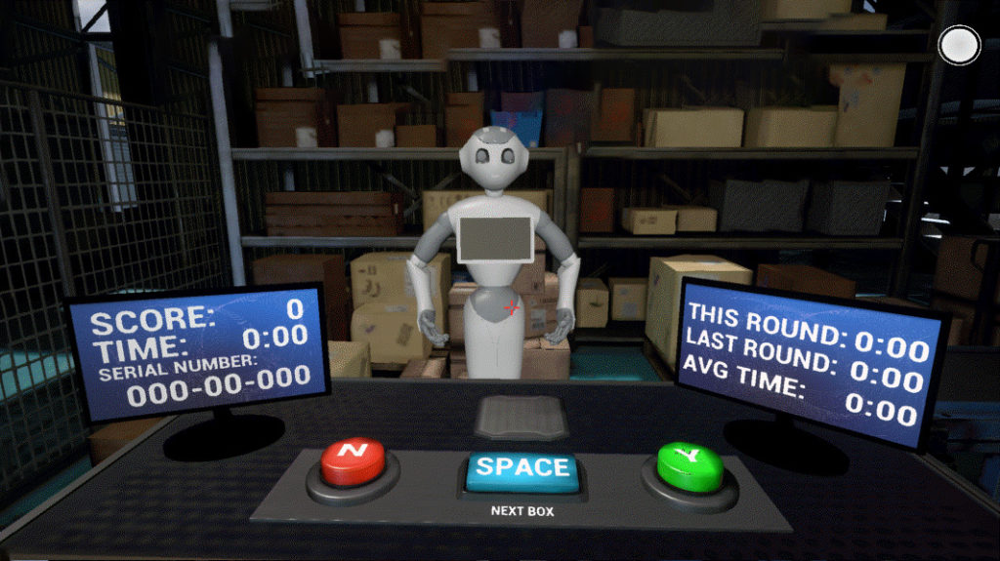
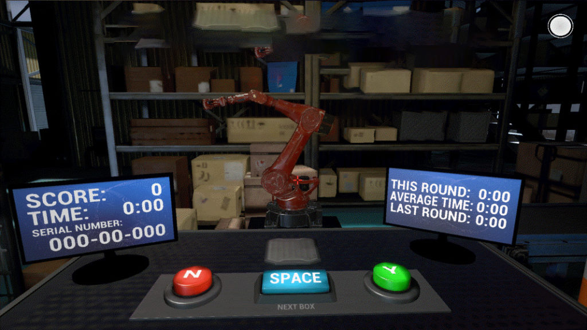

<figure>

<figcaption>

The human-like, android robot used in the virtual experimental task of handling boxes.

</figcaption>

</figure>

When robots make mistakes—and they do from time to time—reestablishing trust with human co-workers depends on how the machines own up to the errors and how human-like they appear, according to University of Michigan research.

[In a study](https://deepblue.lib.umich.edu/handle/2027.42/168396) that examined multiple trust repair strategies—apologies, denials, explanations or promises—the researchers found that certain approaches directed at human co-workers are better than others and often are impacted by how the robots look.

“Robots are definitely a technology but their interactions with humans are social and we must account for these social interactions if we hope to have humans comfortably trust and rely on their robot co-workers,” said [Lionel Robert](https://robotics.umich.edu/people/faculty/lionel-robert/ "Lionel Robert"), associate professor at the U-M School of Information and core faculty of the Robotics Institute.

“Robots will make mistakes when working with humans, decreasing humans’ trust in them. Therefore, we must develop ways to repair trust between humans and robots. Specific trust repair strategies are more effective than others and their effectiveness can depend on how human the robot appears.”

For their study published in the Proceedings of 30th IEEE International Conference on Robot and Human Interactive Communication, Robert and doctoral student [Connor Esterwood](https://www.si.umich.edu/people/connor-esterwood) examined how the repair strategies—including a new strategy of explanations—impact the elements that drive trust: ability (competency), integrity (honesty) and benevolence (concern for the trustor).

<figure>

<figcaption>

The mechanical arm robot used in the virtual experiment.

</figcaption>

</figure>

The researchers recruited 164 participants to work with a robot in a virtual environment, loading boxes onto a conveyor belt. The human was the quality assurance person, working alongside a robot tasked with reading serial numbers and loading 10 specific boxes. One robot was anthropomorphic or more humanlike, the other more mechanical in appearance.

Sara Eskandari and Stephanie O’Malley of the [Emerging Technology Group](http://www.dc.umich.edu/visualization) at U-M's James and Anne Duderstadt Center helped develop the experimental virtual platform.

The robots were programed to intentionally pick up a few wrong boxes and to make one of the following trust repair statements: “I’m sorry I got the wrong box” (apology), “I picked the correct box so something else must have gone wrong” (denial), “I see that was the wrong serial number” (explanation), or “I’ll do better next time and get the right box” (promise).

Previous studies have examined apologies, denials and promises as factors in trust or trustworthiness but this is the first to look at explanations as a repair strategy, and it had the highest impact on integrity, regardless of the robot’s appearance.

When the robot was more humanlike, trust was even easier to restore for integrity when explanations were given and for benevolence when apologies, denials and explanations were offered.

As in the previous research, apologies from robots produced higher integrity and benevolence than denials. Promises outpaced apologies and denials when it came to measures of benevolence and integrity.

Esterwood said this study is ongoing with more research ahead involving other combinations of trust repairs in different contexts, with other violations.

“In doing this we can further extend this research and examine more realistic scenarios like one might see in everyday life,” Esterwood said. “For example, does a barista robot’s explanation of what went wrong and a promise to do better in the future repair trust more or less than a construction robot?”

This originally appeared on [Michigan News.](https://news.umich.edu/robots-who-goof-can-we-trust-them-again/)
