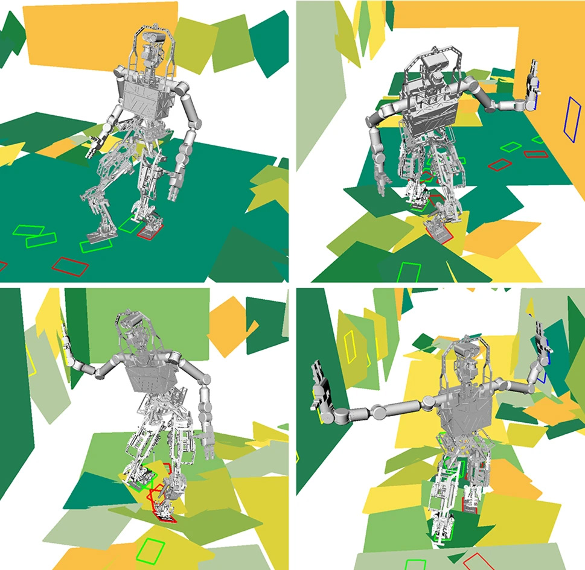
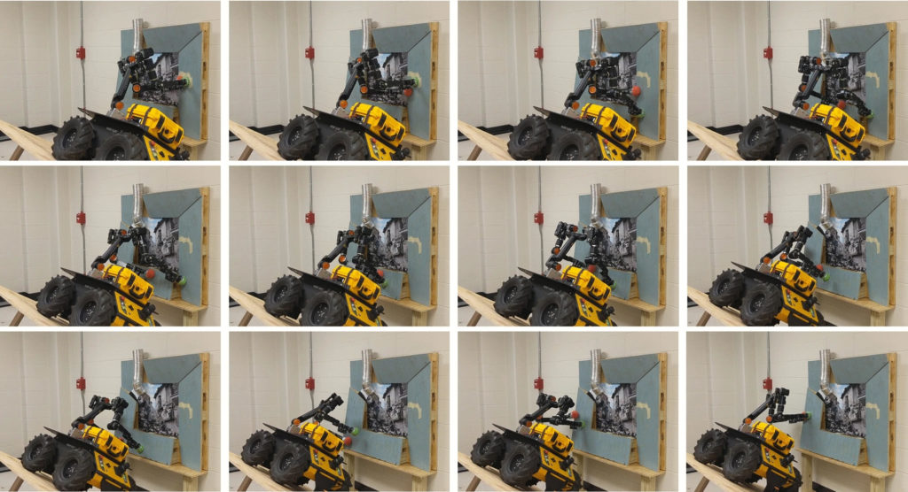

<VideoCenter url="X2KZupY8FQY" />

Humans are adept at using our hands to keep our balance, whether by grabbing a railing as we climb stairs, walking with help from a cane, or gripping a strap on the subway. Now, University of Michigan researchers have enabled humanoid robots to use their hands in a similar way, so the robots can better travel across rough terrain, such as disaster areas or construction sites.

“In a collapsed building or on very rough terrain, a robot won't always be able to balance itself and move forward with just its feet,” said Dmitry Berenson, professor of electrical and computer engineering and core faculty in the Robotics Institute. 

“You need new algorithms to figure out where to put both feet and hands. You need to coordinate all these limbs together to maintain stability, and what that boils down to is a very difficult problem.”

The research enables robots to determine how difficult the terrain is before calculating a successful path forward, which might include bracing on the wall with one or two hands while taking the next step forward.

“First, we used machine learning to train the robot on the different ways it can place its hands and feet to maintain balance and make progress,” said Yu-Chi Lin, recent Robotics PhD graduate and software engineer at Nuro, Inc. “Then, when placed in a new, complex environment, the robot can use what it learned to determine how traversable a path is, allowing it to find a path to the goal much faster.”

<figure>

<figcaption>_A virtual robot shows different modes of motion, with only feet, with one hand, or with both, as it traverses rough terrain. Credit Yu-Chi Lin._</figcaption>
</figure>

However, even when using this traversability estimate, it is still time-consuming to plan a long path using traditional planning algorithms.

“If we tried to find all the hand and foot locations over a long path, it would take a very long time,” said Berenson.

So, the team used a “divide-and-conquer” approach, splitting a path into tough-to-traverse sections, where they can apply their learning-based method, and easier-to-traverse sections, where a simpler path planning method works better.

“That sounds simple, but it's really hard to know how to split up that problem correctly, and which planning method to use for each segment,” said Lin. With their new method of path segmentation, however, they are able to not only break up paths and match them with the best planning method, but do so over long distances.

One limiting factor of their approach is that it requires a geometric model of the entire environment. However, this could be obtained by a flying drone which scouts ahead of the robot.

In a virtual experiment with a humanoid robot in a corridor of rubble, the team’s method outperformed previous methods in both success and total time to plan–important when quick action is needed in disaster scenarios. Specifically, over 50 trials, their method reached the goal 84 percent of the time compared to 26 percent for the basic path planner, and took just over two minutes to plan compared to over three minutes for the basic path planner.

The team also showcased their method’s ability to work on a real world, mobile manipulator ---a wheeled robot with a torso and two arms. With the base of the robot placed on a steep ramp, it had to use its hands to brace itself on an uneven surface as it moved. The robot utilized the team’s method to plan a path in just over a tenth of a second, compared to over 3.5 seconds with the basic path planner.

<figure>

<figcaption>_A two-arm mobile manipulator, which would fall if it did not brace itself on the wall, rolls across the steep incline by using the team’s approach to identify placements for its arms. Credit Yu-Chi Lin._</figcaption>
</figure>

In future work, the team hopes to incorporate dynamically-stable motion, similar to the natural movement of humans and animals, which would free the robot from having to be constantly in balance, and could improve its speed of movement.

The paper describing the work, “[Long-horizon humanoid navigation planning using traversability estimates and previous experience](https://link.springer.com/article/10.1007/s10514-021-09996-3),” was published in Autonomous Robots.

Funding for the research was provided by the Office of Naval Research (N00014-17-1-2050).
