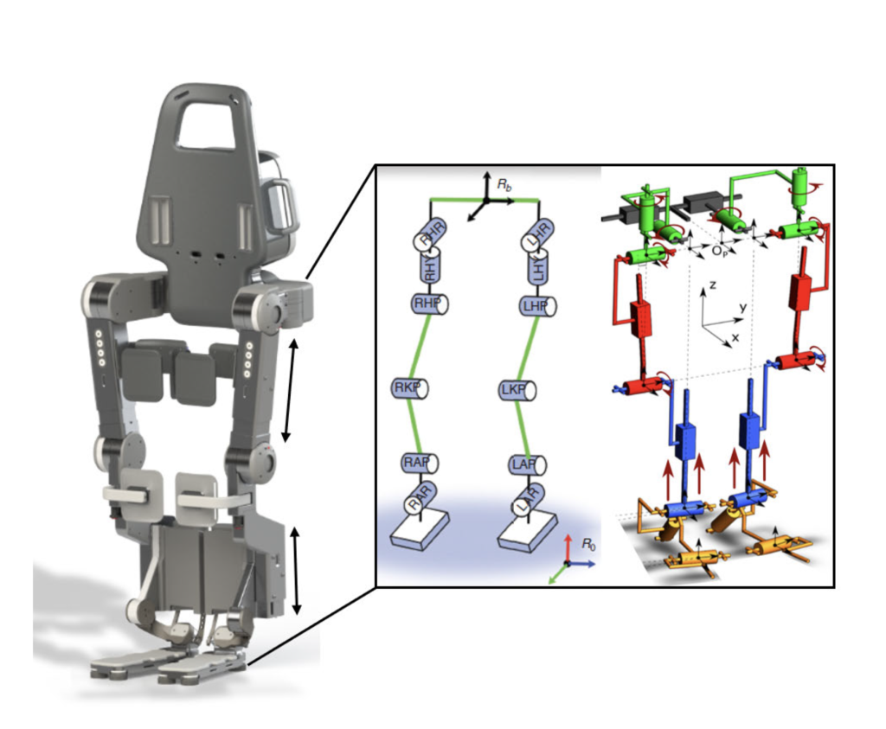
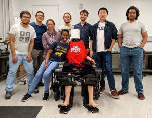

<figure>

<figcaption>

A virtual model of the Wandercraft Atlante exoskeleton moving from sitting to standing position. Courtesy paper.

</figcaption>

</figure>

An exoskeleton user can now go from sitting to standing safely and without assistance based on the work of University of Michigan researchers, who developed a new approach to create and test solutions to such problems virtually.

“We now have a way to systematically design control objectives for highly constrained systems such that the objectives are not in conflict with the contact constraints,” said Eva Mungai, a PhD candidate in Mechanical Engineering. 

The paper, “[Feedback Control Design for Robust Comfortable Sit-to-Stand Motions of 3D Lower-Limb Exoskeletons](https://ieeexplore.ieee.org/abstract/document/9303457),” is published in _IEEE Access_.

Similar research on the sit-to-stand activity is often done with a simplified model due to the complexity that three dimensions introduces. That work focuses on the sagittal plane, the X-axis of the sit-to-stand problem, while Mungai’s work incorporates sagittal, frontal, and transverse planes, or X, Y, and Z-axes.

<!--more-->

“While it’s easier to figure out stability for linear systems, it’s quite difficult to analyze for non-linear systems in three dimensions,” said Mungai, who is advised by Jessy Grizzle, professor of electrical and computer engineering and Director of U-M Robotics Institute.

Adding to the complexity of the problem is the need to guarantee both an exoskeleton user’s safety and comfort.

To address the complexity, Mungai and Grizzle split the problem into three challenges: modeling the exoskeleton in 3D, creating the sit-to-stand motions, and then executing and testing the motions to make sure the system operates in real-time to meet the goal while keeping the user comfortable and safe.

Wandercraft, creators of the Atlante exoskeleton, provided the universal robot description file for Mungai to use for modeling and generation of chair-to-stand and chair-to-crouch-to-stand motions, which could then undergo testing.

<figure>

<figcaption>

_Wandercraft Atlante exoskeleton. Courtesy paper._

</figcaption>

</figure>

<figure>

<figcaption>

_Eva Mungai visits Ayonga Hereid, professor of mechanical and aerospace engineering at Ohio State University and former post-doc at U-M, and the Cyberbotics Lab, with Wandercraft’s Atlante exoskeleton in sitting position. Photo courtesy Cyberbotics Lab._

</figcaption>

</figure>

“In order to find the operational range of the exoskeleton+user system that satisfied our criteria for user safety and comfort, we ran robustness tests based on the various situations the system could encounter such as different users, chair heights, asymmetric torque outputs, or no assistive force from the user. These robustness tests also helped us analyze the two sit-to-stand motions.”

Ensuring a system successfully completes its task while still operating within its numerous constraints, such as user safety, is a concept that can apply across robotics. One apparent application is on bipedal robots, where they have to choose an objective while maintaining balance and coming into contact with external forces.

Also an important step in this work is the focus on comfort.

“It’s really hard to quantify user comfort, but it’s so important, and this is just a beginning,” said Mungai.
