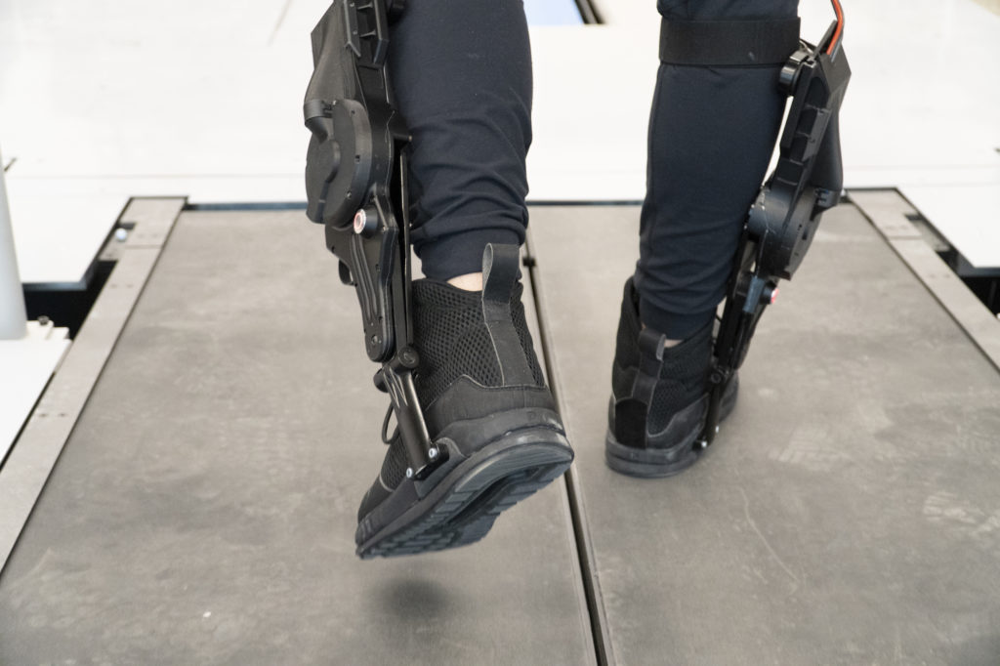
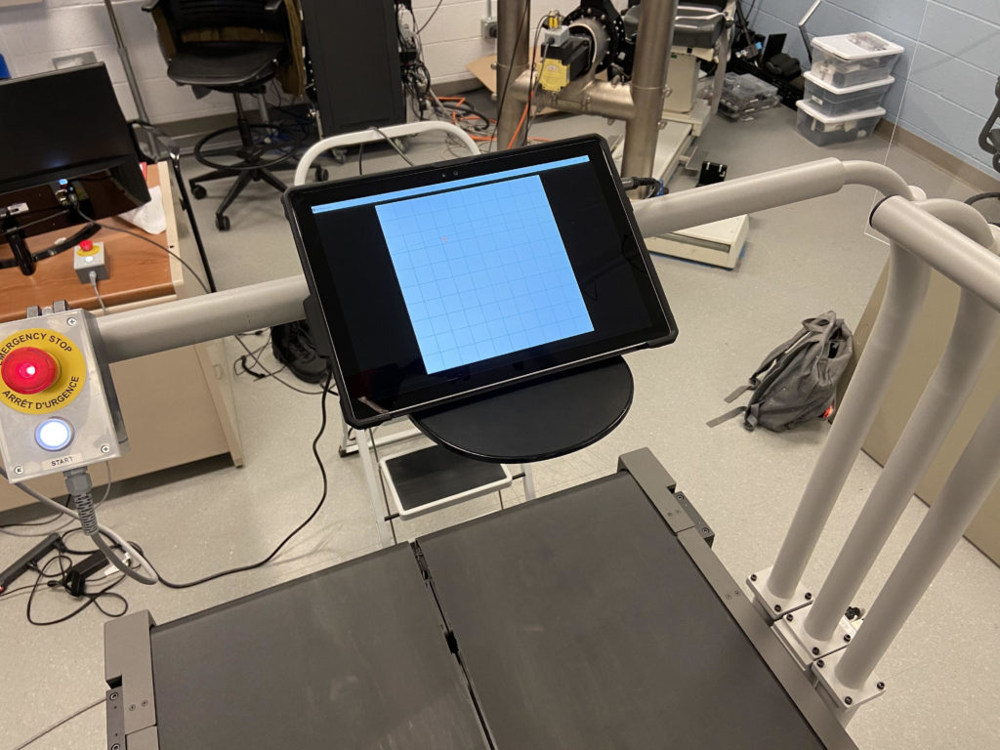
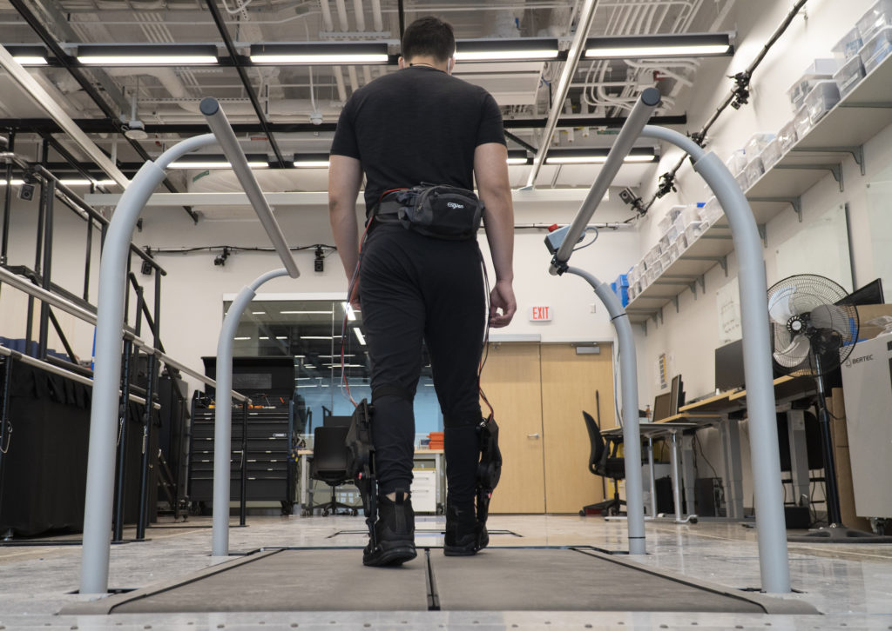

<figure>

<figcaption>

Leo Medrano, a PhD student in the Neurobionics Lab at the University of Michigan, tests out an ankle exoskeleton on a two-track treadmill. Researchers were able to give the exoskeleton user direct control to tune its behavior, allowing them to find the right torque and timing settings for themselves.

</figcaption>

</figure>

To transform human mobility, exoskeletons need to interact seamlessly with their user, providing the right level of assistance at the right time to cooperate with our muscles as we move. 

To help achieve this, University of Michigan researchers gave users direct control to customize the behavior of an ankle exoskeleton.

Not only was the process faster than the conventional approach, in which an expert would decide the settings, but it may have incorporated preferences an expert would have missed. For instance, user height and weight, which are commonly used metrics for tuning exoskeletons and robotic prostheses, had no effect on preferred settings.

"Instead of a one-size-fits-all level of power, or using measurements of muscle activity to customize an exoskeleton's behavior, this method uses active user feedback to shape the assistance a person receives," said Kim Ingraham, first author of the study in Science Robotics, and a recent mechanical engineering Ph.D. graduate. 

Experts usually tune the wide-ranging settings of powered exoskeletons to take into account the varied characteristics of human bodies, gait biomechanics and user preferences. This can be done by crunching quantifiable data, such as metabolic rate or muscle activity, to minimize the energy expended from a user, or more simply by asking the user to repeatedly compare between pairs of settings to find which feels best.

https://youtu.be/W0yYrnlBME4

What minimizes energy expenditure, however, may not be the most comfortable or useful. And asking the user to select between choices for numerous settings could be too time consuming and also obscures how those settings might interact with each other to affect the user experience.

By allowing the user to directly manipulate the settings, preferences that are difficult to detect or measure could be accounted for by the users themselves. Users could quickly and independently decide what features are most important—for example, trading off comfort, power or stability, and then selecting the settings to best match those preferences without the need for an expert to retune.

"To be able to choose and have control over how it feels is going to help with user satisfaction and adoption of these devices in the future," Ingraham said. "No matter how much an exoskeleton helps, people won't wear them if they are not enjoyable."

<figure>

<figcaption>

By allowing the user to directly manipulate the exoskeleton’s settings using a tablet while on a treadmill, preferences that are difficult to detect or measure, such as comfort, could be accounted for by the users themselves.   
  
Courtesy Kim Ingraham

</figcaption>

</figure>

To test the feasibility of such a system, the research team outfitted users with Dephy powered ankle exoskeletons and a touch screen interface that displayed a blank grid. Selecting any point on the grid would alter the torque output of the exoskeleton on one axis, while changing the timing of that torque on the alternate axis.

When told to find their preference while walking on a treadmill, the set of users who had no previous experience with an exoskeleton were, on average, able to confirm their optimal settings in about one minute, 45 seconds.

"We were surprised at how precisely people were able to identify their preferences, especially because they were totally blinded to everything that was happening—we didn't tell them what parameters they were tuning, so they were only selecting their preferences based on how they felt the device was assisting them," Ingraham said.

In addition, user preference changed over the course of the experiment. As the first-time users gained more experience with the exoskeleton, they preferred a higher level of assistance. And, those already experienced with exoskeletons preferred a much greater level of assistance than the first-time users. 

These findings could help determine how often retuning of an exoskeleton needs to be done as a user gains experience and supports the idea of incorporating direct user input into preference for the best experience.

<figure>

<figcaption>

The ankle exoskeleton, from Dephy Inc., provides assistance when stepping off with the foot. An expert usually tunes the precise machines’ wide-ranging settings to take into account the varied characteristics of human bodies, gait biomechanics, and user preferences.

</figcaption>

</figure>

"This is fundamental work in exploring how to incorporate people’s preference into exoskeleton control," said [Elliott Rouse](https://2024.robotics.umich.edu/profile/elliott-rouse/), senior author of the study, an assistant professor of mechanical engineering and a core faculty member of the Robotics Institute. "This work is motivated by our desire to develop exoskeletons that go beyond the laboratory and have a transformative impact on society. 

"Next is answering why people prefer what they prefer, and how these preferences affect their energy, their muscle activity, and their physiology, and how we could automatically implement preference-based control in the real world. It’s important that assistive technologies provide a meaningful benefit to their user."

The research was supported by the National Science Foundation, the D. Dan and Betty Kahn Foundation and the Carl Zeiss Foundation in cooperation with the German Scholars Organization, in addition to hardware and technical assistance from Dephy Inc. Ingraham is now a postdoctoral researcher at the University of Washington.

Study: [The role of user preference in the customized control of robotic exoskeletons](http://dx.doi.org/10.1126/scirobotics.abj3487) (DOI: 10.1126/scirobotics.abj3487)
