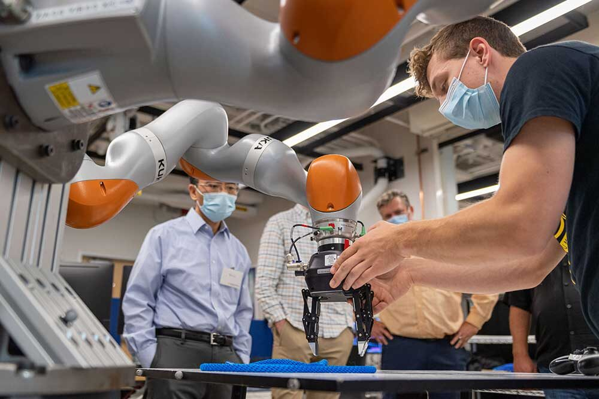

https://www.youtube.com/watch?v=fXu47_7FH3s

In a step toward robots that can learn on the fly like humans do, a new approach expands training data sets for robots that work with soft objects like ropes and fabrics, or in cluttered environments.

Developed by robotics researchers at the University of Michigan, it could cut learning time for new materials and environments down to a few hours rather than a week or two.

In simulations, the expanded training data set improved the success rate of a robot looping a rope around an engine block by more than 40% and nearly doubled the successes of a physical robot for a similar task.

That task is among those a robot mechanic would need to be able to do with ease. But using today’s methods, learning how to manipulate each unfamiliar hose or belt would require huge amounts of data, likely gathered for days or weeks, says [Dmitry Berenson](https://web.eecs.umich.edu/~dmitryb/), U-M associate professor of robotics and senior author of [a paper presented today at Robotics: Science and Systems](https://arxiv.org/abs/2205.02886) in New York City. 

In that time, the robot would play around with the hose—stretching it, bringing the ends together, looping it around obstacles and so on—until it understood all the ways the hose could move.

“If the robot needs to play with the hose for a long time before being able to install it, that’s not going to work for many applications,” Berenson said.

Indeed, human mechanics would likely be unimpressed with a robot co-worker that needed that kind of time. So Berenson and Peter Mitrano, a doctoral student in robotics, put a twist on an optimization algorithm to enable a computer to make some of the generalizations we humans do—predicting how dynamics observed in one instance might repeat in others.

In one example, the robot pushed cylinders on a crowded surface. In some cases, the cylinder didn’t hit anything, while in others, it collided with other cylinders and they moved in response.

If the cylinder didn’t run into anything, that motion can be repeated anywhere on the table where the trajectory doesn’t take it into other cylinders. This is intuitive to a human, but a robot needs to get that data. And rather than doing time-consuming experiments, Mitrano and Berenson’s program can create variations on the result from that first experiment that serve the robot in the same way.

They focused on three qualities for their fabricated data. It had to be relevant, diverse and valid. For instance, if you’re only concerned with the robot moving cylinders on the table, data on the floor is not relevant. The flip side of that is that the data must be diverse—all parts of the table, all angles must be explored. 

“If you maximize the diversity of the data, it won’t be relevant enough. But if you maximize relevance, it won’t have enough diversity,” Mitrano said. “Both are important.”

And finally, the data must be valid. For example, any simulations that have two cylinders occupying the same space would be invalid and need to be identified as invalid so that the robot knows that won’t happen.

<figure>

<figcaption>

Peter Mitrano demonstrates a rope manipulation experiment. Software that he and Berenson developed can expand training data sets for challenges like rope manipulation, doubling the success rate of the robot. Image credit: Daryl Marshke

</figcaption>

</figure>

For the rope simulation and experiment, Mitrano and Berenson expanded the data set by extrapolating the position of the rope to other locations in a virtual version of a physical space—so long as the rope would behave the same way as it had in the initial instance. Using only the initial training data, the simulated robot hooked the rope around the engine block 48% of the time. After training on the augmented data set, the robot succeeded 70% of the time.

An experiment exploring on-the-fly learning with a real robot suggested that enabling the robot to expand each attempt in this way nearly doubles its success rate over the course of 30 attempts, with 13 successful attempts rather than seven.

This work was supported by the National Science Foundation grants IIS-1750489 and IIS-2113401, the Office of Naval Research grant N00014-21-1-2118, and the Toyota Research Institute.
