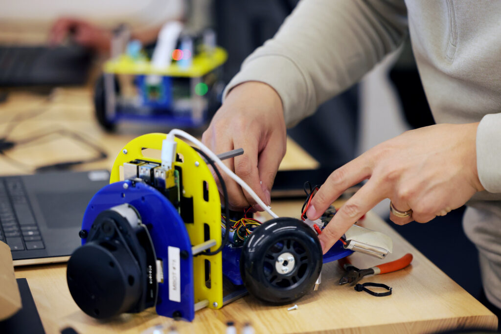

<figure>

<figcaption>

A student works on a robot in ROB 550, one of the first classes Robotics graduate students take with hands-on labs in hardware and coding.

</figcaption>

</figure>

Eight incoming Robotics master’s students received a scholarship award as recipients of the Roger Ehrenberg and Carin Levine Ehrenberg Fellowship. The funds, which create opportunities for a wide range of students, enable the recipients to pursue robotics degrees with greater financial stability, and help ease making the decision to further invest in their education at the University of Michigan.

The students who received the Ehrenberg Fellowship include:

- Marcus Badgett
- Jack Fenton
- Michael Hall
- Jacob Jancek
- Hannah Klooster
- Arthur Lovekin
- Andrew Roberts
- Susan Zhao

The fellowships' impact is best stated in the words of the recipients:

> "Being chosen for this fellowship has allowed me to attend graduate school without having to take out further private loans or to worry about how I was going to pay for schooling. It has allowed me to attend the University of Michigan for the degree and program of my choice: Robotics. It has given me hope."
> 
> — Ehrenberg Fellowship recipient

> "My goal in getting a masters in robotics is to explore robotics to a depth that wasn't feasible in undergrad and to set myself up to continue working with new and exciting areas of robotics in the future. The opportunities available at Michigan are extremely exciting to me, and the Ehrenberg Fellowship helped make them a possibility. It also contributed to my decision to come to Michigan–a decision I'm very glad I made!"
> 
> — Ehrenberg Fellowship recipient

> "The Ehrenberg Fellowship has allowed me to craft the kind of Master’s experience that I had been so eager to pursue – one dedicated to being diligent in my studies, applying my knowledge to research, and making an impact towards things larger than just me. As I have been able to apply the funds towards my tuition, I can now devote the precious time and energy towards research at the Locomotor Control Systems Lab, where I am working on lower-limb exoskeletons to assist those with disabilities. This has a direct connection to my own father, who has suffered from polio and has major complications walking. Also, I can now affect change as part of the Women in Science and Engineering Student Programming Board, which I have joined in hopes of seeing more women in STEM succeed and reach higher goals. Perhaps simple but no less important to me and my journey, I can now just focus more on my classes. I am so grateful to the Ehrenbergs and their amazing gift. Their generosity is inspiring, and I plan to hold onto the memory and the feelings as I work towards developing technology which will benefit others in the future."
> 
> — Ehrenberg Fellowship recipient

> "The Ehrenberg Fellowship has enabled my peace of mind about my finances this semester. With my degree, I hope to expand education in robotics to more underrepresented areas and improve the world around me. I can’t wait to see the robotics program here continue growing!"
> 
> — Ehrenberg Fellowship recipient

We join in thanking the Ehrenbergs for their generosity, and know the chosen students are dedicated to developing robotics that serve society.
