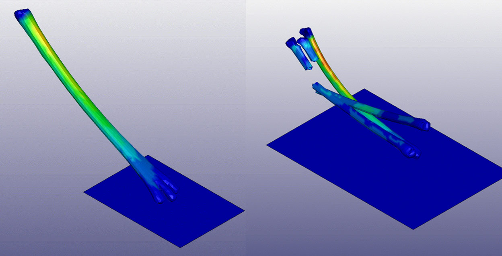

<figure>

<figcaption>

In simulation, a jerboa species' fused metatarsals (left), or foot bones, withstood greater stress than unfused metatarsals (right), but not as well as partially-fused metatarsals.

</figcaption>

</figure>

Foot bones that are separate in small hopping rodents are fused in their larger cousins, and a team of researchers at the University of Michigan and University of California, San Diego, wanted to know why. 

It appears that once evolution set jerboa bones on the path toward fusing together, they overshot the optimum amount of fusing—the structure that best dissipated stresses from jumping and landing—to become fully bonded.

This finding could inform the design of future robotic legs capable of withstanding the higher forces associated with rapid bursts of agile locomotion.

<!--more-->

https://www.instagram.com/reel/Cj0biLcggo2/

Jerboas are desert rodents that hop erratically on two legs to avoid predators. Across the jerboa family tree, these two legs can look a lot different: there are species that weigh just three grams to those that weigh 400 grams, with heavier species sporting vastly different bones of the feet, or metatarsals. Lighter jerboas are like most other mammals, including humans: their metatarsal foot bones are separate from each other. 

“We wanted to explore why we are seeing these fused bones in only larger jerboas,” said Carla Nathaly Villacís Núñez, U-M doctoral candidate in mechanical engineering and first author of [the study in _Proceedings of the Royal Society B_](https://royalsocietypublishing.org/doi/full/10.1098/rspb.2022.1322).

“We found that the fused bones showed lower stresses than unfused bones, thereby reinforcing against higher loads,” she said. “But we also discovered the partially fused bones had even lower stresses than the fully fused bones. One hypothesis is that fully fused jerboas have evolutionary overshoot.”

To study the bone performance across species, the researchers performed micro-CT scans of museum specimens and built 3D models of the jerboa metatarsals in software, then scaled them to equal sizes and stress tested them as they hit, flexed and hopped off of a surface. 

The smaller jerboas have three separate metatarsal bones, which are capable of supporting the rodent’s small stature even if used for high-impact jumping. The more recent, larger jerboa species have completely fused these three bones into one. The intermediate weight species have something in-between: a metatarsal with interior remnants of bone where it has partially fused together, like a bundle of sticks.

“Our interdisciplinary team applied state-of-the-art engineering techniques to unravel an evolutionary puzzle,” said [Talia Moore](https://2024.robotics.umich.edu/profile/talia-moore/), U-M assistant professor of robotics and senior author of the study.

“Evolution hit an advantageous point of partially fused geometry, but then evolutionary momentum may have continued to completely fuse the metatarsals. Because the fully fused bones are still sufficient to keep from breaking, there was likely no evolutionary pressure to stop fusing.”

The research team notes that similar analyses could help uncover other ways in which the skeleton changed shape to compensate as species evolved from quadrupedal, or walking on four feet, to bipedal locomotion.

“While kangaroos, primates and other rodents converged on bipedalism, the dynamics of their locomotion and the anatomical changes associated with that shift are quite different in each case,” said Andrew Ray, an undergraduate student studying materials science and engineering in Moore’s lab.

“Through similar analysis, we could simulate how the foot bones of extinct human ancestors might have experienced stresses during walking, running or other locomotion.”

An additional author is Kimberly Cooper, professor of developmental biology at the University of California, San Diego, who formulated the idea for the project with Moore during a separate study tracing the evolution and development of metatarsal fusion in jerboas. Cooper’s expertise was key to understanding the evolutionary implications of the findings. 

The research was supported in part by a Harvard Chapman Memorial Fellowship, a David Rockefeller Center for Latin America Studies Collaborative Research grant, and the U-M Mechanical Engineering Research, Innovation, Service and Entrepreneurship program.
