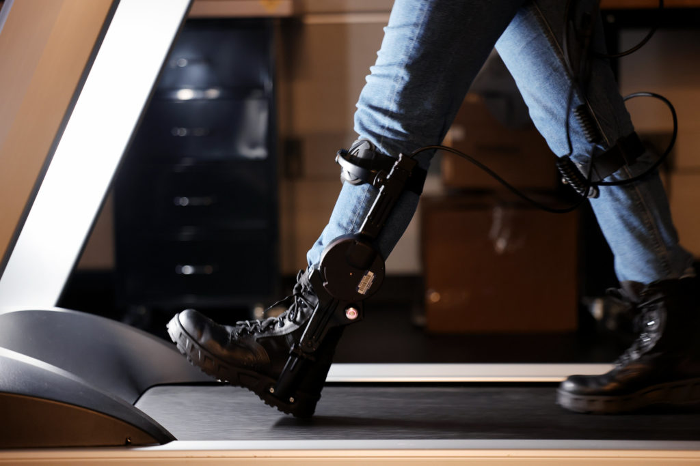
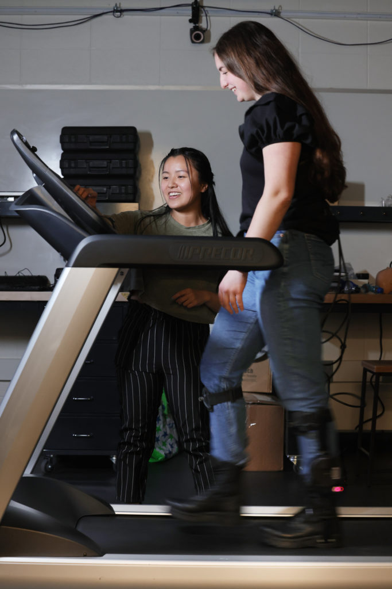

<figure>

<figcaption>

A user demonstrates walking with a lower-body exoskeleton. In a new study, powered exoskeleton users had trouble incorporating instructional haptic feedback cues, informing how future human-machine interaction must be designed. Photo: Brenda Ahearn/University of Michigan, College of Engineering, Communications and Marketing

</figcaption>

</figure>

A team led by University of Michigan researchers recently tested how exoskeleton users responded to the task of matching haptic feedback to the timing of each footstep. The team found that the haptic cues added mental workload, causing less effective use of the exoskeleton, and demonstrated the hurdles in future human-machine design.

“When we introduce haptic feedback while walking with an exoskeleton, we usually intend for the user to understand and maintain coordination with the exoskeleton," said Man I (Maggie) Wu, a robotics PhD student.

“We discovered that the exoskeleton actually introduces a competing mental load. We really need to understand how this affects the user while they attempt to complete tasks.”

<figure>

<figcaption>

Man I (Maggie) Wu, a PhD student in robotics, sets up equipment for her research related to how lower-body exoskeletons can be used to support people during walking by applying power at the hip, knee, and ankle. Photo: Brenda Ahearn/University of Michigan, College of Engineering, Communications and Marketing

</figcaption>

</figure>

Exoskeletons could help a range of users complete tasks, from factory workers lifting heavy components to enabling mobility for people with disabilities. More so than any other machine, users must operate an exoskeleton as an extension of the body and be able to focus on the task at hand, and not on operating the exoskeleton, to make the most of muscle and machine.

To help represent a task, the researchers utilized haptic feedback, similar to a cell phone vibrating.

In this study, users wore a Dephy powered ankle exoskeleton, along with a haptic device that vibrated across a range of timings related to a user’s footfalls. One group of users were told to match their footfalls to the haptic cue, both with the exoskeleton turned on, adding torque to each step, and turned off, not providing any torque. The other group of users were not given any instructions regarding the haptic cues.

The results showed that users given the instructions had more trouble following the haptic cues when the exoskeleton was on and providing torque, and showed less effective use of the exoskeleton than when used without the haptic cues present. 

<figure>

<figcaption>

Wu, left, talks with Jacqueline Hannan, a PhD student in industrial and operations engineering, as they begin to demonstrate walking with the Dephy ankle exoskeleton. Photo: Brenda Ahearn/University of Michigan, College of Engineering, Communications and Marketing

</figcaption>

</figure>

“When the user receives information from both the haptic cue and exoskeleton torque, they may try to synchronize with the cue, with the exoskeleton, or somewhere between both.” said [Leia Stirling](https://robotics.umich.edu/people/faculty/leia-stirling/ "Leia Stirling"), associate professor of industrial and operations engineering.

The group not given instructions ended up ignoring the haptic cues, instead coordinating their walking pace with the exoskeleton. This also revealed that it was unintuitive to use such cues for pacing, and to do so, training would be required.

“We need to further understand how training, control algorithms, and external tasks impact exoskeleton user behavior and broader task performance,” Stirling said. 

“We can further explore how audio or visual cues might perform, as opposed to tactile vibration, to help limit perceptual overlap–but there would still be hurdles for cognitive interference and the motion response selected.”

The [paper](https://journals.sagepub.com/eprint/JQ5GWIXWWSCUCV2QCFRY/full) on this work is published in _Human Factors_ (DOI: [10.1177/00187208221113625](https://doi.org/10.1177/00187208221113625))

The research was supported by the Under Secretary of Defense for Research and Engineering under Air Force Contract No. FA8702-15-D-0001 and National Science Foundation Award 1952279. Paul Stegall and Ho Chit Siu, Massachusetts Institute of Technology, are co-authors on the paper.
