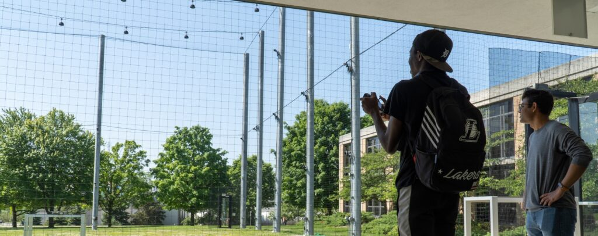
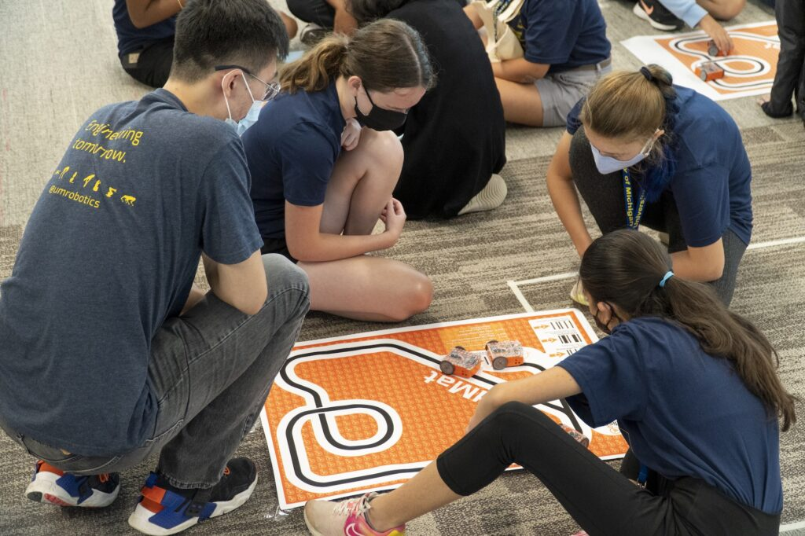

<figure>

<figcaption>

Hardik Parwana gives drone flight lessons to a visiting Marygrove High School student.

</figcaption>

</figure>

_Enthusiastic outreach_ is one of Michigan Robotics' three [values](https://2024.robotics.umich.edu/about/values/ "Values"): as a growing field with the ability to change everyday life, we have to take on opportunities to explain what goes into robotics, what is possible or unlikely, and hopefully inspire more people to become roboticists and provide their input and experience so that robotics can serve all communities. Even if outreach is not robotics specific, being an active community member in other ways can help inform us about others' needs.

Students are the largest part of our robotics community, and regularly take this task on in addition to their coursework, research, student instruction workloads. While there are many, many students who take part in volunteering, there are several that have gone above and beyond in the past year. These students have earned the distinction of Robotics Outreach Ambassador.

<!--more-->

The 2022 Robotics Outreach Ambassadors are:

- Arsha Ali
- Hannah Baez
- Zahraa Bazzi
- Kevin Best
- Mingjie Bi
- Jiawei Chen
- Ross Cortino
- Luis Cubillos
- Parker Ewen
- Grant Gibson
- Alia Gilbert
- Yukai Gong
- Michael Gonzalez
- Jennifer Humanchuk
- Prince Kuevor
- José Montes Pérez
- Eva Mungai
- Mark Nail
- Daksh Narang
- Chinwendu Nwokeabia
- Wami Ogunbi
- Miquel Oller Oliveras
- Hardik Parwana
- Shreya Phirke
- Abigail Rafter
- Emma Reznick
- Advaith Sethuraman
- Andrea Sipos
- Man I (Maggie) Wu

https://twitter.com/HiddenGeniusPro/status/1560410625162956800

Examples of this groups service include:

- Conducting lab tours, even impromptu ones, for primary school and prospective students that included underwater sonar sensing, prosthetic limb testing, legged robot demonstrations, drone flying, and manipulator tasks with many groups including Ypsilanti Community High School, [Marygrove High School](https://www.detroitk12.org/marygrove) and the [Hidden Genius Project](https://www.hiddengeniusproject.org)
- Mentoring primary school and current undergraduate students about furthering their interests in STEM
- Coordinating and running booths at academic and industry conferences, including the Engineering Research Symposium and Automate
- Participated in grant applications to aid in outreach and recruitment
- Traveling and meeting with prospective students around the country to discuss experiences in robotics
- Lunching with primary school students to casually discuss their interests and paths after graduation
- Contributing personal experiences to the [Ford Robotics Building Audio Tour](https://audio.2024.robotics.umich.edu) to allow visitors an in-depth and unique take while exploring
- Planning, developing, and running summer camp modules on all aspects of robotics from hardware to software to human-robot interaction through groups like [Discover and Xplore Engineering](https://campsforkids.engin.umich.edu), [WISE GISE](https://wise.umich.edu/?page_id=147), and [MI-LSAMP](https://sites.soe.umich.edu/drpp/michigan-louis-stokes-alliance-for-minority-participation/)
- Acting as judges and even loading and unloading supplies at a FIRST Lego League robotics tournament
- Performing duties in student organizations, such as the [Robotics Graduate Student Council](https://2024.robotics.umich.edu/academics/current-students/robotics-graduate-student-council/ "Robotics Graduate Student Council"), as members, board members, and leaders

We thank these students for strengthening both the Michigan Robotics and local communities. While these students have stood out based on their hours contributed, many other students regularly provide service that goes undocumented but still positively affects others–and we thank them all.

<figure>

<figcaption>

Bohao Zhang teaches Women in Science and Engineering summer camp students with Edison robots.

</figcaption>

</figure>
