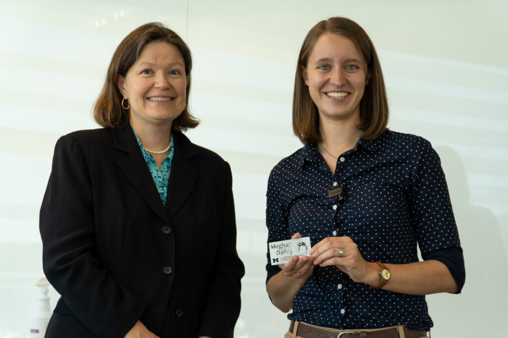

<VideoCenter url="CvzxNYegv44" />

The Robotics Department announced its first Alumni Merit Award recipient last week: Meghan Dailey.

Dailey joined the inaugural Robotics graduate class in 2014, taking a risk at the time with the new Robotics graduate program. The Robotics Department invited Dailey, now a machine learning specialist in [Advanced Research Computing](https://arc.umich.edu/) under ITS at U-M, back on homecoming to present the alumni award and learn about her latest work.

Dailey presented the Robotics Alumni Award Lecture, titled “The Future of Machine Learning in Robotics: How advances in machine learning can aid in the development of intuitive robots."

Following the presentation, Professor Dawn Tilbury, the Ronald D. and Regina C. McNeil Department Chair of Robotics, congratulated Dailey and presented a small token of accomplishment, a lapel magnet that was designed and fabricated in the Robotics Building’s own makerspace.

In her current role, Dailey consults on several faculty and student machine learning applications and research studies, specializing in natural language processing and convolutional neural networks.

<figure>

<figcaption>

Professor Dawn Tilbury presents Meghan Dailey with a gift.

</figcaption>

</figure>
