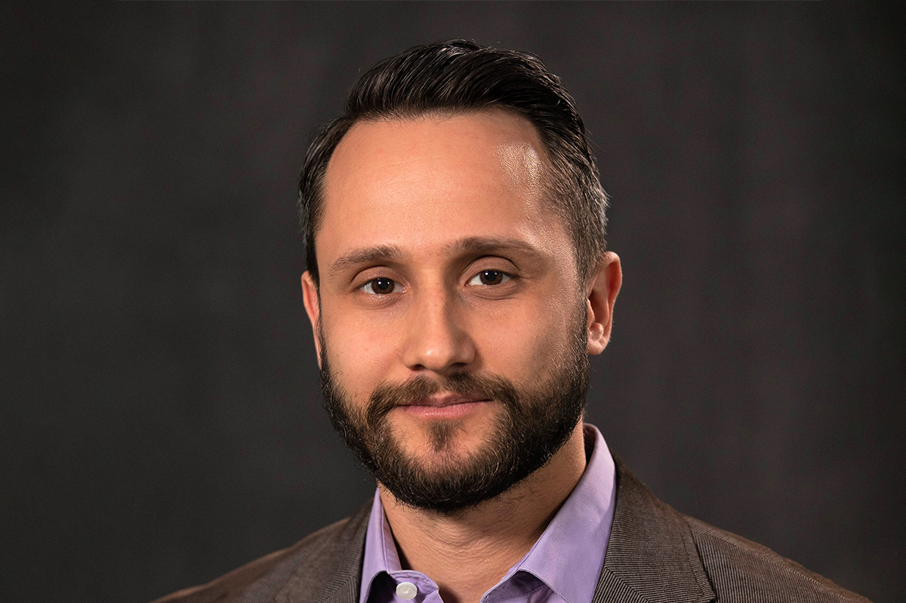
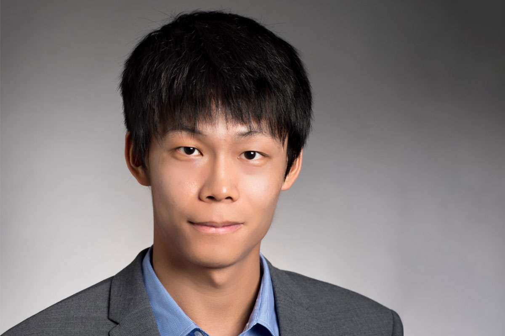

With the [new Robotics Department](https://robotics.umich.edu/news/2021/first-robotics-department/ "The first robotics department among top 10 engineering schools") and [undergraduate robotics program](https://robotics.umich.edu/news/2022/new-u-m-undergraduate-robotics-program/ "New U-M Undergraduate Robotics Program launches") launched, we have brought on additional faculty who exemplify our [values](https://robotics.umich.edu/about/values/ "Values"). These new members will help us meet our goals of training the next generation of roboticists and advancing robotics research in order to positively impact the quality of people's lives.

We are proud to welcome the following to the University of Michigan:

## Jamie Berger

Lecturer, started Fall 2022

Interests:  
Teaching and learning for computing and engineering disciplines.

[Learn more](https://robotics.umich.edu/people/ "Jamie Berger")

## Mark Draelos

Assistant Professor in Robotics and Ophthalmology, starting Winter 2023

Interests:  
Medical robotics, intrasurgical navigation, biomedical imaging, data visualization, medical device development, and real-time algorithms.

[Learn more](https://robotics.umich.edu/people/faculty/mark-draelos/ "Mark Draelos")

## Greg Formosa

Lecturer, starting Winter 2023

Interests:  
Mechanical design engineering, especially for the design, fabrication, and control of robotic medical devices; wheeled robot dynamics, modeling, and estimation; STEM education and design engineering pedagogy.

[Learn more](https://robotics.umich.edu/people/faculty/greg-formosa/ "Greg Formosa")

## Xiaonan (Sean) Huang

Assistant Professor, starting Winter 2023

Interests:  
Design, control, and modeling of autonomous multi-terrain soft robots and tensegrity robots, integration of novel soft multifunctional materials into soft machines, and development of novel soft actuators, sensors, and wearable devices.

[Learn more](https://robotics.umich.edu/people/faculty/xiaonan-sean-huang/ "Xiaonan (Sean) Huang")

## Christoforos Mavrogiannis

Assistant Professor, starting Fall 2023

Interests:  
Human-robot interaction, shared autonomy, multiagent and multirobot systems, navigation in dynamic environments, decentralized control, behavior prediction, robotic manipulation

[Learn more](https://robotics.umich.edu/people/faculty/christoforos-mavrogiannis/ "Christoforos Mavrogiannis")
