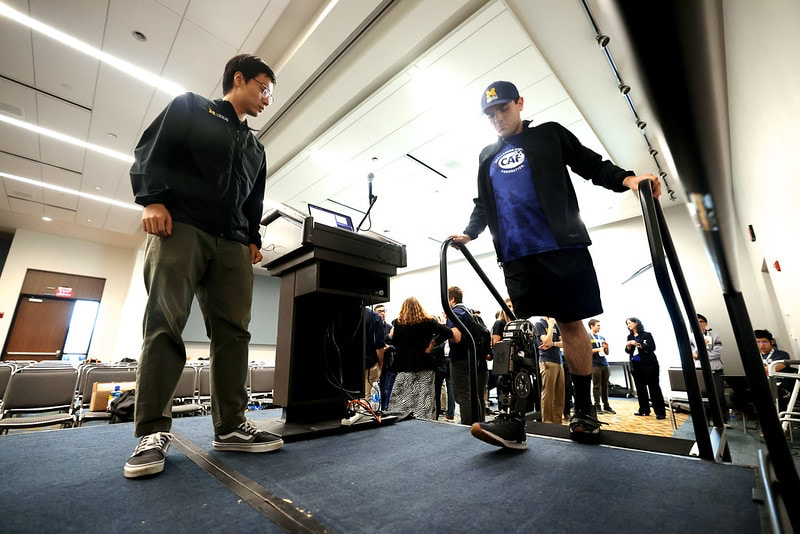

A smoother experience for robotic prosthetic leg users is the aim of a University of Michigan project that has received renewed support from the National Institutes of Health. The R01 grant of $3 million will also enable the implementation of the researchers’ improved control program on a commercially available robotic prosthetic leg. 

Sit to stand, stand to walk, up and down stairs and inclines—the human body shifts among these activities almost thoughtlessly. But these transitions are hard for robots, and robotic prosthetic legs have the additional challenge of not being hooked into the human user’s central nervous system to stay synchronized with their body. 

Working on the problem since 2013, principal investigator [Robert Gregg](https://gregg.engin.umich.edu/), an associate professor of robotics, saw early success controlling the position of the knee and ankle joints through a model that continuously represents all stages of the gait cycle. Previously, robotic prosthetic legs used separate controllers for each stage in the gait cycle like the heel strike, push-off and swing. As a result, the control parameters for each model and rules for switching from one model to another had to be optimized for each patient. 

“Every person has different parameters because every person walks differently. And that resulted in very, very cumbersome clinical deployment,” said Gregg.

Using the motion of the thigh to predict joint position with a continuous model turned out to be a pretty good way of creating a natural gait. With the initial R01 grant in 2018, Gregg’s team extended the walking control model to cover other important scenarios: inclines, stairs, sit-to-stand and stand-to-walk. Study participants could do all of these activities with more typical biomechanics using the robotic leg than they could with passive prosthetics. However, pinning the control algorithm to joint angles leads to a more rigid experience when trying to change activities.

<figure>

<figcaption>

Andrew Seelhoff, right, a first year PhD student in Mechanical Engineering walk up a set of stairs to a platform to demonstrate the robotic prosthetic designed by Robert Gregg’s Locomotor Control Systems Laboratory, at IROS 2023 at Huntington Place in Detroit, Michigan, on Thursday, October 5, 2023.

</figcaption>

</figure>

“The robot has very strong motors, and so, if you’re controlling the position and it’s somehow incompatible with the environment, it can feel very rigid and jarring,” he said, which can mean pain for amputees where the limb meets the socket.

So Gregg’s team is now looking at controlling joint position indirectly—mimicking biomechanical impedance instead—using their continuous modeling framework. With an impedance approach, there’s an equilibrium position, and the forces are set to gently pull the joint back into that position if it’s disturbed. This provides some wiggle room.

Gregg compares it to suspension on a car. “You have the spring, and then you have a shock-absorbing mechanism. You want to hit the pothole and have enough bounce to soften the jolt, but you don’t want to oscillate forever.”

This should enable the leg to offer the same ability to seamlessly move from one activity to another while also providing a cushier ride.

The programming of the leg is based on biomechanical measurements of people with two biological legs, in an effort to replicate the motion that the hips and back evolved for. Users of passive prosthetic legs often experience pain in the hips, back and organic knee due to the way they need to compensate for the dead weight of the prosthetic leg.

To learn how the leg should behave across activities, Gregg united with collaborator [Elliott Rouse](https://robotics.umich.edu/people/faculty/elliott-rouse/), who studies the mechanical properties of healthy human gait. 

“We obtain the measurements for determining the biomechanical properties of the leg using an exoskeleton,” said Rouse, an associate professor of robotics and mechanical engineering, and co-investigator on the project. “The exoskeleton mostly provides no assistance but occasionally applies a quick perturbation that displaces the limb. From these measurements, we can determine the mechanical impedance, including properties like stiffness, viscosity and inertia.”

The control programs will first be tested on the robotic leg that Gregg’s team built in-house, with motors to power both the ankle and knee. Then, to see if the new algorithms are ready to start helping people now, the team will test them on Ossür’s Power Knee prosthetic leg. In addition to measuring the biomechanics of study participants as they walk with the prosthetic legs, the team will collect formal feedback to quantify increases in comfort and reductions in pain.

<VideoCenter url="https://www.youtube.com/watch?v=Iin6UqeT14A" caption="This video shows a tuning-free, phase-based controller that uses a hybrid combination of continuously-variable impedance control during stance and kinematic control during swing to enable biomimetic locomotion over a continuum of tasks. Credit: Locomotor Control Systems Laboratory, University of Michigan" />

The Power Knee has a springy, passive ankle with a smaller range of motion, but it is also lighter than the lab leg—and most importantly, it is helping people walk now. Gregg’s team is confident that they can modify their control model to work on it, perhaps improving on the models Ossür is currently running.

Jeff Wensman, clinical collaborator from the [U-M Orthotics and Prosthetics Center](https://www.uofmhealth.org/conditions-treatments/rehabilitation/orthotics-and-prosthetics), is also a co-investigator of the project. Gregg is also an associate professor of electrical and computer engineering and mechanical engineering.
