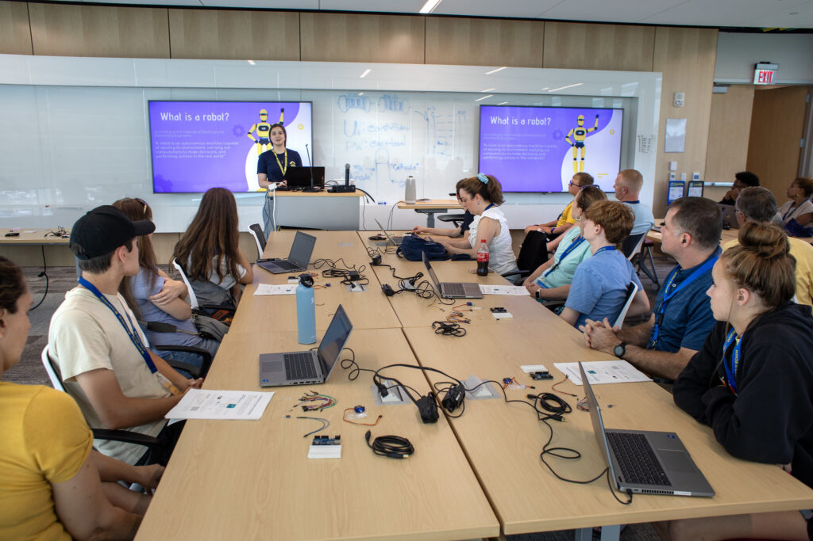

<figure>

<figcaption>

Jessi Carlson leads a summer camp activity for Discover Engineering. Photo by Marcin Szczepanski, Michigan Engineering.

</figcaption>

</figure>

The community among the Robotics Department is a key feature that sets it apart from other institutions. Many of our roboticists cite the collegiality and positive culture as the reason for joining Michigan as a student, faculty, or staff member. While each of us do our part in furthering this spirit through actions great and small, there are those who dedicate an extra amount of time in doing so.

To honor these leaders in community service, we established the Robotics Outreach Ambassador program in 2021. The title is given to those who have completed a certain amount of outreach work over the past academic year, and to a few standouts nominated by others. All of them exhibit enthusiastic outreach, [a value of Michigan Robotics](https://robotics.umich.edu/about/values/).

The 2023 Robotics Outreach Ambassadors are:

<ColumnList columns={2}>

- Arsha Ali
- Brandon Apodaca
- Hannah Baez
- Zahraa Bazzi
- Kaleb Ben Naveed
- Kevin Best
- Joseph Breeden
- Emily Bywater
- Jessi Carlson
- Jaiwei Chen
- Dylan Colli
- Luis Cubillos
- Challen Enninful Adu
- Zariq George
- Grant Gibson
- Alia Gilbert
- Karis Hu
- Mohamad Louai Shehab
- José Montes-Pérez
- Eva Mungai
- Mark Nail
- Chris Nesler
- Wami Ogunbi
- Miquel Oller Oliveras
- Liz Olson
- Xiangyu Peng
- Thomas Power
- Abigail Rafter
- Emma Reznick
- Samanta Rodriguez
- Anja Sheppard
- Andrea Sipos
- Katharine Walters
- Nick Wohlfeil
- Chae Woo Lim
- Maggie Wu
- Ziyou Wu

</ColumnList>

The wide range of community activities often goes beyond the frequent lab tour–though that will always be a favorite of those interested in robotics. A few highlight events from the past year include:

<VideoCenter url="https://youtu.be/unSseBx4sWU" caption="Educating the public on the current state of robotics, students led and helped put together an event to show how exoskeletons might impact our future." />

- Worked with Boy Scouts to earn merit badged and participated in a panel discussion for Girl Scout Leaders, addressing the gender gap in STEM and discussing factors of success for women in engineering.

- Planned and hosted "How to Grad School" workshops in collaboration with FAMU-FSU, [NSBE](https://www.nsbe.org), and [SWE](https://swe.org).

- Participated in the [SHPE](https://shpe.org), the largest gathering of Hispanics in STEM, speaking about grad school and the Robotics Department at U-M.

- Mentored students participating in the [Summer Research Opportunity Program](https://rackham.umich.edu/rackham-life/diversity-equity-and-inclusion/srop/), and assisting with their graduate school applications.

- Participated in recruitment events at [SACNAS](https://www.sacnas.org).

- Visited Universities in Florida and Puerto Rico to talk about graduate programs in robotics.

- Led and participated in the first [Michigan Robotics Testing Lab series](https://www.youtube.com/watch?v=unSseBx4sWU), featuring evaluating powered exoskeletons for jumping.

- Volunteered at the [U-M Science Olympiad](https://www.umichscioly.org) to judge student projects.

- Assisted with the Discover Engineering Camp, teaching students about Arduino code and breadboards, human factors, industrial engineering, optimization, and building a sunflower project.

- Welcomed, talked, guided and mentored students from Addis Ababa Institute of Technology in Ethiopia for the 12 week [African Undergraduate Research Adventure (AURA) program](https://aura.engin.umich.edu).

- Demonstrated exoskeleton and EMG sensors to elementary school students.

- Organizing a workshop for STEM educators as part of Carnegie Mellon's [RoboticsEd](https://roboticsed.ri.cmu.edu/) project with free educational resources related to robotics.

- Leading and planning [Robotics Graduate Student Council](https://robotics.umich.edu/academics/student-services/robotics-graduate-student-council/ "Robotics Graduate Student Council") events.

- Showcased multi-legged robots and their applications in agriculture during the [U-M Museum of Natural History's Scientist Spotlight](https://lsa.umich.edu/ummnh/visitors/things-to-do/scientist-spotlight.html).

The range and number of organizations that our students find time to work with is astounding. We are proud of these students and all the others who make an effort toward improving local and global communities.
