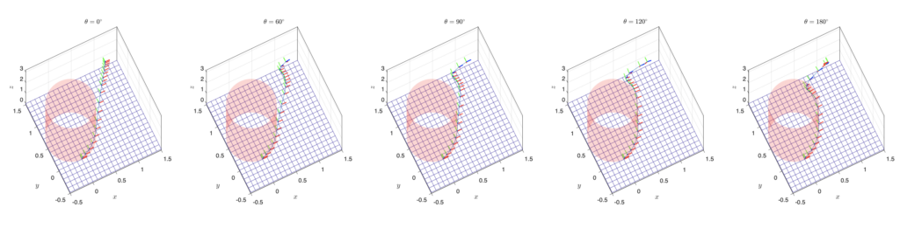
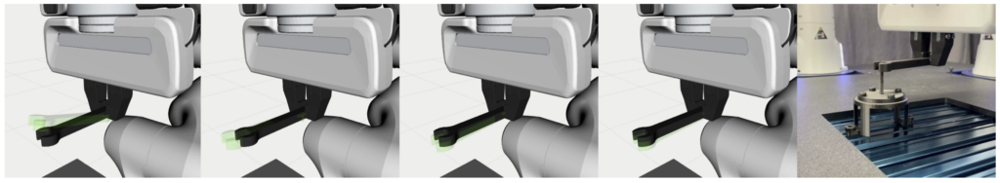
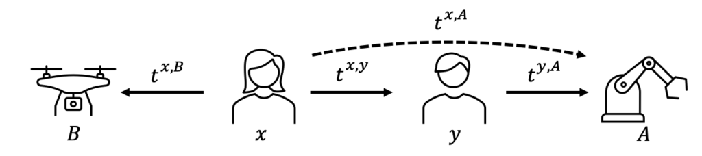
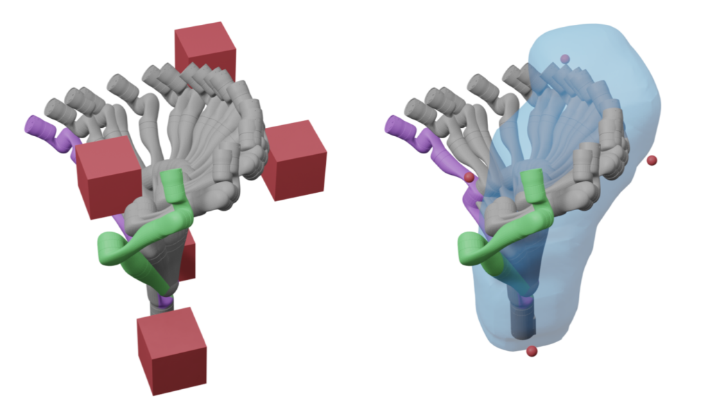
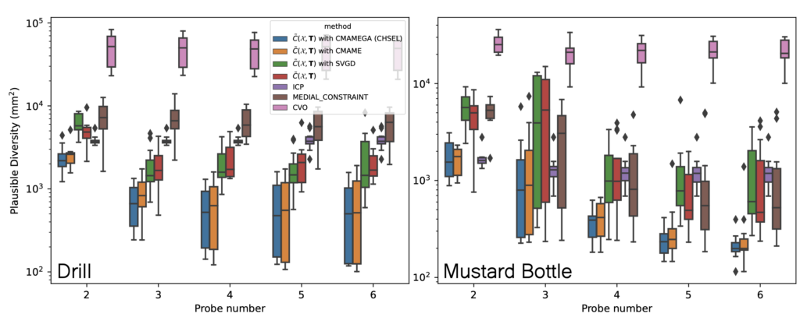
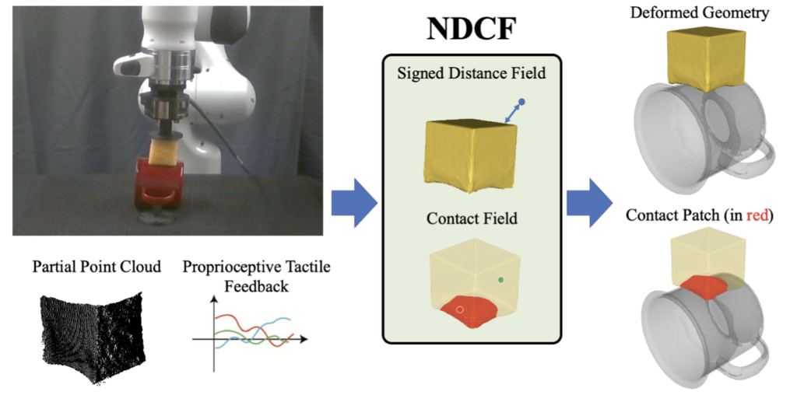
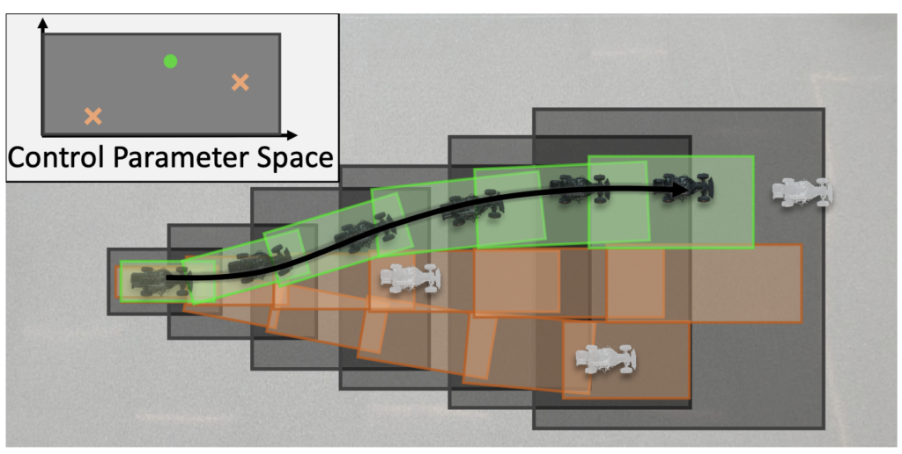
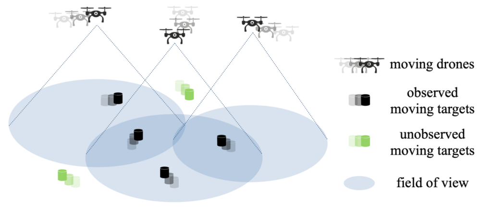

<figure>

<figcaption>

A Digit robot holds a box in the Ford Robotics Building. Photo: Marcin Szczepanski

</figcaption>

</figure>

Michigan roboticists, many representing the [new University of Michigan Robotics Department](https://robotics.umich.edu/news/2021/first-robotics-department/ "The first robotics department among top 10 engineering schools"), will be presenting a total of nine papers at [Robotics Science and Systems](https://roboticsconference.org) (RSS). Their research covers a wide range of topics from robot teams and trust propagation to trajectory design and motion planning. The RSS conference is held in Daegu, Korea, from July 11 to July 14.

In addition to the nine accepted papers, two of the papers are nominated for awards of Best Paper and Best Student Paper. Below is a summary of all the submissions.

## Nominated for Best Paper

### Convex Geometric Motion Planning on Lie Groups via Moment Relaxation

Sangli Teng, Ashkan Jasour, Ram Vasudevan, Maani Ghaffari

<figure>

<figcaption>

3D drone landing task with obstacle 1. Obstacle 1 blocks some of the waypoints computed from the free space task. All these plots converge to a locally feasible path after being refined by IPOPT, and the first 4 cases are certified as globally optimal solutions by metric ε.

</figcaption>

</figure>

This paper reports a novel result: with proper robot models on matrix Lie groups, one can formulate the kinodynamic motion planning problem for rigid body systems as *exact* polynomial optimization problems that can be relaxed as semidefinite programming (SDP). Due to the nonlinear rigid body dynamics, the motion planning problem for rigid body systems is nonconvex. Existing global optimization-based methods do not properly deal with the configuration space of the 3D rigid body; thus, they do not scale well to long-horizon planning problems. We use Lie groups as the configuration space in our formulation and apply the variational integrator to formulate the forced rigid body systems as quadratic polynomials. Then we leverage Lasserre's hierarchy to obtain the globally optimal solution via SDP. By constructing the motion planning problem in a sparse manner, the results show that the proposed algorithm has *linear* complexity with respect to the planning horizon. This paper demonstrates the proposed method can provide rank-one optimal solutions at relaxation order two for most of the testing cases of 1, 3D drone landing using the full dynamics model and 2, inverse kinematics for serial manipulators.

## Nominated for Best Student Paper

### MultiSCOPE: Disambiguating In-Hand Object Poses with Proprioception and Tactile Feedback

Andrea Sipos, Nima Fazeli

<figure>

<figcaption>

Estimated wrench pose (green, transparent) compared to ground truth (black, opaque) after Action 1 through after Action 4. At the far right, the result of planning using the estimated wrench pose after Action 4 in the real world. The robot succeeded in the task in all 5 real-world trials.

</figcaption>

</figure>

In this paper, we propose a method for estimating in-hand object poses using proprioception and tactile feedback from a bimanual robotic system. Our method addresses the problem of reducing pose uncertainty through a sequence of frictional contact interactions between the grasped objects. As part of our method, we propose 1) a tool segmentation routine that facilitates contact location and object pose estimation, 2) a loss that allows reasoning over solution consistency between interactions, and 3) a loss to promote converging to object poses and contact locations that explain the external force-torque experienced by each arm. We demonstrate the efficacy of our method in a task-based demonstration both in simulation and on a real-world bimanual platform and show significant improvement in object pose estimation over single interactions.

## Accepted papers
<Accordion title="Enabling Team of Teams: A Trust Inference and Propagation (TIP) Model in Multi-Human Multi-Robot Teams">

**Enabling Team of Teams: A Trust Inference and Propagation (TIP) Model in Multi-Human Multi-Robot Teams**  
Yaohui Guo, X. Jessie Yang, Cong Shi

<figure>

<figcaption>

An arrow points from a trustor to a trustee, representing the trust ttrustor,trustee. Human x updates her trust in robot B based on direct experience. Even though x does not have direct interaction with A, x could still update her trust toward A through a third party, y.

</figcaption>

</figure>

Trust has been identified as a central factor for effective human-robot teaming. Existing literature on trust modeling predominantly focuses on dyadic human-autonomy teams where one human agent interacts with one robot. There is little, if not no, research on trust modeling in teams consisting of multiple human agents and multiple robotic agents.

To fill this research gap, we present the trust inference and propagation (TIP) model for trust modeling in multi-human multi-robot teams. In a multi-human multi-robot team, we postulate that there exist two types of experiences that a human agent has with a robot: direct and indirect experiences. The TIP model presents a novel mathematical framework that explicitly accounts for both types of experiences. To evaluate the model, we conducted a human-subject experiment with 15 pairs of participants (N=30). Each pair performed a search and detection task with two drones. Results show that our TIP model successfully captured the underlying trust dynamics and significantly outperformed a baseline model. To the best of our knowledge, the TIP model is the first mathematical framework for computational trust modeling in multi-human multi-robot teams.

</Accordion>

<Accordion title="Precise Object Sliding with Top Contact via Asymmetric Dual Limit Surfaces">

**Precise Object Sliding with Top Contact via Asymmetric Dual Limit Surfaces**  
Xili Yi, Nima Fazeli

<figure>

<figcaption>

(a) Human sliding a book with palm on a horizontal surface. (b) Robot sliding a book with top contact. Here, the book is trapped by two walls meaning that planar pushing cannot solve this task due to side occlusion.

</figcaption>

</figure>

In this paper, we discuss the mechanics and planning algorithms to slide an object on a horizontal planar surface via frictional patch contact made with its top surface. Here, we propose an asymmetric dual limit surface model to determine slip boundary conditions for both the top and bottom contact. With this model, we obtain a range of twists that can keep the object in sticking contact with the robot end-effector while slipping on the supporting plane. Based on these constraints, we derive a planning algorithm to slide objects with only top contact to arbitrary goal poses without slippage between end effector and the object. We validate the proposed model empirically and demonstrate its predictive accuracy on a variety of object geometries and motions. We also evaluate the planning algorithm over a variety of objects and goals demonstrate an orientation error improvement of 90% when compared to methods naive to linear path planners.

</Accordion>

<Accordion title="Reachability-based Trajectory Design with Neural Implicit Safety Constraints">

**Reachability-based Trajectory Design with Neural Implicit Safety Constraints**  
Jonathan Michaux, Yong Seok Kwon, Qingyi Chen, Ram Vasudevan

<figure>

<figcaption>

Real-time receding-horizon trajectory planning with RDF in a cluttered environment. (Left) The arm safely moves from the start pose (purple) through intermediate configurations (grey) to reach the goal (green) while avoiding obstacles (red cubes). (Right) During the highlighted planning iteration all obstacle centers (red spheres) remain outside RDF's zero-level set (blue).

</figcaption>

</figure>

Generating safe motion plans in real-time is a key requirement for deploying robot manipulators to assist humans in collaborative settings. In particular, robots must satisfy strict safety requirements to avoid damaging itself or harming nearby humans. This is particularly challenging if the robot must also operate in real-time to quickly adjust to changes in its environment. This paper addresses these challenges by proposing Reachability-based Signed Distance Functions (RDFs) as a neural implicit representation for robot safety. RDF, trained using supervised learning, accurately predicts the distance between the swept volume of a robot arm and an obstacle. RDF's inference and gradient computations are fast and scale linearly with the dimension of the system; these features enables its use within a novel real-time trajectory planning framework as a continuous-time collision-avoidance constraint. The planning method here is compared to state-of-the-art methods and is demonstrated to successfully solve challenging motion planning tasks for high-dimensional systems under a limited planning time horizon.

</Accordion>

<Accordion title="CHSEL: Producing Diverse Plausible Pose Estimates from Contact and Free Space Data">

**CHSEL: Producing Diverse Plausible Pose Estimates from Contact and Free Space Data**  
Sheng Zhong, Dmitry Berenson, Nima Fazeli

<figure>

<figcaption>

Plausible Diversity for real drill (left) and mustard (right) probing experiments across 2 configurations and 6 trials each. The bars indicate the 25 to 75 percentile while the whiskers are the min and max with outliers as diamonds. Lower is better.

</figcaption>

</figure>

This paper proposes a novel method for estimating the set of plausible poses of a rigid object from a set of points with volumetric information, such as whether each point is in free space or on the surface of the object. In particular, we study how pose can be estimated from force and tactile data arising from contact. Using data derived from contact is challenging because it is inherently less information-dense than visual data, and thus the pose estimation problem is severely under-constrained when there are few contacts. Rather than attempting to estimate the true pose of the object, which is not tractable without a large number of contacts, we seek to estimate a plausible set of poses which obey the constraints imposed by the sensor data. Existing methods struggle to estimate this set because they are either designed for single pose estimates or require informative priors to be effective. Our approach to this problem, Constrained pose Hypothesis Set Elimination (CHSEL), has three key attributes: 1) It considers volumetric information, which allows us to account for known free space; 2) It uses a novel differentiable volumetric cost function to take advantage of powerful gradient-based optimization tools; and 3) It uses methods from the Quality Diversity (QD) optimization literature to produce a diverse set of high-quality poses. To our knowledge, QD methods have not been used previously for pose registration. We also show how to update our plausible pose estimates online as more data is gathered by the robot. Our experiments suggest that CHSEL shows large performance improvements over several baseline methods for both simulated and real-world data.

</Accordion>

<Accordion title="Integrated Object Deformation and Contact Patch Estimation from Visuo-Tactile Feedback">

**Integrated Object Deformation and Contact Patch Estimation from Visuo-Tactile Feedback**  
Mark Van der Merwe, Youngsun Wi, Dmitry Berenson, Nima Fazeli

<figure>

<figcaption>

A robot with a deforming sponge presses into the YCB mug object. NDCF is able to faithfully recover the deformed tool geometry and contact patch between the deformed sponge and rigid mug (shown in red) given real-world sensing from this interaction.

</figcaption>

</figure>

Reasoning over the interplay between object deformation and force transmission through contact is central to the manipulation of compliant objects. In this paper, we propose Neural Deforming Contact Field (NDCF), a representation that jointly models object deformations and contact patches from visuo-tactile feedback using implicit representations. Representing the object geometry and contact with the environment implicitly allows a single model to predict contact patches of varying complexity. Additionally, learning geometry and contact simultaneously allows us to enforce physical priors, such as ensuring contacts lie on the surface of the object. We propose a neural network architecture to learn a NDCF, and train it using simulated data. We then demonstrate that the learned NDCF transfers directly to the real-world without the need for fine-tuning. We benchmark our proposed approach against a baseline representing geometry and contact patches with point clouds. We find that NDCF performs better on simulated data and in transfer to the real-world. More details and video results can be found at [https://www.mmintlab.com/ndcf/](https://www.mmintlab.com/ndcf/).

</Accordion>

<Accordion title="RADIUS: Risk-Aware, Real-Time, Reachability-Based Motion Planning">

**RADIUS: Risk-Aware, Real-Time, Reachability-Based Motion Planning**  
Jinsun Liu, Challen Enninful Adu, Lucas Lymburner, Vishrut Kaushik, Lena Trang, Ram Vasudevan

<figure>

<figcaption>

Moving obstacles are shown in white and the 3-σ regions of the corresponding probability distributions for the obstacle locations are shown as the purple and blue ellipses where the probability density from low to high is illustrated from blue to purple. The subsets of the dark gray zonotope reachable sets corresponding to the trajectory parameter shown in green ensure a collision-free path that is guaranteed to have a no greater than ε risk of colliding with all obstacles, while the two trajectory parameters and their corresponding reachable sets shown orange may have a greater than ε risk of collision with the moving obstacles.

</figcaption>

</figure>

Deterministic methods for motion planning guarantee safety amidst uncertainty in obstacle locations by trying to restrict the robot from operating in any possible location that an obstacle could be in. Unfortunately, this can result in overly conservative behavior. Chance-constrained optimization can be applied to improve the performance of motion planning algorithms by allowing for a user-specified amount of bounded constraint violation. However, state-of-the-art methods rely either on moment-based inequalities, which can be overly conservative, or make it difficult to satisfy assumptions about the class of probability distributions used to model uncertainty. To address these challenges, this work proposes a real-time, risk-aware reachability-based motion planning framework called RADIUS. The method first generates a reachable set of parameterized trajectories for the robot offline. At run time, RADIUS computes a closed-form over-approximation of the risk of a collision with an obstacle. This is done without restricting the probability distribution used to model uncertainty to a simple class (e.g., Gaussian). Then, RADIUS performs real-time optimization to construct a trajectory that can be followed by the robot in a manner that is certified to have a risk of collision that is less than or equal to a user-specified threshold. The proposed algorithm is compared to several state-of-the-art chance-constrained and deterministic methods in simulation, and is shown to consistently outperform them in a variety of driving scenarios. A demonstration of the proposed framework on hardware is also provided.

</Accordion>

<Accordion title="Bandit Submodular Maximization for Multi-Robot Coordination in Unpredictable and Partially Observable Environments">

**Bandit Submodular Maximization for Multi-Robot Coordination in Unpredictable and Partially Observable Environments**  
Zirui Xu, Xiaofeng Lin, Vasileios Tzoumas

<figure>

<figcaption>

In target tracking, drones are often tasked to coordinate their motion to maximize at each time step the number of tracked targets.

</figcaption>

</figure>

We study the problem of multi-agent coordination in unpredictable and partially observable environments, that is, environments whose future evolution is unknown a priori and that can only be partially observed. We are motivated by the future of autonomy that involves multiple robots coordinating actions in dynamic, unstructured, and partially observable environments to complete complex tasks such as target tracking, environmental mapping, and area monitoring. Such tasks are often modeled as submodular maximization coordination problems due to the information overlap among the robots. We introduce the first submodular coordination algorithm with bandit feedback and bounded tracking regret —bandit feedback is the robots' ability to compute in hindsight only the effect of their chosen actions, instead of all the alternative actions that they could have chosen instead, due to the partial observability; and tracking regret is the algorithm's suboptimality with respect to the optimal time-varying actions that fully know the future a priori. The bound gracefully degrades with the environments' capacity to change adversarially, quantifying how often the robots should re-select actions to learn to coordinate as if they fully knew the future a priori. The algorithm generalizes the seminal Sequential Greedy algorithm by Fisher et al. to the bandit setting, by leveraging submodularity and algorithms for the problem of tracking the best action. We validate our algorithm in simulated scenarios of multi-target tracking.

</Accordion>
